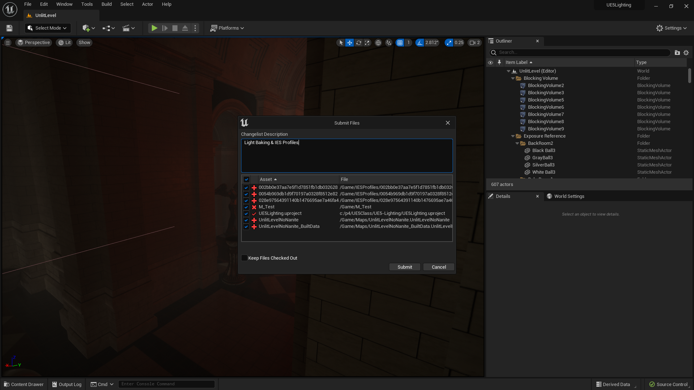

### Baked Lighting II

[previous](../baked-lighting/README.md#user-content-baked-lighting) • [home](../README.md#user-content-ue5-lighting) • [next](../post-process/README.md#user-content-post-process-volumes)

Lets do one bake with mobility of **Stationary** and look at IES profiles

 

---

##### `Step 1.`\|`ITL`|:small_blue_diamond:

Add a **Shapes | Cube** to the back room against the wall on the ground. 

##### `Step 2.`\|`ITL`|:small_blue_diamond: :small_blue_diamond: 

Now lets add a **SpotLight**.  This is the final light type that we can use.  It operates like a normal spotlight focusing a light in a forward direction. An spotlight can broadcast a strong light that can be manually focused.

##### `Step 3.`\|`ITL`|:small_blue_diamond: :small_blue_diamond: :small_blue_diamond:

Rotate the spotlight so it points down on top of the box and broadcasts on the wall.  The **Mobility** to `Stationary`. 

>Lights that have their Mobility set to Stationary are lights that are intended to stay in one position, but are able to change in other ways, such as their brightness and color. This is the primary way they differ from Static Lights, which cannot change in any way during gameplay.  Of the three light mobilities to choose from, Stationary lights have the highest quality, medium mutability, and medium performance cost.  Stationary Lights use both dynamic and static lighting to achieve its result, with indirect lighting and shadowing being stored within lightmaps for the Level. Direct shadows are stored within shadow maps. These lights make use of Distance Field Shadows, meaning that their shadows can remain crisp even with fairly low lightmap resolutions on lit objects.

https://user-images.githubusercontent.com/5504953/189501441-5661ed14-e387-4d05-b65c-aab48fd1d041.mp4

##### `Step 4.`\|`ITL`|:small_blue_diamond: :small_blue_diamond: :small_blue_diamond: :small_blue_diamond:

https://user-images.githubusercontent.com/5504953/189501556-69ac3267-431d-4753-90f3-3f221bb65619.mp4

##### `Step 5.`\|`ITL`| :small_orange_diamond:

https://user-images.githubusercontent.com/5504953/189501595-3d4f85b0-17da-453d-bb53-9c8882207bfd.mp4

##### `Step 6.`\|`ITL`| :small_orange_diamond: :small_blue_diamond:

##### `Step 7.`\|`ITL`| :small_orange_diamond: :small_blue_diamond: :small_blue_diamond:

##### `Step 8.`\|`ITL`| :small_orange_diamond: :small_blue_diamond: :small_blue_diamond: :small_blue_diamond:

https://user-images.githubusercontent.com/5504953/189501986-00161166-4255-4821-9543-536ab98ca7ff.mp4

##### `Step 9.`\|`ITL`| :small_orange_diamond: :small_blue_diamond: :small_blue_diamond: :small_blue_diamond: :small_blue_diamond:

Select the **File | Save All** then press the <kbd>Source Control</kbd> button and select **Submit Content**.  If you are prompted, select **Check Out** for all items that are not checked out of source control. Update the **Changelist Description** message and with the latest changes. Make sure all the files are correct and press the <kbd>Submit</kbd> button. A confirmation will pop up on the bottom right with a message about a changelist was submitted with a commit number. Quit Unreal and make sure your **Pending** tab in **P4V** is empty. **Submit** any work that is still in the editor.

<!--  -->

| [previous](../baked-lighting/README.md#user-content-baked-lighting)| [home](../README.md#user-content-ue5-lighting) | [next](../post-process/README.md#user-content-post-process-volumes)|
|---|---|---|
