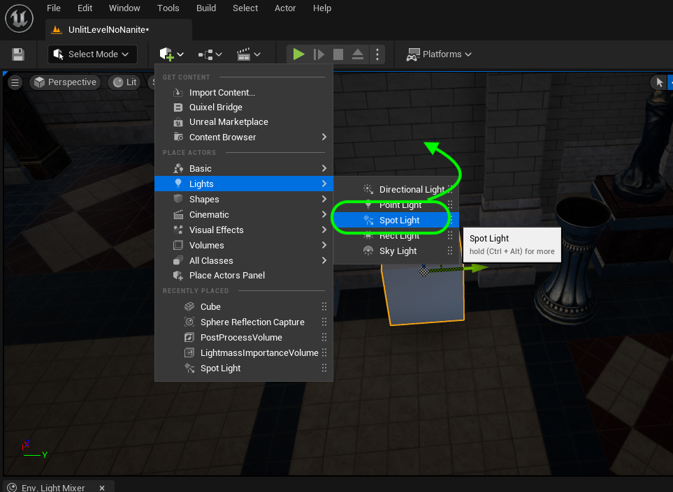
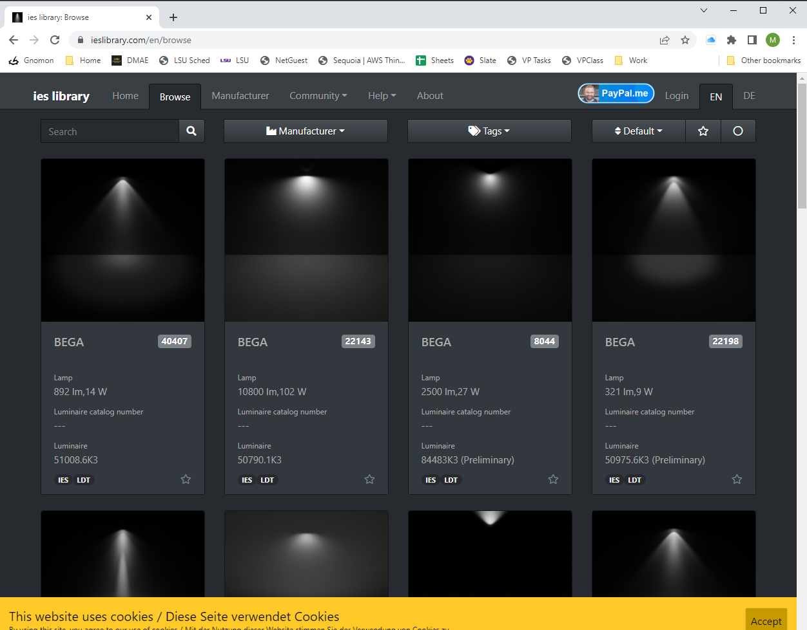

### Baked Lighting II

[previous](../baked-lighting/README.md#user-content-baked-lighting) • [home](../README.md#user-content-ue5-lighting) • [next](../)

Chapter introduction here.

 

---

##### `Step 1.`\|`ITL`|:small_blue_diamond:

##### `Step 2.`\|`ITL`|:small_blue_diamond: :small_blue_diamond: 

##### `Step 3.`\|`ITL`|:small_blue_diamond: :small_blue_diamond: :small_blue_diamond:

https://user-images.githubusercontent.com/5504953/189501441-5661ed14-e387-4d05-b65c-aab48fd1d041.mp4

##### `Step 4.`\|`ITL`|:small_blue_diamond: :small_blue_diamond: :small_blue_diamond: :small_blue_diamond:

https://user-images.githubusercontent.com/5504953/189501556-69ac3267-431d-4753-90f3-3f221bb65619.mp4

##### `Step 5.`\|`ITL`| :small_orange_diamond:

https://user-images.githubusercontent.com/5504953/189501595-3d4f85b0-17da-453d-bb53-9c8882207bfd.mp4

##### `Step 6.`\|`ITL`| :small_orange_diamond: :small_blue_diamond:

##### `Step 7.`\|`ITL`| :small_orange_diamond: :small_blue_diamond: :small_blue_diamond:

##### `Step 8.`\|`ITL`| :small_orange_diamond: :small_blue_diamond: :small_blue_diamond: :small_blue_diamond:

https://user-images.githubusercontent.com/5504953/189501986-00161166-4255-4821-9543-536ab98ca7ff.mp4

##### `Step 9.`\|`ITL`| :small_orange_diamond: :small_blue_diamond: :small_blue_diamond: :small_blue_diamond: :small_blue_diamond:

Select the **File | Save All** then press the <kbd>Source Control</kbd> button and select **Submit Content**.  If you are prompted, select **Check Out** for all items that are not checked out of source control. Update the **Changelist Description** message and with the latest changes. Make sure all the files are correct and press the <kbd>Submit</kbd> button. A confirmation will pop up on the bottom right with a message about a changelist was submitted with a commit number. Quit Unreal and make sure your **Pending** tab in **P4V** is empty. **Submit** any work that is still in the editor.

<!--  -->

| [previous](../baked-lighting/README.md#user-content-baked-lighting)| [home](../README.md#user-content-ue5-lighting) | [next](../)|
|---|---|---|
