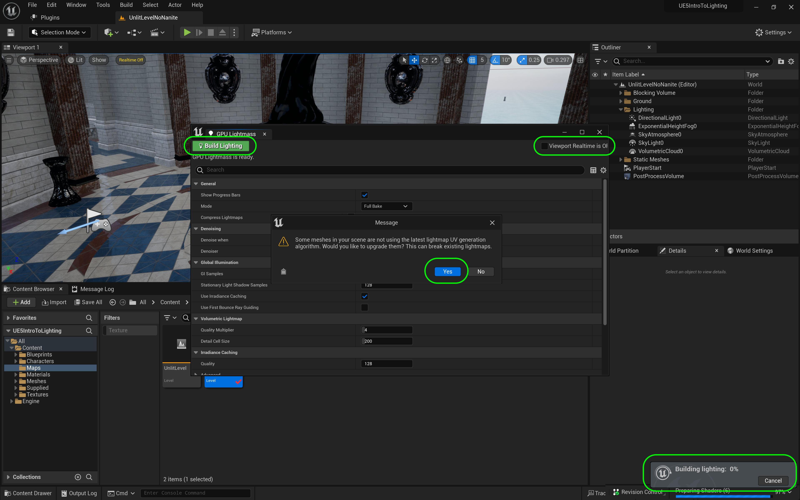

### Baked Lighting

[previous](../light-functions-ii/README.md#user-content-light-functions-ii) • [home](../README.md#user-content-ue5-lighting) • [next](../baked-lighting-ii/README.md#user-content-baked-lighting-ii)

Now Nanites and Lumen are amazing but they do require high end PC's.  They also do not work in VR yet or on lower power devices like cel phones.  For games that can't use nanites and lumen, lighting is done in a completely different manner, with a combination of real and baked lights.  This is by **NO MEANS** an exhaustive guide to how to make bake lights work well, but a quick intro so that you are familiar with the primary concept. We will also look at the final light a **[Directional Light](https://docs.unrealengine.com/5.0/en-US/directional-lights-in-unreal-engine/)** and **[IES](https://docs.unrealengine.com/5.0/en-US/using-ies-light-profiles-in-unreal-engine/)** lighting profiles.

 

---

##### `Step 1.`\|`ITL`|:small_blue_diamond:

Lets load up a level that has no nanites in it.  Double click on **Maps | UnlitLevelNoNanite**

##### `Step 2.`\|`ITL`|:small_blue_diamond: :small_blue_diamond: 

Go to **Window | Env Light Meter** and click on the <kbd>Create Sky Light</kbd>, <kbd>Create Atmospheric Light</kbd>, <kbd>Create Sky Atmosphere</kbd>, <kbd>Create Volumetric Cloud</kbd> and <kbd>Create Height Fog</kbd>. 

##### `Step 3.`\|`ITL`|:small_blue_diamond: :small_blue_diamond: :small_blue_diamond:

>Lights that have their Mobility set to Static are lights that cannot be changed or moved in any way during runtime. They are precomputed using Lightmass when a lighting built is performed. Static Lights store their data in textures called Lightmaps that are applied to geometry in the Level. Once the lighting build is complete, these lights have no further impact on performance.  Static Meshes with their Mobility set to Movable and Skeletal Meshes do not integrate (or blend) fully with Static Lighting. However, when a light build takes place, lighting data is stored in Volumetric Lightmaps or the Indirect Lighting Cache to assist in lighting and grounding these movable objects within a statically lit area.  Of the three light mobilities, Static Lights tend to have medium quality, lowest mutability, and the lowest performance cost. [Unreal Manual](https://docs.unrealengine.com/5.0/en-US/static-light-mobility-in-unreal-engine/)

Change the mobility of the **Volumetric Cloud** to **Static** and all the others to **Stationary**. 

Put all of the 5 lights/sky/effects in a **Lighting** folder in the **Outliner**.

##### `Step 4.`\|`ITL`|:small_blue_diamond: :small_blue_diamond: :small_blue_diamond: :small_blue_diamond:

Lets add a **Post Process Volume** to the level and set the  **Infinite Extent (Unbound)** to `true`. This way the volume affects the entire level.

##### `Step 5.`\|`ITL`| :small_orange_diamond:
Lets get back to having no auto iris.  Go to **Lens | Exposure** and adjust the **Min EV 100** and **Max Ev 100** to `0.0`.  Then adjust **Exposure Compensation** to taste.

##### `Step 6.`\|`ITL`| :small_orange_diamond: :small_blue_diamond:

**DO NOT DO THIS**.  This is the old way of baking lights that is slow and uses the CPU.  Unreal has implemented a more effective way, but we need to activate a **Plugin**.

##### `Step 7.`\|`ITL`| :small_orange_diamond: :small_blue_diamond: :small_blue_diamond:

Open up **Edit | Plugins** and select the **GPU Lightmass** plugin.  Accept the warning message and press the <kbd>Restart Now</kbd> button. It will take time to rebuild all the shaders.

##### `Step 8.`\|`ITL`| :small_orange_diamond: :small_blue_diamond: :small_blue_diamond: :small_blue_diamond:

Now the **Build** menu has a **GPU Lightmass** selection.  Now selct the GPU Lightmass. 

##### `Step 9.`\|`ITL`| :small_orange_diamond: :small_blue_diamond: :small_blue_diamond: :small_blue_diamond: :small_blue_diamond:

First we need to turn off **Viewport Realtime** to get the maximum speed for the bake. Then press the **Build Lighting** button. I got a warning saying the lightmap uv's need updating. I pressed the <kbd>Yes</kbd> button.  Be patient this might take a while. Its got to take every texture and bake the lighting into it.  It is no longer dynamic and will be fixed and not moved or animate. All the shadowing in the level will be essentially static and baked.

##### `Step 10.`\|`ITL`| :large_blue_diamond:

Play game and notice all reflective surfaces are dark.  We have Lumen turned off so it is no longer being used for reflections and we need something to build static reflections.

https://github.com/maubanel/UE5-Lighting/assets/5504953/92e25200-f4a0-4bca-ac33-dbed26ceacb6

##### `Step 11.`\|`ITL`| :large_blue_diamond: :small_blue_diamond: 

##### `Step 12.`\|`ITL`| :large_blue_diamond: :small_blue_diamond: :small_blue_diamond: 

##### `Step 13.`\|`ITL`| :large_blue_diamond: :small_blue_diamond: :small_blue_diamond:  :small_blue_diamond: 

##### `Step 14.`\|`ITL`| :large_blue_diamond: :small_blue_diamond: :small_blue_diamond: :small_blue_diamond:  :small_blue_diamond: 

Now our static meshes do not have dynamic lights but the lighting has been baked into the textures. Go back to the **Post Processing Volume** and make any needed changes to **Exposure**.

##### `Step 15.`\|`ITL`| :large_blue_diamond: :small_orange_diamond: 

##### `Step 16.`\|`ITL`| :large_blue_diamond: :small_orange_diamond:   :small_blue_diamond: 

Add a **Sphere Reflection Volume**.

>Reflection Capture Actors are probes that can be placed around the world to capture a static image of the area they cover. This reflection method reprojects the captured cubemap onto surrounding reflective materials. It is a low-cost method of reflections with no runtime performance cost. - [Unreal Manual](https://docs.unrealengine.com/5.0/en-US/reflections-captures-in-unreal-engine/). 

This is a much lower cost solution to using Lumen to do this at runtime.

##### `Step 17.`\|`ITL`| :large_blue_diamond: :small_orange_diamond: :small_blue_diamond: :small_blue_diamond:

Now select **Build | Build Reflection Captures** and you should see the black replaced with nice reflections.

##### `Step 18.`\|`ITL`| :large_blue_diamond: :small_orange_diamond: :small_blue_diamond: :small_blue_diamond: :small_blue_diamond:

Select the **Directional Light** and press and hold the <kbd>Cntrl L</kbd> buttons and move the mouse to get the sun to cast shadow onto the gazebo.

##### `Step 19.`\|`ITL`| :large_blue_diamond: :small_orange_diamond: :small_blue_diamond: :small_blue_diamond: :small_blue_diamond: :small_blue_diamond:

Now in we see that we have shaows in the scene. If there is a message saying to re-bake lights go back to the **GPU LightMass** and rebuild the lighting again.

https://user-images.githubusercontent.com/5504953/189500913-d49cf52d-a63f-4f40-9602-ea54fda42c40.mp4

##### `Step 20.`\|`ITL`| :large_blue_diamond: :large_blue_diamond:

Now lets go in the backroom and adjust the **PostProcessVolume | Lens | Exposure** and make it darker to make the effect a bit greater.

<!--  -->

| [previous](../light-functions-ii/README.md#user-content-light-functions-ii)| [home](../README.md#user-content-ue5-lighting) | [next](../baked-lighting-ii/README.md#user-content-baked-lighting-ii)|
|---|---|---|
