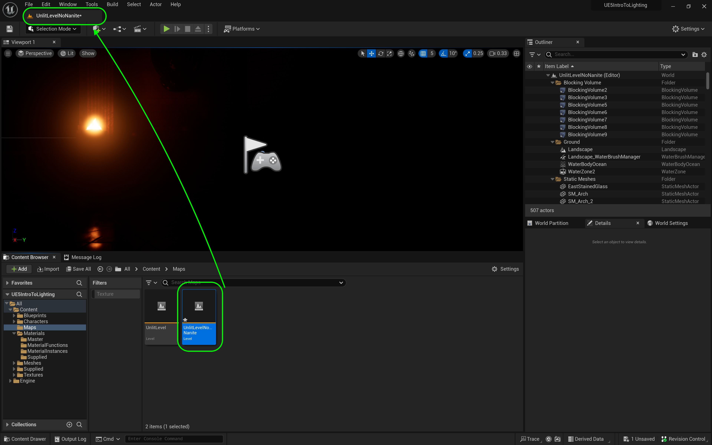
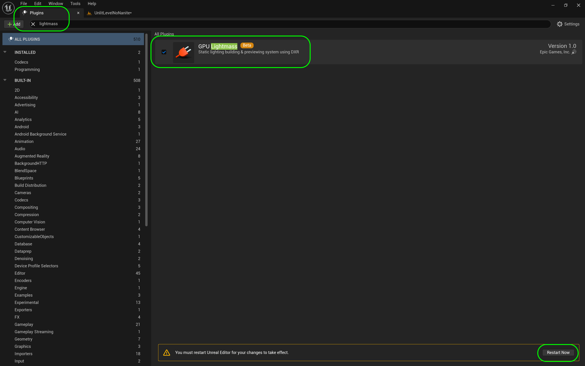

### Baked Lighting

[previous](../light-functions-ii/README.md#user-content-light-functions-ii) • [home](../README.md#user-content-ue5-lighting) • [next](../baked-lighting-ii/README.md#user-content-baked-lighting-ii)

Now Nanites and Lumen are amazing but they do require high end PC's.  They also do not work in VR yet or on lower power devices like cel phones.  For games that can't use nanites and lumen, lighting is done in a completely different manner, with a combination of real and baked lights.  This is by **NO MEANS** an exhaustive guide to how to make bake lights work well, but a quick intro so that you are familiar with the primary concept. We will also look at the final light a **[Directional Light](https://docs.unrealengine.com/5.0/en-US/directional-lights-in-unreal-engine/)** and **[IES](https://docs.unrealengine.com/5.0/en-US/using-ies-light-profiles-in-unreal-engine/)** lighting profiles.

 

---

##### `Step 1.`\|`ITL`|:small_blue_diamond:

Lets load up a level that has no nanites in it.  Double click on **Maps | UnlitLevelNoNanite**

##### `Step 2.`\|`ITL`|:small_blue_diamond: :small_blue_diamond: 

It is bright, as we are not in manual exposure. Drop in a **Visual Effect | Post Process Volume**.

##### `Step 3.`\|`ITL`|:small_blue_diamond: :small_blue_diamond: :small_blue_diamond:

We want it to effect the entire level so set the **Infinite Extent (Unbound)** to `true`. This way all our changes will affect the entire level.

##### `Step 4.`\|`ITL`|:small_blue_diamond: :small_blue_diamond: :small_blue_diamond: :small_blue_diamond:

Lets get back to manual exposure.  Go to **Lens | Exposure** and adjust the **Metering Mode** to `Manual`, the **Exposure Compensation** to `1.0` and **Apply Physical Camera Exposure** to `true`.

##### `Step 5.`\|`ITL`| :small_orange_diamond:

Go to **Window | Env Light Meter** and click on the <kbd>Create Sky Light</kbd>, kbd>Create Atmospheric Light 0</kbd>, kbd>Create Sky Atmosphere</kbd>, kbd>Create Volumetric Cloud</kbd> and kbd>Create Height Fog</kbd>. Put all of these in a **Lighting** folder in the **Outliner**.

https://user-images.githubusercontent.com/5504953/189499355-fc1c7569-8a48-457f-9869-bcc9fa6c2965.mp4

##### `Step 6.`\|`ITL`| :small_orange_diamond: :small_blue_diamond:

##### `Step 7.`\|`ITL`| :small_orange_diamond: :small_blue_diamond: :small_blue_diamond:

https://user-images.githubusercontent.com/5504953/189499629-d88a146c-213b-4e2a-8fb4-15b43085c5d9.mp4

##### `Step 8.`\|`ITL`| :small_orange_diamond: :small_blue_diamond: :small_blue_diamond: :small_blue_diamond:

##### `Step 9.`\|`ITL`| :small_orange_diamond: :small_blue_diamond: :small_blue_diamond: :small_blue_diamond: :small_blue_diamond:

https://user-images.githubusercontent.com/5504953/189499754-857b6440-cab5-4bc8-b0e8-262b027d39ba.mp4

##### `Step 10.`\|`ITL`| :large_blue_diamond:

##### `Step 11.`\|`ITL`| :large_blue_diamond: :small_blue_diamond: 

##### `Step 12.`\|`ITL`| :large_blue_diamond: :small_blue_diamond: :small_blue_diamond: 

##### `Step 13.`\|`ITL`| :large_blue_diamond: :small_blue_diamond: :small_blue_diamond:  :small_blue_diamond: 

https://user-images.githubusercontent.com/5504953/189500520-d2b52fea-94d8-491f-aade-0e687ffa175f.mp4

##### `Step 14.`\|`ITL`| :large_blue_diamond: :small_blue_diamond: :small_blue_diamond: :small_blue_diamond:  :small_blue_diamond: 

##### `Step 15.`\|`ITL`| :large_blue_diamond: :small_orange_diamond: 

https://user-images.githubusercontent.com/5504953/189500693-b1eca194-9cf7-4d33-b41b-dca70051625e.mp4

##### `Step 16.`\|`ITL`| :large_blue_diamond: :small_orange_diamond:   :small_blue_diamond: 

##### `Step 17.`\|`ITL`| :large_blue_diamond: :small_orange_diamond: :small_blue_diamond: :small_blue_diamond:

##### `Step 18.`\|`ITL`| :large_blue_diamond: :small_orange_diamond: :small_blue_diamond: :small_blue_diamond: :small_blue_diamond:

##### `Step 19.`\|`ITL`| :large_blue_diamond: :small_orange_diamond: :small_blue_diamond: :small_blue_diamond: :small_blue_diamond: :small_blue_diamond:

https://user-images.githubusercontent.com/5504953/189500913-d49cf52d-a63f-4f40-9602-ea54fda42c40.mp4

##### `Step 20.`\|`ITL`| :large_blue_diamond: :large_blue_diamond:

<!--  -->

| [previous](../light-functions-ii/README.md#user-content-light-functions-ii)| [home](../README.md#user-content-ue5-lighting) | [next](../baked-lighting-ii/README.md#user-content-baked-lighting-ii)|
|---|---|---|
