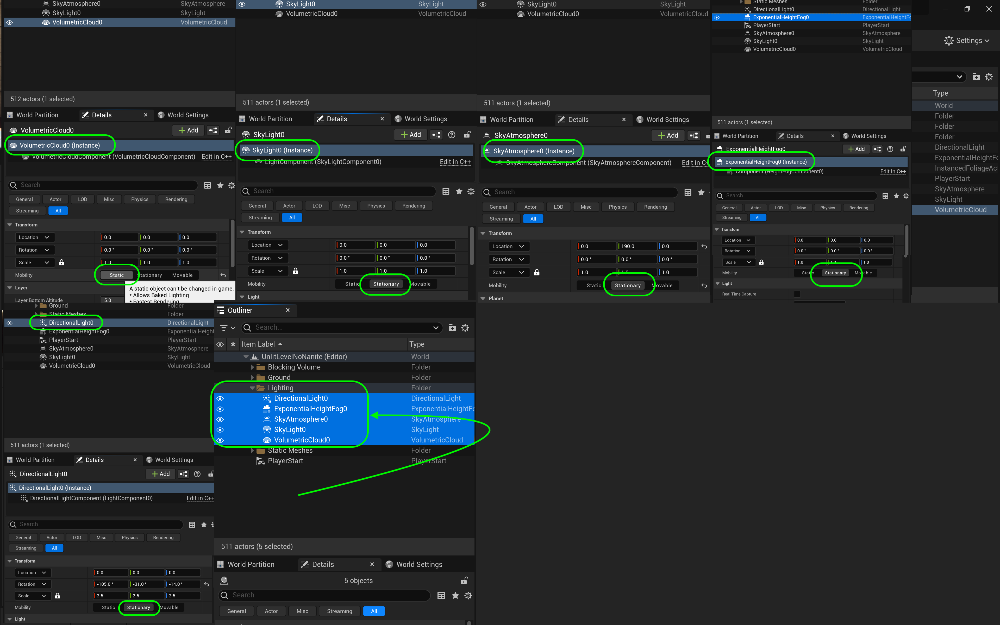

### Baked Lighting

[previous](../light-functions-ii/README.md#user-content-light-functions-ii) • [home](../README.md#user-content-ue5-lighting) • [next](../)

Now Nanites and Lumen are amazing but they do require high end PC's.  They also do not work in VR yet or on lower power devices like cel phones.  For games that can't use nanites and lumen, lighting is done in a completely different manner, with a combination of real and baked lights.  This is by **NO MEANS** an exhaustive guide to how to make bake lights work well, but a quick intro so that you are familiar with the primary concept. We will also look at the final light a **[Directional Light](https://docs.unrealengine.com/5.0/en-US/directional-lights-in-unreal-engine/)** and **[IES](https://docs.unrealengine.com/5.0/en-US/using-ies-light-profiles-in-unreal-engine/)** lighting profiles.

 

---

##### `Step 1.`\|`ITL`|:small_blue_diamond:

Lets load up a level that has no nanites in it.  Double click on **Maps | UnlitLevelNoNanite**

##### `Step 2.`\|`ITL`|:small_blue_diamond: :small_blue_diamond: 

##### `Step 3.`\|`ITL`|:small_blue_diamond: :small_blue_diamond: :small_blue_diamond:

##### `Step 4.`\|`ITL`|:small_blue_diamond: :small_blue_diamond: :small_blue_diamond: :small_blue_diamond:

##### `Step 5.`\|`ITL`| :small_orange_diamond:

https://user-images.githubusercontent.com/5504953/189499355-fc1c7569-8a48-457f-9869-bcc9fa6c2965.mp4

##### `Step 6.`\|`ITL`| :small_orange_diamond: :small_blue_diamond:

##### `Step 7.`\|`ITL`| :small_orange_diamond: :small_blue_diamond: :small_blue_diamond:

https://user-images.githubusercontent.com/5504953/189499629-d88a146c-213b-4e2a-8fb4-15b43085c5d9.mp4

##### `Step 8.`\|`ITL`| :small_orange_diamond: :small_blue_diamond: :small_blue_diamond: :small_blue_diamond:

##### `Step 9.`\|`ITL`| :small_orange_diamond: :small_blue_diamond: :small_blue_diamond: :small_blue_diamond: :small_blue_diamond:

https://user-images.githubusercontent.com/5504953/189499754-857b6440-cab5-4bc8-b0e8-262b027d39ba.mp4

##### `Step 10.`\|`ITL`| :large_blue_diamond:

##### `Step 11.`\|`ITL`| :large_blue_diamond: :small_blue_diamond: 

##### `Step 12.`\|`ITL`| :large_blue_diamond: :small_blue_diamond: :small_blue_diamond: 

##### `Step 13.`\|`ITL`| :large_blue_diamond: :small_blue_diamond: :small_blue_diamond:  :small_blue_diamond: 

https://user-images.githubusercontent.com/5504953/189500520-d2b52fea-94d8-491f-aade-0e687ffa175f.mp4

##### `Step 14.`\|`ITL`| :large_blue_diamond: :small_blue_diamond: :small_blue_diamond: :small_blue_diamond:  :small_blue_diamond: 

##### `Step 15.`\|`ITL`| :large_blue_diamond: :small_orange_diamond: 

##### `Step 16.`\|`ITL`| :large_blue_diamond: :small_orange_diamond:   :small_blue_diamond: 

##### `Step 17.`\|`ITL`| :large_blue_diamond: :small_orange_diamond: :small_blue_diamond: :small_blue_diamond:

##### `Step 18.`\|`ITL`| :large_blue_diamond: :small_orange_diamond: :small_blue_diamond: :small_blue_diamond: :small_blue_diamond:

##### `Step 19.`\|`ITL`| :large_blue_diamond: :small_orange_diamond: :small_blue_diamond: :small_blue_diamond: :small_blue_diamond: :small_blue_diamond:

##### `Step 20.`\|`ITL`| :large_blue_diamond: :large_blue_diamond:

##### `Step 21.`\|`ITL`| :large_blue_diamond: :large_blue_diamond: :small_blue_diamond:

<!--  -->

| [previous](../light-functions-ii/README.md#user-content-light-functions-ii)| [home](../README.md#user-content-ue5-lighting) | [next](../)|
|---|---|---|
