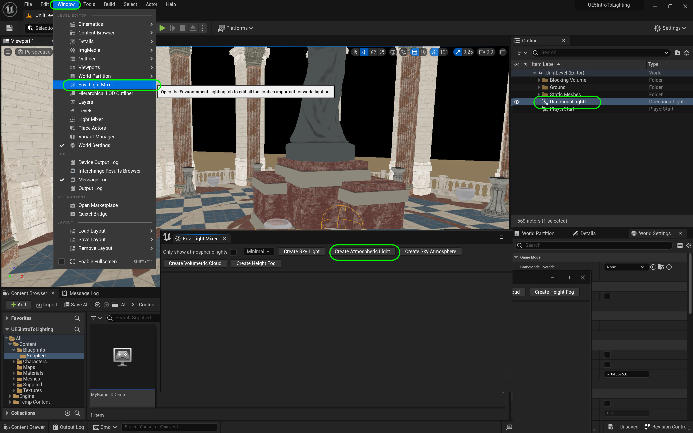
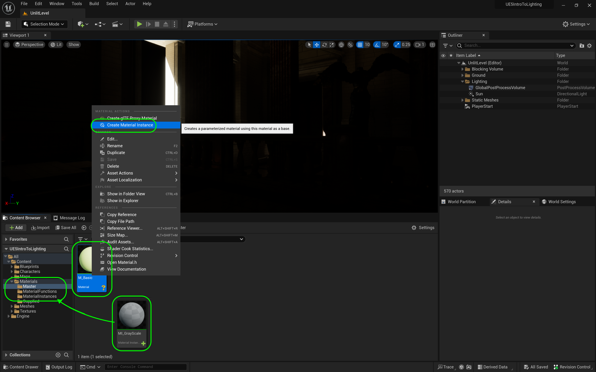

### Directional Light & Exposure

[previous](../setting-up/README.md#user-content-setting-up) • [home](../README.md#user-content-ue5-lighting) • [next](../sky-fog/README.md#user-content-sky--fog)

Lets get ready to start lighting the scene. Before we can begin we need to add the sky sphere, light up the water and add two types of fog fog.  We will also add a post processing volume to kill the auto iris so that we can light the level with a fixed exposure. We will rotate the sun to match the skybox. This will set up the very basics of the scene for this level.

 

---

##### `Step 1.`\|`ITL`|:small_blue_diamond:

Since most of this scene is lit by sun through openings in this structure we will add a **Directional Light** to the level.  The easiest way to do this is to select **Window | Env. Light Mixer** and press the <kbd>Create Atmospheric Light</kbd> which will add a **Directional Light** to the level.

The placement is irrelevant of where you put the light in the level.  It will light the entire scene.  It lights at an infinite distance (which for us is essentially how the sun behaves, it doesn't fall off like an artificial light). The position is not important.  The light shafts are parallel so the shadows are proportianal.

> The [**Directional Light**](https://docs.unrealengine.com/5.2/en-US/directional-lights-in-unreal-engine/) simulates light that is being emitted from a source that is infinitely far away. This means that all shadows cast by this light will be parallel, making this the ideal choice for simulating sunlight.  - Unreal Manual

##### `Step 2.`\|`ITL`|:small_blue_diamond: :small_blue_diamond: 

Now the sun's XYZ position in the scene doesn't matter but its rotation does.  It changes the angle of the sun (directional light).  Pressing <kbd>Cntrl L</kbd> and moving your mouse around allows you to rotate the angle (or if that doesn't work you can use the rotation gizmo).  Pick one where the sun is coming into the porch with longer shadows.

https://github.com/maubanel/UE5-Lighting/assets/5504953/34aeda08-6a57-48ac-b530-f3f6064c3fdb

##### `Step 3.`\|`ITL`|:small_blue_diamond: :small_blue_diamond: :small_blue_diamond:

We will also add a folder called `Lighting` to the **World Outliner**. We will rename the light to `Sun` and move it inside the new **Lighting** folder.

##### `Step 4.`\|`ITL&G`|:small_blue_diamond: :small_blue_diamond: :small_blue_diamond: :small_blue_diamond:

We don't want the auto iris exposure built in the game affect our lighting settings.  It is hard to light when it opens up to iris to light the scene. Move the camera to and from the front porch to the hallway and you can see that it compensates (like our eyes do or auto exposure on your camera).

So lets go add a **Volumes | Post Process Volume** to the level.  Go to **Post Process Volume Settings | Infinite Extent** and tick the box to `true`.  We want to have this volume affect every object in the world even if it falls outside this box. This allows us to appy effects to the entire level.

##### `Step 5.`\|`ITL`| :small_orange_diamond:

Now when you move the camera to and from the hallway look at the sides and the back.  You can see that the exposure is compensating just like our eyes do when moving from outdoors to indoors or vice versa.  For lighting we want to remove it, then turn it back on when we are done (if we like that effect).  Look carefully at the game and see how the exposure is dynamically changing.  This is death for lighting a scene as if we want dark and moody, it will ALWAYS brighten it up. This is where the post production volume comes in.

https://github.com/maubanel/UE5-Lighting/assets/5504953/00e305f6-8c1e-4355-8682-7a2dbaa03740

##### `Step 6.`\|`ITL`| :small_orange_diamond: :small_blue_diamond:

We are now going to set the **Min EV 100** and **Max EV 100** to the same value of `-2`.  This will stop the exposure compensation.

##### `Step 7.`\|`ITL`| :small_orange_diamond: :small_blue_diamond: :small_blue_diamond:

Now <kbd>Play</kbd> the game and notice that the camera lense is no longer compensating. We have turned auto exposure off. We will get more lighting in the indoor space when we add the full complement of environmental effects.

https://github.com/maubanel/UE5-Lighting/assets/5504953/87492283-1161-4dc7-87ba-ee72ee1b4ce7

##### `Step 8.`\|`ITL`| :small_orange_diamond: :small_blue_diamond: :small_blue_diamond: :small_blue_diamond:

Call it `GlobalPostProcessingVolume` and move it to the **Lighting** folder. 

##### `Step 9.`\|`ITL`| :small_orange_diamond: :small_blue_diamond: :small_blue_diamond: :small_blue_diamond: :small_blue_diamond:

Now before we can properly set the exposure we should have a range of spheres in the level that has white, black, mid gray and a reflective ball for the specular and reflections.  This will act as a gray card which is used on film sets to properly set the camera exposure.  In the digital world, it is no deifferent. Go to **Materials | Master** and select **M_Basic** and right mouse click to select `Create Material Instance`.  Call this new instance `MI_GrayScale`. 

Create a new folder called **Materials | Material Instances** and drag the **MI_GrayScale** material instance into it.

##### `Step 10.`\|`ITL`| :large_blue_diamond:

##### `Step 11.`\|`ITL`| :large_blue_diamond: :small_blue_diamond: 

##### `Step 12.`\|`ITL`| :large_blue_diamond: :small_blue_diamond: :
 
Now middle gray that we use in photograph as a grey card is at [18% gray](https://en.wikipedia.org/wiki/Gray_card). This mid gray is a good reference for white balance and finding the middle ground.  So our **R G B** are all `.18`, we have minimal **Specular** with `.1` and a very high roughness with `.908`.  So there is not much specularity, just mid gray.   

##### `Step 13.`\|`ITL`| :large_blue_diamond: :small_blue_diamond: :small_blue_diamond:  :small_blue_diamond: 

Now add a  **Place Actors | Shapes | Sphere** and make the **Scale** `0.65` on **X Y Z**.  Make it a bit smaller.  Place it half in sun and half in shadow and drag the **MI_GrayScale** material you just created.

##### `Step 14.`\|`ITL`| :large_blue_diamond: :small_blue_diamond: :small_blue_diamond: :small_blue_diamond:  :small_blue_diamond: 
 
Now right click on **MI_GrayScale** and select duplicate and make a `MI_White`, duplicate again and make a `MI_Black`, and duplicate a final time and make a `MI_TestBall`.  

**MI_White** is an **R G B** of `.9` which is very bright snow.  There is no pure white in nature so `0.9` is about as high as we want to go.  Make the **Specular** `.5`, leave the **Metallic** at `0` and change the **Roughness** to `.75`.

For **MI_Black** use **R G B** of `.05` which is very dark latex paint.  There is no pure dark in nature so `.05` is about as low as we want to go.  Make the **Specular** `.5`, leave the **Metallic** at `0` and change the **Roughness** to `.75`.

For **MI_Ball_Test** use **R G B** of `.9` which is very bright.  Make the **Specular** `.7`, and change the **Metallic** to `1` and change the **Roughness** to `.05`.

Now stack 4 ballls with white at the bottom, then gray, then black and silver at the top.  Create a folder called **Exposure Reference** and name the ball's accordingly. Make sure all the new materials are assigned.

##### `Step 15.`\|`ITL`| :large_blue_diamond: :small_orange_diamond: 

Now we can finally set the exposure.  Go back to the **GlobalPostProcessVolume** and when we the **Lens | Exposure** section's **Exposure Compensation** up we blow out the white, if we turn it down too low we go out to black.  We want to see good definition of the different brightness in the shade and in the light.  Pick a middle ground value that works for you.  `-1.64` works best for me to tone down the brightness.

https://user-images.githubusercontent.com/5504953/188338730-7ad547c5-51c9-45be-8147-36f5959c7f39.mp4

##### `Step 16.`\|`ITL`| :large_blue_diamond: :small_orange_diamond:   :small_blue_diamond: 

Now there are two more settings for the directional light we want to look at. Lets highlight the **Sun** directional light and adjust the **Source Angle**.  `0` is completely sharp shadows with a hard edge and anything above 0 increase the [penumbra])(https://nineplanets.org/penumbra-shadow/).  The more clouds the larger the penumbra, and the less clouds with very clear air the crisper the shadows.  If you look at the specular in the silver ball the sun also gets more diffuse the larger the number.

You can also adjust the **Soft Source Angle**.  This affects mostly the specular.  Look at the reflection ball and it softens the lights sources.  I liked a **Source Angle** of `3.28` and a **Source Soft Angle** of `1.68`.

https://user-images.githubusercontent.com/5504953/188339500-3b148242-a80a-4ba1-a077-382c042615e2.mp4

##### `Step 17.`\|`ITL`| :large_blue_diamond: :small_orange_diamond: :small_blue_diamond: :small_blue_diamond:

Now you can also change between the engine doing the shadows through software or through ray tracing if you have a ray tracing gpu.  Go to the **Sun** directional light and select **Cast Ray Traced Shadows**.  Switch between **Use Project Settings** and **Enabled**.  YOu can see there is some noise in the ray traced shadows by they are a bit more detailed and subtle.

https://user-images.githubusercontent.com/5504953/188353653-4173684f-bd9a-4381-8c49-209331c0ace1.mp4

##### `Step 18.`\|`ITL`| :large_blue_diamond: :small_orange_diamond: :small_blue_diamond: :small_blue_diamond: :small_blue_diamond:

*Press* the <kbd>Play</kbd> button and run around.  Now our exposure is good for the bright end of the front porch but is too dark inside.  We will address that next.

https://user-images.githubusercontent.com/5504953/188353839-975604cb-cd71-40ba-9c2d-580806d8ef38.mp4

##### `Step 19.`\|`ITL`| :large_blue_diamond: :small_orange_diamond: :small_blue_diamond: :small_blue_diamond: :small_blue_diamond: :small_blue_diamond:

Select the **File | Save All** then press the <kbd>Source Control</kbd> button and select **Submit Content**.  If you are prompted, select **Check Out** for all items that are not checked out of source control. Update the **Changelist Description** message and with the latest changes. Make sure all the files are correct and press the <kbd>Submit</kbd> button. A confirmation will pop up on the bottom right with a message about a changelist was submitted with a commit number.

<!--  -->

| [previous](../setting-up/README.md#user-content-setting-up)| [home](../README.md#user-content-ue5-lighting) | [next](../sky-fog/README.md#user-content-sky--fog)|
|---|---|---|
