### Add Dynamics To Mobility

[previous](../mobility/README.md#user-content-actor--light-mobility) • [home](../README.md#user-content-ue4-lighting) • [next](../)

Now having the different modes are necessary for certain abilities.  Lets make sure that when lights and static meshes are marked as either **Stationary** or **Movable** that we are doing it to the light and the mesh.

 

---

##### `Step 1.`\|`ITL`|:small_blue_diamond:

Now the easiest thing for us to do is to add our existing flickering light to the **Stationary Lights**.  This is affecting this light without moving it.  You can select all lights that are marked as **Stationary** and drab **M_FlickerFlame** into the **Light Function Material** which will make all three lights flicker.

##### `Step 2.`\|`FHIU`|:small_blue_diamond: :small_blue_diamond: 
Now lets rotate the static mesh we created.  Go to one of the **SM_ShadowCubes** that is in an area that is marked as **Movable Object**.  Click on the **Blueprint/Add Script**.  Select the **Blueprints** folder and call the blueprint `BP_MovingCubes`. Keep the default parent class and press the <kbd>Select</kbd> button.

##### `Step 3.`\|`ITL`|:small_blue_diamond: :small_blue_diamond: :small_blue_diamond:

Open up **BP_MovingCubes** and add a **Float X float** node to multiply to floats.  Connect the **Delta Seconds** output from the **Event Tick** into the top side of the multiply pin. Set the bottom value to `50.0`.  Add a comment of `Degrees per Second`.  This will dictate how many degrees the cubes will turn per second.

##### `Step 4.`\|`ITL`|:small_blue_diamond: :small_blue_diamond: :small_blue_diamond: :small_blue_diamond:

Add a **Make Rotator** node.  Attach the output of **X** to the **Z(Yaw)** of the rotator.  We want to rotate around Z (remember z is up so it will rotate like a turntable). Add an **Actor Local Rotation** node and connect the **Return Value** of the **Make Rotator Node** to its **Delta Rotation** input pin.  Connect the execution pin from **Event Tick** to **Add Actor Local Rotation**.  Press the <kbd>Compile</kbd> button. 

##### `Step 5.`\|`ITL`| :small_orange_diamond:

Play the game and make sure that the cube actually turns!

https://user-images.githubusercontent.com/5504953/131739199-1c5f8d20-b7c0-4823-b21c-96bbf2d78e7a.mp4

##### `Step 6.`\|`ITL`| :small_orange_diamond: :small_blue_diamond:

Now if you select **BP_Moving_Cube** in the **Content Browser** you can right click on other two **Static Meshes** that are set to **Movable**.  Select the **Replace Selected Actors with BP_MovingCube**.

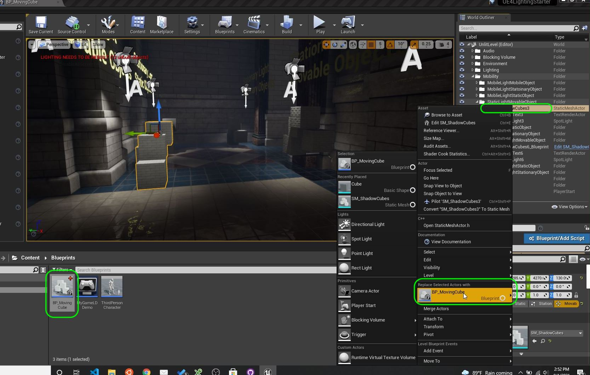

##### `Step 7.`\|`ITL`| :small_orange_diamond: :small_blue_diamond: :small_blue_diamond:

Now hit play and make sure that the three movable static meshes rotate.

https://user-images.githubusercontent.com/5504953/131740035-507a6f3d-35dc-4ed5-a412-1d786cfbe2c1.mp4

##### `Step 8.`\|`ITL`| :small_orange_diamond: :small_blue_diamond: :small_blue_diamond: :small_blue_diamond:

Now lets animated a moving light.  Select a spot light that is marked as **Movable** and press the **Blueprint/Add Script** and select the **Blueprints** folder and call the file `BP_MobileSpotlight`. Press the <kbd>Select</kbd> button.

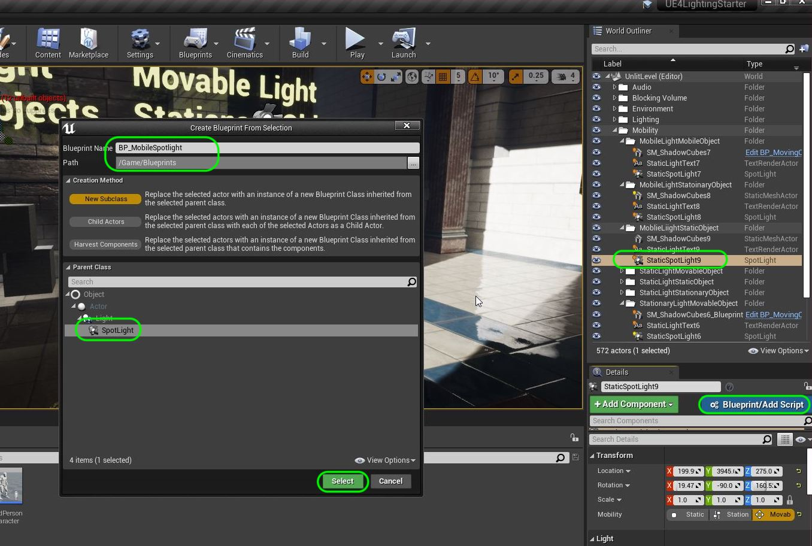

##### `Step 9.`\|`ITL`| :small_orange_diamond: :small_blue_diamond: :small_blue_diamond: :small_blue_diamond: :small_blue_diamond:

Lets add a **Custom Event** node to this blueprint and call it `Animate Light`.

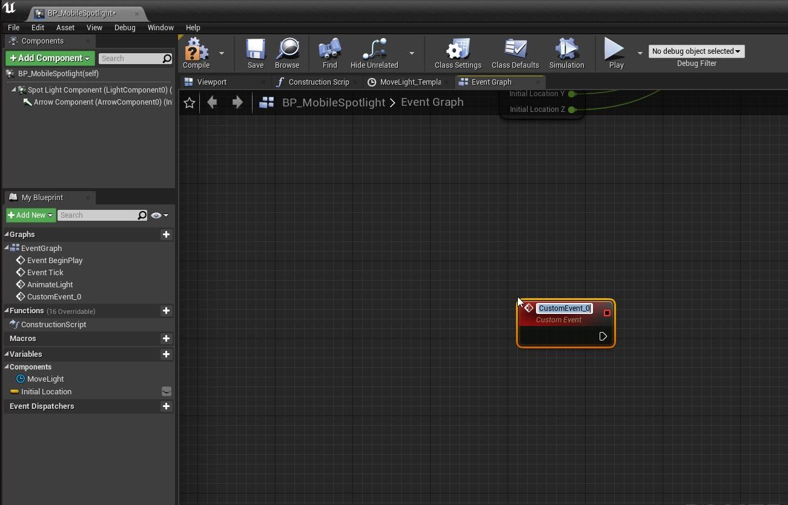

##### `Step 10.`\|`ITL`| :large_blue_diamond:

Add a **Timeline** node and call it `Move Light`. Connect the execution pin from **Animate Light** to **Play From Start**.

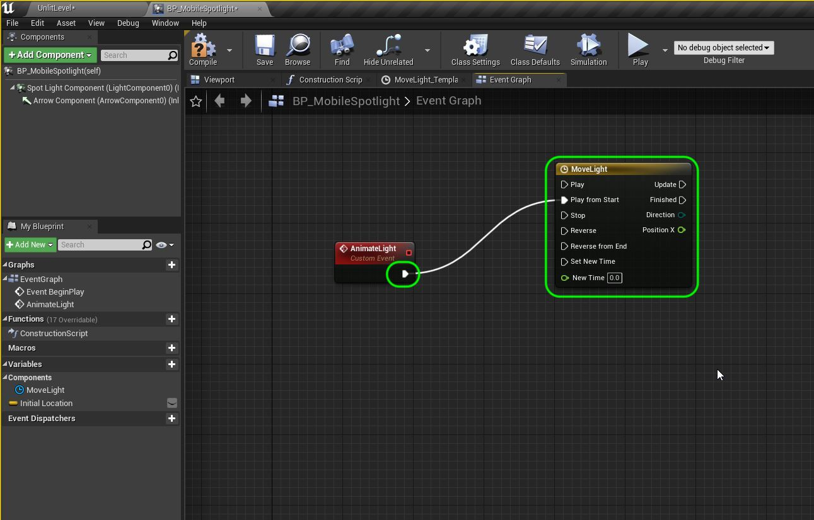

##### `Step 11.`\|`ITL`| :large_blue_diamond: :small_blue_diamond: 

Double click the timeline to open it up.  Change the **Length** to `10.0`.  Press the **F+** button to add a float curve.  Right click the name and select **Rename** and call this curve `Position X`.  

On the open graph right mouse click and then select **Add key to CurveFLoat0**.  This puts a diamond and click on it and set the **Time** and **Value** to `0`.

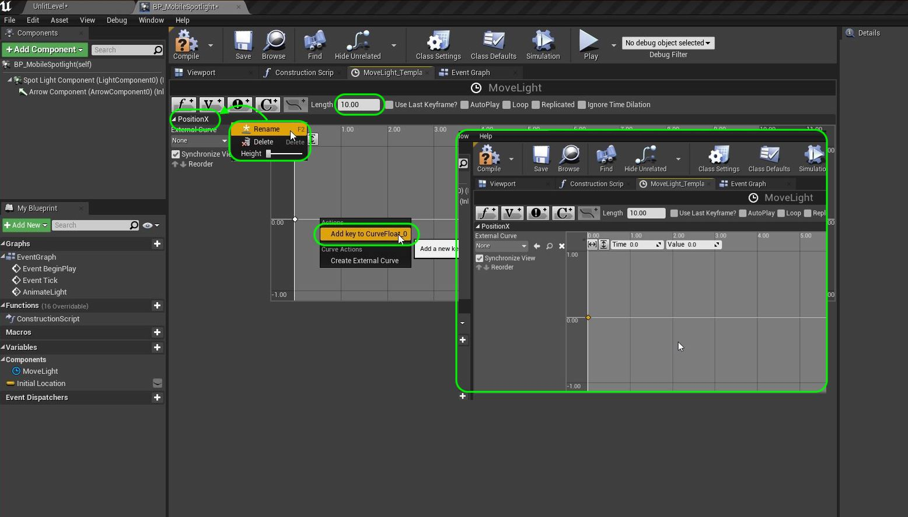

##### `Step 12.`\|`ITL`| :large_blue_diamond: :small_blue_diamond: :small_blue_diamond: 

Add a second key at **Time** `2.5` and **Value** of `1.0`. Add a third key at **Time** `5` and **Value** of `0.0`. Add a fourth key at **Time** `7.5` and **Value** of `-1.0` and finally a fifth key  at **Time** `10` and **Value** of `0`.  It should look like the graph I have.

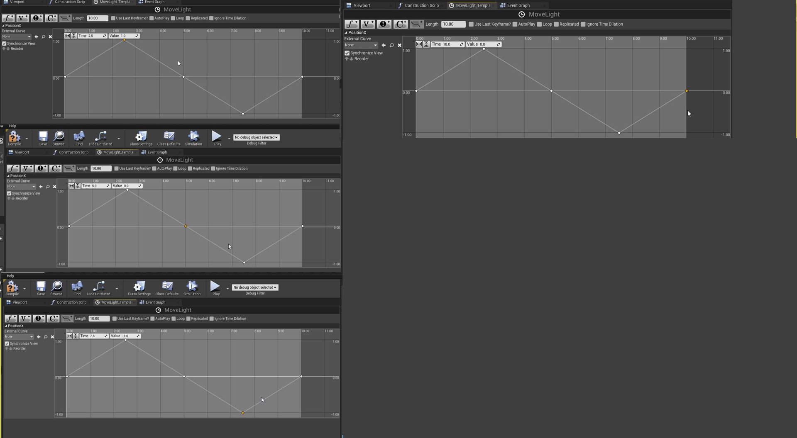

##### `Step 13.`\|`ITL`| :large_blue_diamond: :small_blue_diamond: :small_blue_diamond:  :small_blue_diamond: 

By left clicking a box around all 5 key points select them so they are all bright orange.  Then right click and select **Auto**.  This will turn the linear interpolation into a nice curve.  This is all we need for the timeline.  What it will do is over 10 seconds will pull a value from the curve between -1 and 1 with nice ease in and ease out.

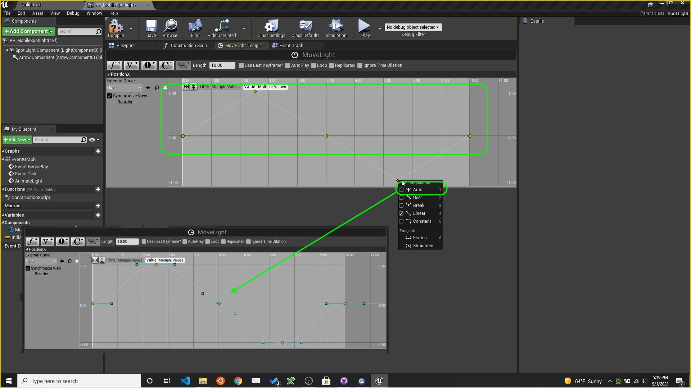

##### `Step 14.`\|`ITL`| :large_blue_diamond: :small_blue_diamond: :small_blue_diamond: :small_blue_diamond:  :small_blue_diamond: 

Press the **+** icon next to **Variable** to add a variable to the blueprint.  Select **Type** `Vector` and call it `Initial Location`.

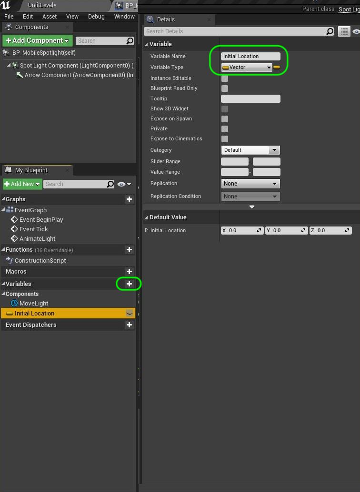

##### `Step 15.`\|`ITL`| :large_blue_diamond: :small_orange_diamond: 

Next to the existing **Event BeginPlay** node add a **Get Actor Location** location node.  Pull off of the **Get Actor Location | Return Value** pin and select **Set Initial Location**.  This will store the starting point of the light in the room (its current position).  Add a **Animate Light** node to call the custom function below.  Connect the execution pins.

We need to know the startin point so we can move to and from there (we use the timeline to displace the light along the X axis).  The **Begin Play** node runs **ONCE** when the game is started and it runs the custom event **Animate Lights**.

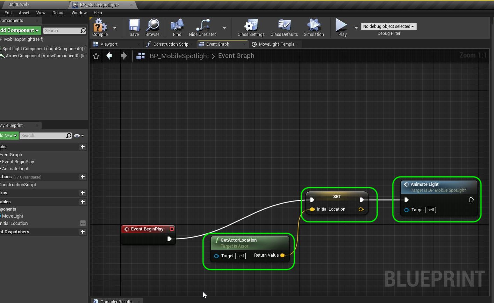

##### `Step 16.`\|`ITL`| :large_blue_diamond: :small_orange_diamond:   :small_blue_diamond: 

Go back to the custom event on the graph and add a **Get Initial Location** pin. Then we just want to adjust the **X** axis of the light so we want to access this location seperately.  Right mouse click on the node and pick **Split Struct Pin**.  This separates the set of **X,Y,Z** values into seperate pins.

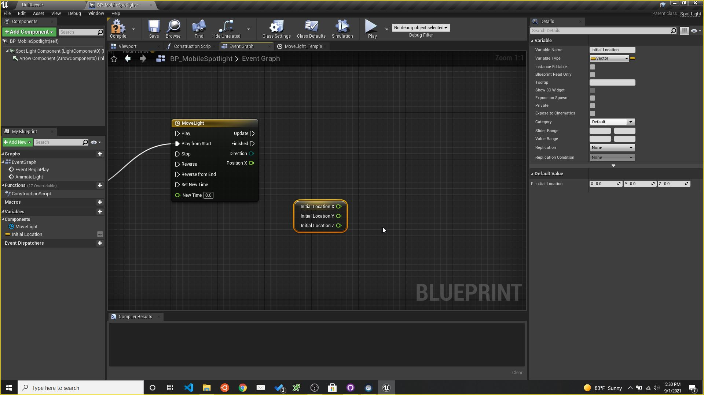

##### `Step 17.`\|`ITL`| :large_blue_diamond: :small_orange_diamond: :small_blue_diamond: :small_blue_diamond:

Now we want to alter our X axis so the light moves left and right.  The amount of offset will be read on the curve coming from **Position X** in the timeline.  Now this will only move 1cm to the right and left so we want add a **Float X Float** multiply node and adjust the value to `75`. This way the light will move 75cm to the left and right (-75cm to 75 cm from its initial position in the room). 

Then we add a **float + float** node to add this new offset to the **Initial Location X** pin. 

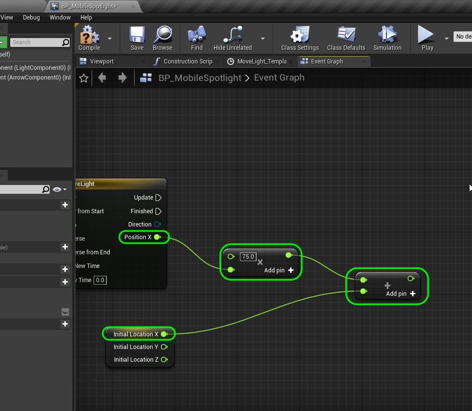

##### `Step 18.`\|`ITL`| :large_blue_diamond: :small_orange_diamond: :small_blue_diamond: :small_blue_diamond: :small_blue_diamond:

Now we are ready to translate the light to the new spot in the room.  Add a **Set Actor Location** node and right click on **New Location** and select **Split Struct Pin**.

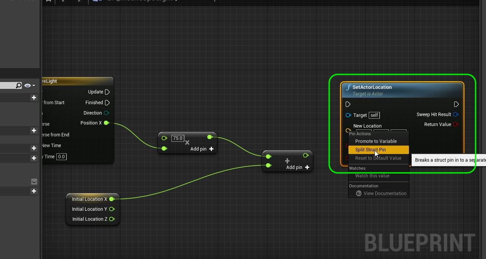

##### `Step 19.`\|`ITL`| :large_blue_diamond: :small_orange_diamond: :small_blue_diamond: :small_blue_diamond: :small_blue_diamond: :small_blue_diamond:

Every frame the **Timeline** will move along the graph for 10 seconds.  Connect the **Update** execution pin from the timeline to the **SetActorLocation** pin.  This will set the actor's new location.

Connect the output of the **+** pin to the **New X Location** pin.  Connect the **Initial Location Y** and **Initial Location X** to the **New Location Y** and **New Location X** pins.  These two axis are not moving so the values will stay the same. 

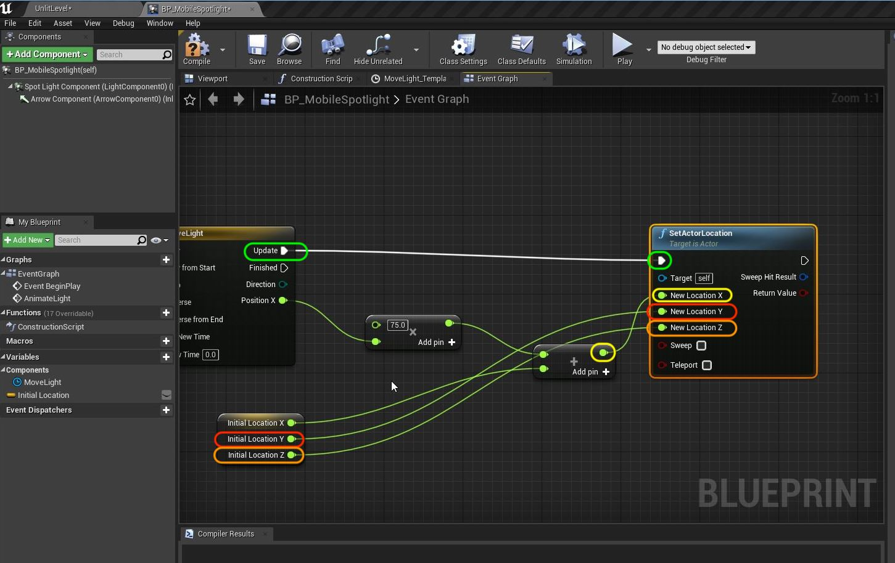

##### `Step 20.`\|`ITL`| :large_blue_diamond: :large_blue_diamond:

Now this will only animate the light for 10 seconds as the timeline stops at the end.  Pull from the **Finished Pin** and select **Animate Light** to restart this custom event again.  This way the light will keep animating the entire time this leve is being played. Press the <kbd>Compile</kbd> button to finish up.

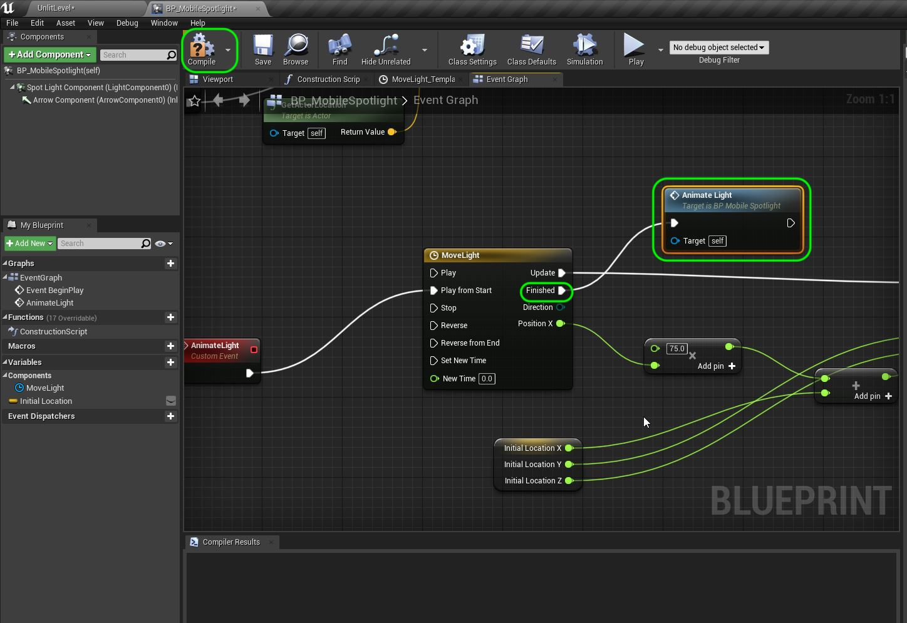

##### `Step 21.`\|`ITL`| :large_blue_diamond: :large_blue_diamond: :small_blue_diamond:

Convert all three movable lights to the **BP_Movable_Spotlight** and run the game.  Look at how the shadow updates dynaimically with this light! Again, this light is the most expensive and should be used only when necessary.

https://user-images.githubusercontent.com/5504953/131831850-56fc6a79-3117-4db4-99d6-04fd9cfbba8b.mp4

##### `Step 22.`\|`ITL`| :large_blue_diamond: :large_blue_diamond: :small_blue_diamond: :small_blue_diamond:

Now these are the most common lighting combinations using the **Mobility** setting.  Notice that they have a large performance impact as well as a visual one.  You need to think about what mobility setting the objects have in your game levels.  Press the <kbd>Build<kbd> button to rebuild the lighting. 
  
Now play the game and look at all 9 combinations.

https://user-images.githubusercontent.com/5504953/131832538-0feb20ea-c523-40f8-bfc9-49321dd0569e.mp4

##### `Step 23.`\|`ITL`| :large_blue_diamond: :large_blue_diamond: :small_blue_diamond: :small_blue_diamond: :small_blue_diamond:

Press **File | Save All** and press **Source Control |  Submit to Source Control...** and enter a **Description** then press the <kbd>Submit</kbd> button. Open up **GitHub Desktop** and press the <kbd>Push</kbd> button. Now we are updated.

___

| [previous](../mobility/README.md#user-content-actor--light-mobility)| [home](../README.md#user-content-ue4-lighting) | [next](../)|
|---|---|---|
