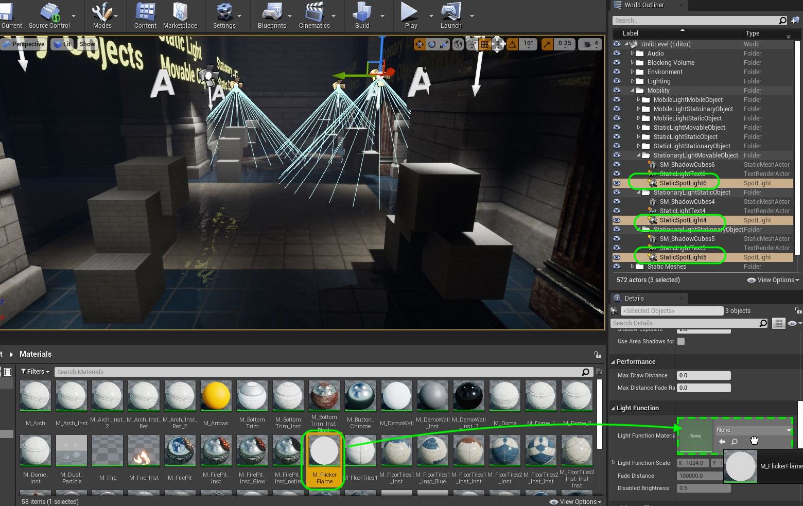
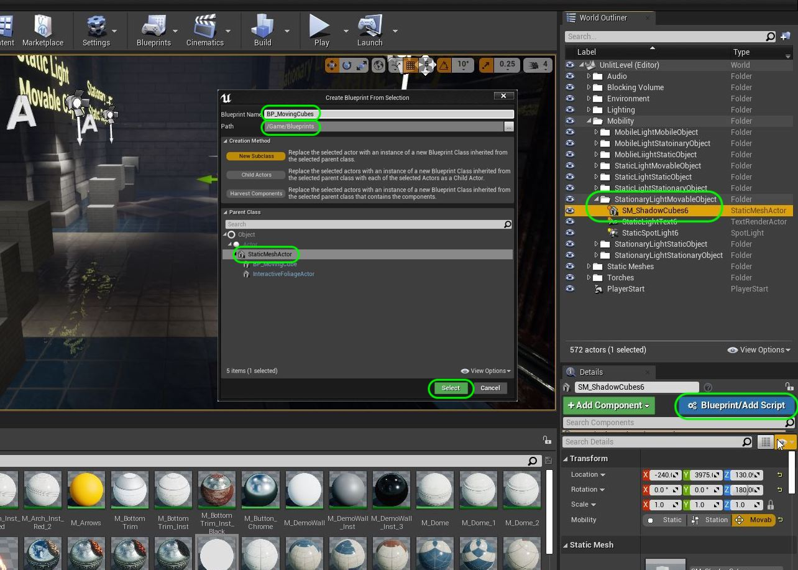
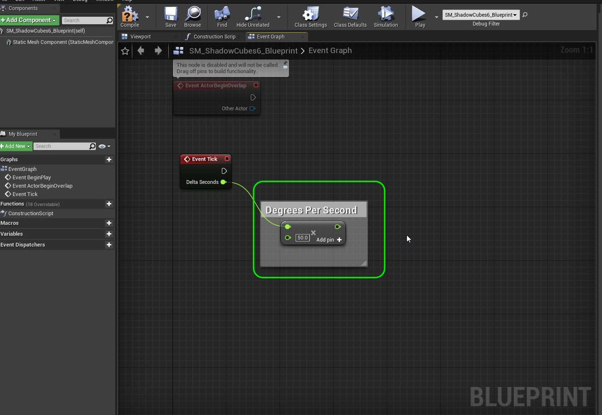
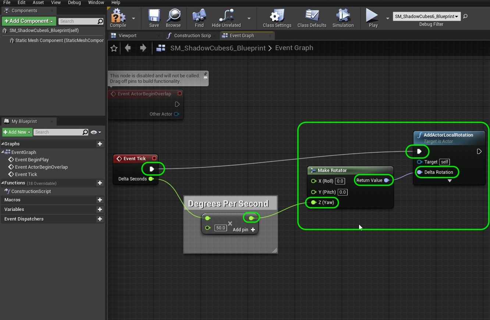

### Add Dynamics To Mobility

[previous](../mobility/README.md#user-content-actor--light-mobility) • [home](../README.md#user-content-ue4-lighting) • [next](../)

Now having the different modes are necessary for certain abilities.  Lets make sure that when lights and static meshes are marked as either **Stationary** or **Movable** that we are doing it to the light and the mesh.

 

---

##### `Step 1.`\|`ITL`|:small_blue_diamond:

Now the easiest thing for us to do is to add our existing flickering light to the **Stationary Lights**.  This is affecting this light without moving it.  You can select all lights that are marked as **Stationary** and drab **M_FlickerFlame** into the **Light Function Material** which will make all three lights flicker.

##### `Step 2.`\|`FHIU`|:small_blue_diamond: :small_blue_diamond: 
Now lets rotate the static mesh we created.  Go to one of the **SM_ShadowCubes** that is in an area that is marked as **Movable Object**.  Click on the **Blueprint/Add Script**.  Select the **Blueprints** folder and call the blueprint `BP_MovingCubes`. Keep the default parent class and press the <kbd>Select</kbd> button.

##### `Step 3.`\|`ITL`|:small_blue_diamond: :small_blue_diamond: :small_blue_diamond:

Open up **BP_MovingCubes** and add a **Float X float** node to multiply to floats.  Connect the **Delta Seconds** output from the **Event Tick** into the top side of the multiply pin. Set the bottom value to `50.0`.  Add a comment of `Degrees per Second`.  This will dictate how many degrees the cubes will turn per second.

##### `Step 4.`\|`ITL`|:small_blue_diamond: :small_blue_diamond: :small_blue_diamond: :small_blue_diamond:

Add a **Make Rotator** node.  Attach the output of **X** to the **Z(Yaw)** of the rotator.  We want to rotate around Z (remember z is up so it will rotate like a turntable). Add an **Actor Local Rotation** node and connect the **Return Value** of the **Make Rotator Node** to its **Delta Rotation** input pin.  Connect the execution pin from **Event Tick** to **Add Actor Local Rotation**.  Press the <kbd>Compile</kbd> button. 

##### `Step 5.`\|`ITL`| :small_orange_diamond:

Play the game and make sure that the cube actually turns!

https://user-images.githubusercontent.com/5504953/131739199-1c5f8d20-b7c0-4823-b21c-96bbf2d78e7a.mp4

##### `Step 6.`\|`ITL`| :small_orange_diamond: :small_blue_diamond:

##### `Step 7.`\|`ITL`| :small_orange_diamond: :small_blue_diamond: :small_blue_diamond:

##### `Step 8.`\|`ITL`| :small_orange_diamond: :small_blue_diamond: :small_blue_diamond: :small_blue_diamond:

##### `Step 9.`\|`ITL`| :small_orange_diamond: :small_blue_diamond: :small_blue_diamond: :small_blue_diamond: :small_blue_diamond:

##### `Step 10.`\|`ITL`| :large_blue_diamond:

##### `Step 11.`\|`ITL`| :large_blue_diamond: :small_blue_diamond: 

##### `Step 12.`\|`ITL`| :large_blue_diamond: :small_blue_diamond: :small_blue_diamond: 

##### `Step 13.`\|`ITL`| :large_blue_diamond: :small_blue_diamond: :small_blue_diamond:  :small_blue_diamond: 

##### `Step 14.`\|`ITL`| :large_blue_diamond: :small_blue_diamond: :small_blue_diamond: :small_blue_diamond:  :small_blue_diamond: 

##### `Step 15.`\|`ITL`| :large_blue_diamond: :small_orange_diamond: 

##### `Step 16.`\|`ITL`| :large_blue_diamond: :small_orange_diamond:   :small_blue_diamond: 

##### `Step 17.`\|`ITL`| :large_blue_diamond: :small_orange_diamond: :small_blue_diamond: :small_blue_diamond:

##### `Step 18.`\|`ITL`| :large_blue_diamond: :small_orange_diamond: :small_blue_diamond: :small_blue_diamond: :small_blue_diamond:

##### `Step 19.`\|`ITL`| :large_blue_diamond: :small_orange_diamond: :small_blue_diamond: :small_blue_diamond: :small_blue_diamond: :small_blue_diamond:

##### `Step 20.`\|`ITL`| :large_blue_diamond: :large_blue_diamond:

##### `Step 21.`\|`ITL`| :large_blue_diamond: :large_blue_diamond: :small_blue_diamond:

___

| [previous](../mobility/README.md#user-content-actor--light-mobility)| [home](../README.md#user-content-ue4-lighting) | [next](../)|
|---|---|---|
