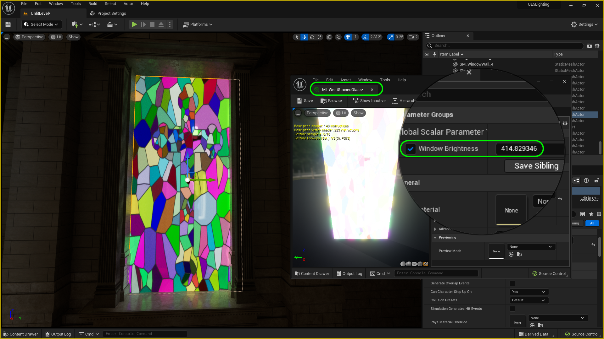
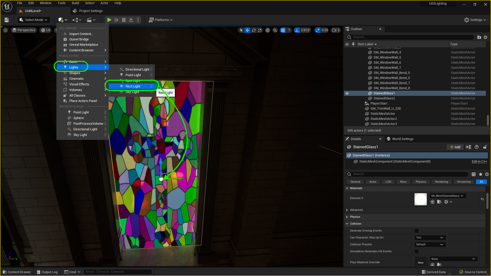
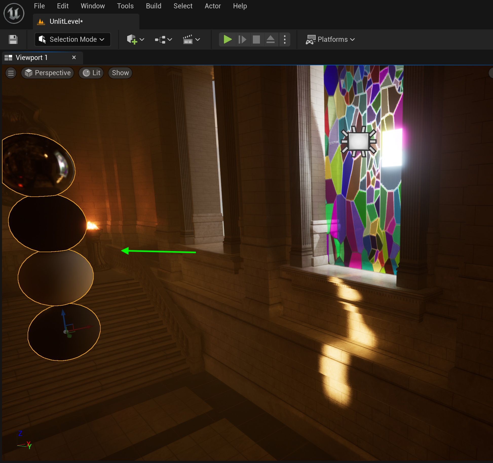
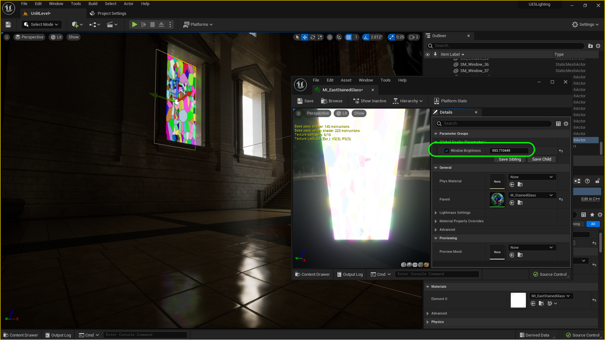
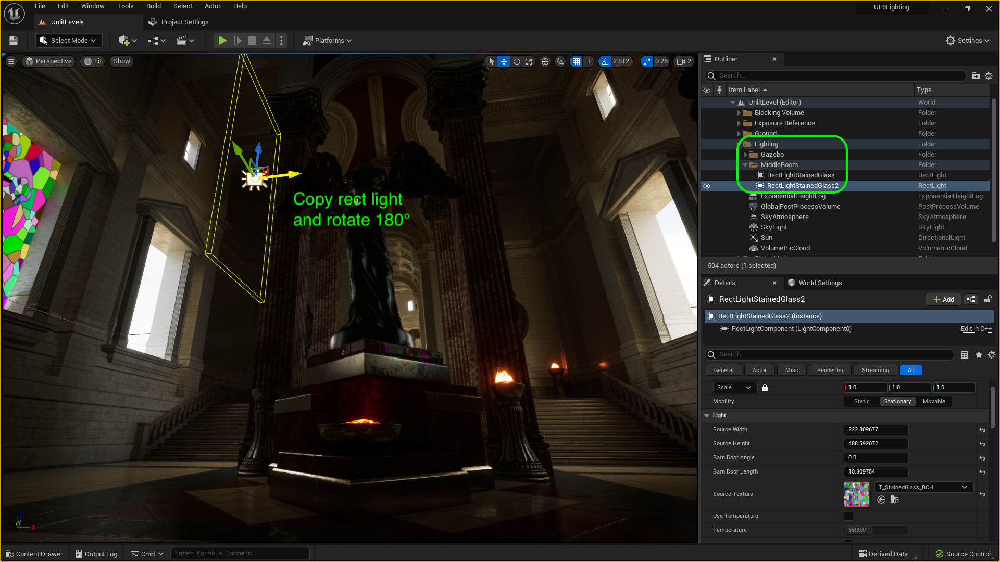
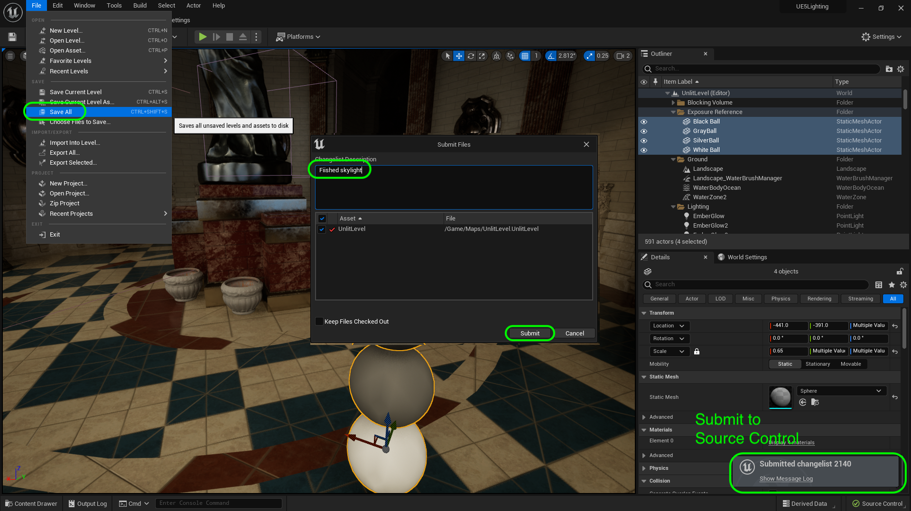

### Global Illumination & Rect Light

[previous](../point-lights/README.md#user-content-point-lights) • [home](../README.md#user-content-ue5-lighting) • [next](../light-functions/README.md#user-content-light-functions)

Unreal 5's big improvement is real-time global illumination with Lumen.  This is why we have not baked any light and set the mobility to movable to have **ALL** real time lights. 

>Lumen is Unreal Engine 5's fully dynamic global illumination and reflections system that is designed for next-generation consoles, and it is the default global illumination and reflections system. Lumen renders diffuse interreflection with infinite bounces and indirect specular reflections in large, detailed environments at scales ranging from millimeters to kilometers. - [UE5 Manual](https://docs.unrealengine.com/5.0/en-US/lumen-global-illumination-and-reflections-in-unreal-engine/)

 

---

##### `Step 1.`\|`ITL`|:small_blue_diamond:

Lets move on to the middle room.  Duplicate the four exposure spheres by holding the <kbd>Alt</kbd> key while moving the widget direction arrow.  If you press the <kbd>Shift</kbd> key as well you the camera will move with the exposure spheres.  and move them to the front part of the middle room in front of the statue. 

https://github.com/maubanel/UE5-Lighting/assets/5504953/b28bf8c6-9c1a-4fb0-b468-a89d4ef5e9a6

##### `Step 2.`\|`ITL`|:small_blue_diamond: :small_blue_diamond: 

Now lets look at the magic of Lumen.  We now have real time global illumination in the engine.  Select the **Directional Light** (Sun) and adjust the **Indirect Lighting Intensity**. This adjusts how much the indirect light bounces off surfaces to light up surrounding areas.  I increased to `50` to show off how much it can affect the lighting but put it back to `8` which is a good amount of indirect light.

https://github.com/maubanel/UE5-Lighting/assets/5504953/5b301034-52ff-40f0-8755-3d0f9c2bddc5

##### `Step 3.`\|`ITL`|:small_blue_diamond: :small_blue_diamond: :small_blue_diamond:

You can turn **Lumen** off in **Project Settings** (for the whole game) or in the **Post Production Volume** for this level only. If you turn Lumen off in my case the lighting blooms out and becomes much flatter. This is the power of ray tracing and really makes the overall look more realistic and more dramatic.

https://github.com/maubanel/UE5-Lighting/assets/5504953/2671396d-d7fb-4181-8451-9fb3cdbdc989

##### `Step 4.`\|`ITL`|:small_blue_diamond: :small_blue_diamond: :small_blue_diamond: :small_blue_diamond:

Now we have another powerful tool we can adjust on the various lights.  Select the **Sun** (Directional Light) and change the **Volumetric Scattering Intensity** to `100`.  You can see that the volumetric fog now picks up the light and it much more visible. Now I want to have a bit of dramatic fog inside so I liked a setting of `3.25`.

https://github.com/maubanel/UE5-Lighting/assets/5504953/cb0fc6a4-a8ef-4e5c-a9e5-cab86f28cc2d

##### `Step 5.`\|`ITL`| :small_orange_diamond:

*Press* the <kbd>Play</kbd> button and now you have a moodier feel and really nice bloom where we have the sun pass in front of the camera as we turn.  The middle room is a bit brighter than before.

https://github.com/maubanel/UE5-Lighting/assets/5504953/568f3d78-5837-470d-9c5a-cf76b36c6414

##### `Step 6.`\|`ITL`| :small_orange_diamond: :small_blue_diamond:

Now some of the torches there have flames. *Click* on the coals on the torch in front of the status.  *Double click* on **M_Fire_Inst** and then *double click* on its **Parent** material called **M_Fire**. *Connect* the output of the **Multiply** node to the **Emissive Color** node in the shader. Now press the <kbdA>pply</kbd>button and now we have a flame.  Look at it in the reflection of the metallic part at the base of the statue.

https://github.com/maubanel/UE5-Lighting/assets/5504953/0a16086d-d1cd-41a4-8fd5-24fe45071615

##### `Step 7.`\|`ITL`| :small_orange_diamond: :small_blue_diamond: :small_blue_diamond:

Look at the flames in the corner and you can see it in the reflection and does affect the Global Illumination.  

##### `Step 8.`\|`ITL`| :small_orange_diamond: :small_blue_diamond: :small_blue_diamond: :small_blue_diamond:

##### `Step 9.`\|`ITL`| :small_orange_diamond: :small_blue_diamond: :small_blue_diamond: :small_blue_diamond: :small_blue_diamond:

##### `Step 10.`\|`ITL`| :large_blue_diamond:

##### `Step 11.`\|`ITL`| :large_blue_diamond: :small_blue_diamond: 

##### `Step 12.`\|`ITL`| :large_blue_diamond: :small_blue_diamond: :small_blue_diamond: 

Select the stained glass window in the middle room that has the **MI_WestStainedGlass** material. Make any adjustments to the window to minimize leaking of light from the outside.

##### `Step 13.`\|`ITL`| :large_blue_diamond: :small_blue_diamond: :small_blue_diamond:  :small_blue_diamond: 

Open up **MI_WestStainedGlass** and adjust the **Window Brightness**.  I liked a value of ~`415`.  Notice that it again glows and affects the near environment.

##### `Step 14.`\|`ITL`| :large_blue_diamond: :small_blue_diamond: :small_blue_diamond: :small_blue_diamond:  :small_blue_diamond: 

Now we could make this material translucent and use the sunlight coming through but this would be very expensive.  There is a light that will do the work for us that will make it look like sun is coming through this window.  Go to **Add Actor | Lighting | Rect Light** and pull it over the window.

##### `Step 15.`\|`ITL`| :large_blue_diamond: :small_orange_diamond: 

Now move the exposure balls in front of the window.  Make sure the rect light is pointing inside the room (it only goes in one direction). In this case I need to rotate it on **Z** `180`°. Play the game and make any other adjustmets you would like!

##### `Step 16.`\|`ITL`| :large_blue_diamond: :small_orange_diamond:   :small_blue_diamond: 

First select the **Rect Light** and adjust the **Attenuation Radius**.  Make it slightly larger than the room so the light affects the entire area. Adjust the **Intensity** and use the exposure balls as a reference for brightness.  Tune to your taste. 

Adjust the **Source Width** and **Source Height** so it is the exact size of the window.  Make sure the rear plane fits perfectly in the sill.  Then adjust the **Barn Door Length** and **Barn Door Angle** setting to create a soft shadow fall off on the window sill to taste.

Now the one unique item of the rect light is that you can use a texture that will change each pixel of the light to match the color of the texture.  In this case we will use the same texture of the window in the **Source Texture** and assign `T_StainedGlass_BCH`. Notice that it now lights up the scene in color!

https://user-images.githubusercontent.com/5504953/189341003-dc00df69-6818-4f53-8529-fd48097ef5ea.mp4

##### `Step 17.`\|`ITL`| :large_blue_diamond: :small_orange_diamond: :small_blue_diamond: :small_blue_diamond:

Now we repeat theis for the east side window.  Now in my case the sun is facing from the east so it will be brighter than the west side.  First select **MI_EastStainedGlass** and adjust the **Window Brightness**.

##### `Step 18.`\|`ITL`| :large_blue_diamond: :small_orange_diamond: :small_blue_diamond: :small_blue_diamond: :small_blue_diamond:

Rename in **Outliner** the first rect light as `RectLightStainedGlass`.  Create a new folder in **Lighting** called `MiddleRoom` and drag this rect light in there.  Copy the first rect light, rotate it 180° and put it in the opposite side window.

##### `Step 19.`\|`ITL`| :large_blue_diamond: :small_orange_diamond: :small_blue_diamond: :small_blue_diamond: :small_blue_diamond: :small_blue_diamond:

Since this light was on the brighter side I added some **Indirect Lighting Intensity**, and increased the **Intensity** of the light.  Play and look at the reflections and light that these two windows add to the scene.

https://user-images.githubusercontent.com/5504953/189345562-b2096d5c-20a3-48d8-88a0-6c1b3b5a26e9.mp4

##### `Step 20.`\|`ITL`| :large_blue_diamond: :large_blue_diamond:

Select the **File | Save All** then press the <kbd>Source Control</kbd> button and select **Submit Content**.  If you are prompted, select **Check Out** for all items that are not checked out of source control. Update the **Changelist Description** message and with the latest changes. Make sure all the files are correct and press the <kbd>Submit</kbd> button. A confirmation will pop up on the bottom right with a message about a changelist was submitted with a commit number. Quit Unreal and make sure your **Pending** tab in **P4V** is empty. **Submit** any work that is still in the editor.

<!--  -->

| [previous](../point-lights/README.md#user-content-point-lights)| [home](../README.md#user-content-ue5-lighting) | [next](../light-functions/README.md#user-content-light-functions)|
|---|---|---|
