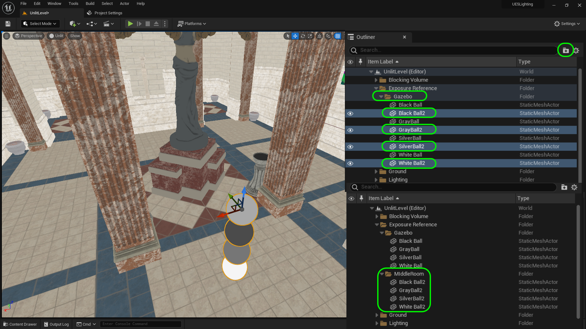

### Global Illumination & Rect Light

[previous](../point-lights/README.md#user-content-point-lights) • [home](../README.md#user-content-ue5-lighting) • [next](../light-functions/README.md#user-content-light-functions)

Unreal 5's big improvement is real-time global illumination with Lumen.  This is why we have not baked any light and set the mobility to movable to have **ALL** real time lights. 

>Lumen is Unreal Engine 5's fully dynamic global illumination and reflections system that is designed for next-generation consoles, and it is the default global illumination and reflections system. Lumen renders diffuse interreflection with infinite bounces and indirect specular reflections in large, detailed environments at scales ranging from millimeters to kilometers. - [UE5 Manual](https://docs.unrealengine.com/5.0/en-US/lumen-global-illumination-and-reflections-in-unreal-engine/)

 

---

##### `Step 1.`\|`ITL`|:small_blue_diamond:

Lets move on to the middle room.  Put the four exposure balls into a **Gazebo** folder.  Duplicate them and move them the copy to the front part of the middle room (in front of the statue). Select the four new balls and press the <kbd>Folder</kbd> button to place them in a new folder called `Middle Room`. Move it to root of the **Exposure REference** folder.

##### `Step 2.`\|`ITL`|:small_blue_diamond: :small_blue_diamond: 

Put the ember glow point lights in a folder called **Gazebo** to clean up our **Outliner**.

##### `Step 3.`\|`ITL`|:small_blue_diamond: :small_blue_diamond: :small_blue_diamond:

Now the middle room is quite dark as it is not nearly as bright as the outdoor gazebo.  We do not want to adjust the lights to compensate as this will throw off the front room.  We will adjust the exposure in the room as if we moved a real camera from outside to indoors.  So go to the **GlobalPostProductionVolume** and go to the **Lens | Exposure** tab. I adjusted the **Exposure Compensation** to a value of `1.0`. This is a little on the dark side but we will be adding some more lights to this room and want to leave it somewhat dark for dramatic effect.

##### `Step 4.`\|`ITL`|:small_blue_diamond: :small_blue_diamond: :small_blue_diamond: :small_blue_diamond:

Now lets look at the magic of Lumen.  We now have real time global illumination in the engine.  Select the **Directional Light** (Sun) and adjust the **Indirect Lighting Intensity**. This adjusts how much the indirect light bounces off surfaces to light up surrounding areas.  I increased to `100` to show off how much it can affect the lighting but put it back to `20` which is a good amount of indirecdt light.

https://user-images.githubusercontent.com/5504953/189326383-b6c20801-1054-4230-8661-bf57385772dd.mp4

##### `Step 5.`\|`ITL`| :small_orange_diamond:

You can turn **Lumen** off in **Project Settings** (for the whole game) or in the **Post Production Volume** for this level only. If you turn Lumen off in my case the lighting blooms out and becomes much flatter.  If I adjust the exposure down to `-4` I get a very flat lighting without the dramatic difference between outdoors and indoors.

##### `Step 6.`\|`ITL`| :small_orange_diamond: :small_blue_diamond:

Now we have another powerful tool we can adjust on the various lights.  Select the **Sun** (Directional Light) and change the **Volumetric Scattering Intensity** to `100`.  You can see that the volumetric fog now picks up the light and it much more visible. Now I want to have a bit of dramatic fog inside so I liked a setting of `10`.

https://user-images.githubusercontent.com/5504953/189334563-8338f094-8ef7-4313-81d6-87ec54f59cb0.mp4

##### `Step 7.`\|`ITL`| :small_orange_diamond: :small_blue_diamond: :small_blue_diamond:

*Press* the <kbd>Play</kbd> button and now you have a moodier feel and really accentuate the rays coming in through the hallway.

##### `Step 8.`\|`ITL`| :small_orange_diamond: :small_blue_diamond: :small_blue_diamond: :small_blue_diamond:

Now some of the torches there have flames. Open up **M_Fire** and connect the output of the **Multiply** node to the **Emissive Color** node in the shader.

##### `Step 9.`\|`ITL`| :small_orange_diamond: :small_blue_diamond: :small_blue_diamond: :small_blue_diamond: :small_blue_diamond:

Now since we are in **EV100** we need to increase the luminence of the flame.  Open up **M_Fire_Inst** and adjust the **Glow**.

https://user-images.githubusercontent.com/5504953/189335528-c68c9587-a5f2-403e-bc9c-7c8956e51f03.mp4

##### `Step 10.`\|`ITL`| :large_blue_diamond:

Move the **Player Start** to the middle room. Run the game and make adjustments to the glow brightness of the fire particle system.  Again with Lumen this lights the world and looks amazing.

https://user-images.githubusercontent.com/5504953/189335925-39a39590-4da0-4b54-9587-9170fdf333c3.mp4

##### `Step 11.`\|`ITL`| :large_blue_diamond: :small_blue_diamond: 

Look at the flames in the corner and you can see it in the reflection and does affect the Global Illumination.  

https://user-images.githubusercontent.com/5504953/189336722-71a573f2-6fe2-4455-afef-389b579a21c0.mp4

##### `Step 12.`\|`ITL`| :large_blue_diamond: :small_blue_diamond: :small_blue_diamond: 

##### `Step 13.`\|`ITL`| :large_blue_diamond: :small_blue_diamond: :small_blue_diamond:  :small_blue_diamond: 

##### `Step 14.`\|`ITL`| :large_blue_diamond: :small_blue_diamond: :small_blue_diamond: :small_blue_diamond:  :small_blue_diamond: 

##### `Step 15.`\|`ITL`| :large_blue_diamond: :small_orange_diamond: 

##### `Step 16.`\|`ITL`| :large_blue_diamond: :small_orange_diamond:   :small_blue_diamond: 

##### `Step 17.`\|`ITL`| :large_blue_diamond: :small_orange_diamond: :small_blue_diamond: :small_blue_diamond:

##### `Step 18.`\|`ITL`| :large_blue_diamond: :small_orange_diamond: :small_blue_diamond: :small_blue_diamond: :small_blue_diamond:

##### `Step 19.`\|`ITL`| :large_blue_diamond: :small_orange_diamond: :small_blue_diamond: :small_blue_diamond: :small_blue_diamond: :small_blue_diamond:

##### `Step 20.`\|`ITL`| :large_blue_diamond: :large_blue_diamond:

##### `Step 21.`\|`ITL`| :large_blue_diamond: :large_blue_diamond: :small_blue_diamond:

<!--  -->

| [previous](../point-lights/README.md#user-content-point-lights)| [home](../README.md#user-content-ue5-lighting) | [next](../light-functions/README.md#user-content-light-functions)|
|---|---|---|
