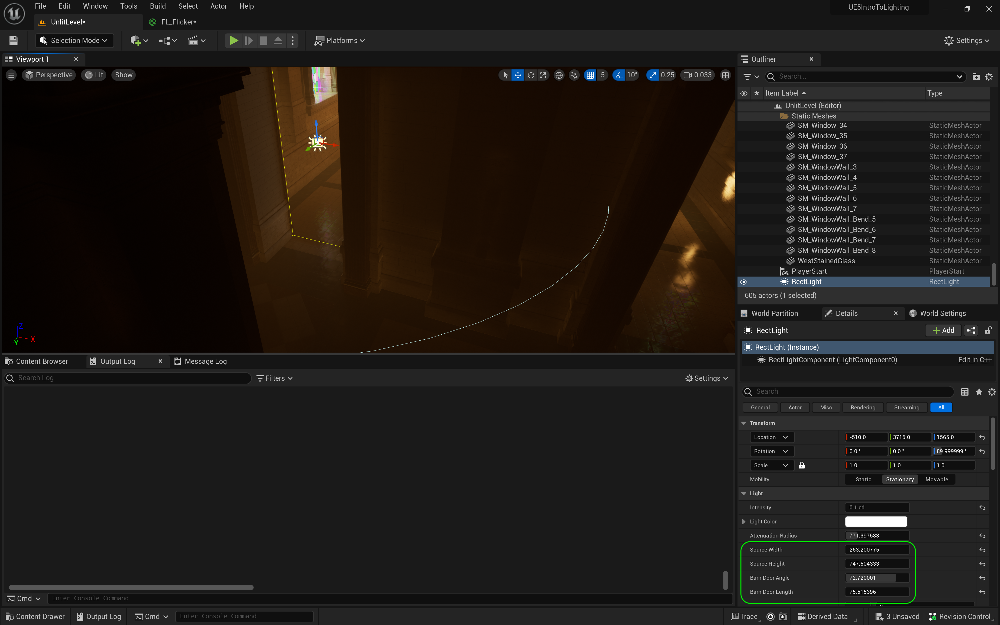
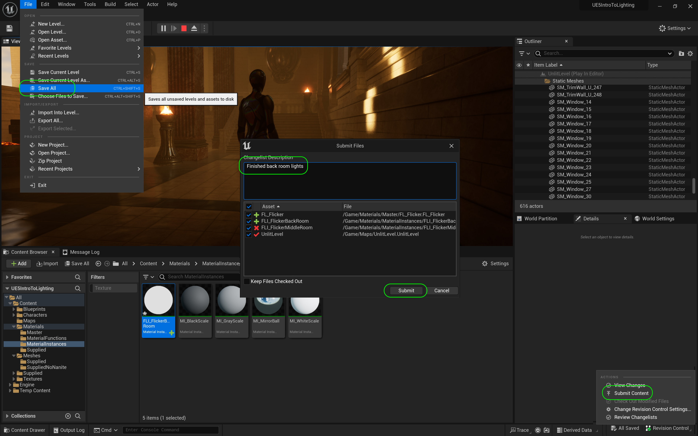

### Light Functions II

[previous](../light-functions/README.md#user-content-light-functions) • [home](../README.md#user-content-ue5-lighting) • [next](../baked-lighting/README.md#user-content-baked-lighting)

Lets finish up the back room to create a moody flickering lights.

 

---

##### `Step 1.`\|`ITL`|:small_blue_diamond:

Add **MFI_FlickerBackRoom** to the **Light Function Material** slot on the point light.  Change the **Intensity** to a subtle value. Adjust the **Indirect Lighting** value and look around to see how it propagates throughout the dark back hallway. Adjust the material variables, especially **SineShift** and **Brightness**.

https://github.com/maubanel/UE5-Lighting/assets/5504953/d5385572-7760-40fb-b075-1d6ff32af829

##### `Step 2.`\|`ITL`|:small_blue_diamond: :small_blue_diamond: 

Adjust the **Attenuation Radius** so that it fills the entire hallway from wall to wall.  Adjust the **Volumetric Scattering Intensity** for how much this light is picked up by the fog in the air.  

##### `Step 3.`\|`ITL`|:small_blue_diamond: :small_blue_diamond: :small_blue_diamond:

Finally adjust **Source Radius** and **Soft Source Radius** to taste. Look at the wall, we shouldn't see the reflection of a point light as there isn't one there in the space.  It is acting as an overall glow reflecting the flames that are not getting picked up by the GI.

##### `Step 4.`\|`ITL`|:small_blue_diamond: :small_blue_diamond: :small_blue_diamond: :small_blue_diamond:

Copy the light and bring to the back of the room between the two torches.  This will help make the back of the room a bit more visible and makes it more definable from a distance. Play the game and make adjustments to this light as necessary.

https://github.com/maubanel/UE5-Lighting/assets/5504953/c8b957cd-c516-460a-985c-f5797b78030d

##### `Step 5.`\|`ITL`| :small_orange_diamond:

*Press* the <kbd>Play</kbd> button and look in the back room.  I am happy with the hallway but when I approach the corridor, not enough light is coming in from the main room.  Lets fix that.

https://github.com/maubanel/UE5-Lighting/assets/5504953/bd30b4f9-59a9-4b9c-814f-c1fd5f3cf6bc

##### `Step 6.`\|`ITL`| :small_orange_diamond: :small_blue_diamond:

Duplicate the four exposure balls and place them in the west side of the back corridor and end of the back hallway with the two torches.  

##### `Step 7.`\|`ITL`| :small_orange_diamond: :small_blue_diamond: :small_blue_diamond:

We will use add a **Light | Rect Light** which we will use to simulate light coming in from the middle room.  Adjust the **Intensity** to exagerate the effect of the light and make sure it is going into the back room (or flip it 180°).

##### `Step 8.`\|`ITL`| :small_orange_diamond: :small_blue_diamond: :small_blue_diamond: :small_blue_diamond:

Now adjust the **Source Width** and **Source Height** to match the entrance way. Make sure it doesn't go into the door frame too much  Ajust the barn doors so that the light comes in softly  and does not cast a hard light. The barn doors should block most light from falling on the entrance walls as this is not a direct light.  Bring down the **Intensity** so it is quite subtle.

##### `Step 9.`\|`ITL`| :small_orange_diamond: :small_blue_diamond: :small_blue_diamond: :small_blue_diamond: :small_blue_diamond:

Duplicate this rect light and bring it to the other door.  Make sure both are stored in a **BackRoom** folder in **Lighting**.  I brought the intensity down as this is the less bright side of the middle room.

##### `Step 10.`\|`ITL`| :large_blue_diamond:

Now I have 4 overlapping lights with the windows and the two doors.  It is too many for Unreal and I am getting a red X.  Adjust the **Attenuation Radius** on the four lights so fewer overlap each other and this should take care of the errors.  Do not more forward with the red X as the light will not work.

##### `Step 11.`\|`ITL`| :large_blue_diamond: :small_blue_diamond: 

*Press* the <kbd>Play</kbd> button and make adjustments so that it is just a subtle light.  We want it to look like light coming in from the hallway.  Make it nice a subtle and taking advantage of all that Lumen offers us to create realistic dramatic lighting!

##### `Step 12.`\|`ITL`| :large_blue_diamond: :small_blue_diamond: :small_blue_diamond: 

Select the **File | Save All** then press the <kbd>Source Control</kbd> button and select **Submit Content**.  If you are prompted, select **Check Out** for all items that are not checked out of source control. Update the **Changelist Description** message and with the latest changes. Make sure all the files are correct and press the <kbd>Submit</kbd> button. A confirmation will pop up on the bottom right with a message about a changelist was submitted with a commit number. Quit Unreal and make sure your **Pending** tab in **P4V** is empty. **Submit** any work that is still in the editor.

##### `Step 13.`\|`ITL`| :large_blue_diamond: :small_blue_diamond: :small_blue_diamond:  :small_blue_diamond: 

Sometimes not all files get submitted to Unreal especially for files that don't show up in the editor.  It is good practice one you submit in **Unreal** and quit the game to right click on the top most project folder and select **Reconcile Offline Work...**.

This will either give a message saying ther is nothing to reconcile or bring up a tab.  Make sure that these are **NOT** files in the **Intermediate** and **Saved** folders as these should be ignored from the `.p4ignore`.

If the files are in **Content** or **Configuration** then press the <kbd>Reconcile</kbd> button.  Then submit the changes with a message and press the <kbd>Submit</kbd> button.

<!--  -->

| [previous](../light-functions/README.md#user-content-light-functions)| [home](../README.md#user-content-ue5-lighting) | [next](../baked-lighting/README.md#user-content-baked-lighting)|
|---|---|---|
