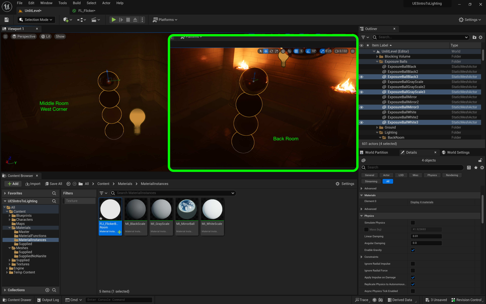
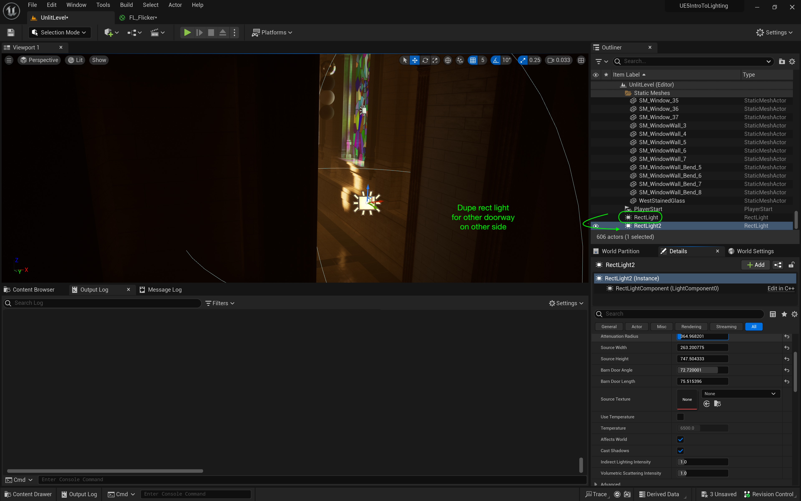

### Light Functions II

[previous](../light-functions/README.md#user-content-light-functions) • [home](../README.md#user-content-ue5-lighting) • [next](../baked-lighting/README.md#user-content-baked-lighting)

Lets finish up the back room to create a moody flickering lights.

 

---

##### `Step 1.`\|`ITL`|:small_blue_diamond:

Add **MFI_FlickerBackRoom** to the **Light Function Material** slot on the point light.  Change the **Intensity** to a subtle value. Adjust the **Indirect Lighting** value and look around to see how it propagates throughout the dark back hallway.

https://user-images.githubusercontent.com/5504953/189475940-771fd6e2-585f-40e3-b741-33ee20ea0900.mp4

##### `Step 2.`\|`ITL`|:small_blue_diamond: :small_blue_diamond: 

Adjust the **Attenuation Radius** so that it fills the entire hallway from wall to wall.  Adjust the **Volumetric Scattering Intensity** for how much this light is picked up by the fog in the air.  Finally adjust **Source Radius** and **Soft Source Radius** to taste.

https://user-images.githubusercontent.com/5504953/189476317-43dba461-6b6c-49f5-9ee8-ae4108ff03d3.mp4

Open up **LFI_FlickerBackRoom** and adjust the parameters to taste.  I brough down the brightness and increased the speed of the flicker. Play the game and look to see how dramatic it is too see the flickering light from the back of the room.

https://user-images.githubusercontent.com/5504953/189476917-5fb33c20-630b-410a-88fd-9232bfe979e8.mp4

Copy the light and bring to the back of the room between the two torches.  This will help make the back of the room a bit more visible and makes it more definable from a distance. Play the game and make adjustments to this light as necessary.

https://user-images.githubusercontent.com/5504953/189477055-461b8b45-ff85-4091-91f8-4cb067daf043.mp4

##### `Step 3.`\|`ITL`|:small_blue_diamond: :small_blue_diamond: :small_blue_diamond:

Lets add a third light to the front of the back hallway by copying a light and bringing it close to the torch.  I cut the **Intensity** in half.

##### `Step 4.`\|`ITL`|:small_blue_diamond: :small_blue_diamond: :small_blue_diamond: :small_blue_diamond:

*Press* the <kbd>Play</kbd> button and look in the back room.  I am happy with the hallway but when I approach the corridor, not enough light is coming in from the main room.  Lets fix that.

https://user-images.githubusercontent.com/5504953/189477300-e728dffa-50e1-482a-afb8-ac6455545006.mp4

##### `Step 5.`\|`ITL`| :small_orange_diamond:

Duplicate the four exposure balls and place them in the back corridor and back hallway.  Name the folders and organize the **Outliner** accordingly.

##### `Step 6.`\|`ITL`| :small_orange_diamond: :small_blue_diamond:

We will use add a **Light | Rect Light** which we will use to simulate light coming in from the middle room.  Adjust the **Intensity** to exagerate the effect of the light and make sure it is going into the back room (or flip it 180°).

##### `Step 7.`\|`ITL`| :small_orange_diamond: :small_blue_diamond: :small_blue_diamond:

Now adjust the size to match the entrance way.  Ajust the barn doors so that the light comes in softly  and does not cast a hard light.  Bring down the **Intensity** so it is quite subtle.

##### `Step 8.`\|`ITL`| :small_orange_diamond: :small_blue_diamond: :small_blue_diamond: :small_blue_diamond:

*Press* the <kbd>Play</kbd> button and make adjustments so that it is just a subtle light.  We want it to look like light coming in from the hallway.  Now on the other side it is way too dark.

https://user-images.githubusercontent.com/5504953/189477675-3026dfd9-01d9-4880-8040-7804268c5c82.mp4

##### `Step 9.`\|`ITL`| :small_orange_diamond: :small_blue_diamond: :small_blue_diamond: :small_blue_diamond: :small_blue_diamond:

Duplicate this rect light and bring it to the other door.  Make sure both are stored in a **BackRoom** folder in **Lighting**.  I brought the intensity down as this is the less bright side of the middle room.

##### `Step 10.`\|`ITL`| :large_blue_diamond:

*Press* the <kbd>Play</kbd> button and notice the pathway of light we have painted to guide the player.  Nice a subtle and taking advantage of all that Lumen offers us to create realistic dramatic lighting!

https://user-images.githubusercontent.com/5504953/189477858-3d16e4a1-5304-4f40-86ba-a4e09590c539.mp4

##### `Step 11.`\|`ITL`| :large_blue_diamond: :small_blue_diamond: 

Select the **File | Save All** then press the <kbd>Source Control</kbd> button and select **Submit Content**.  If you are prompted, select **Check Out** for all items that are not checked out of source control. Update the **Changelist Description** message and with the latest changes. Make sure all the files are correct and press the <kbd>Submit</kbd> button. A confirmation will pop up on the bottom right with a message about a changelist was submitted with a commit number. Quit Unreal and make sure your **Pending** tab in **P4V** is empty. **Submit** any work that is still in the editor.

<!--  -->

| [previous](../light-functions/README.md#user-content-light-functions)| [home](../README.md#user-content-ue5-lighting) | [next](../baked-lighting/README.md#user-content-baked-lighting)|
|---|---|---|
