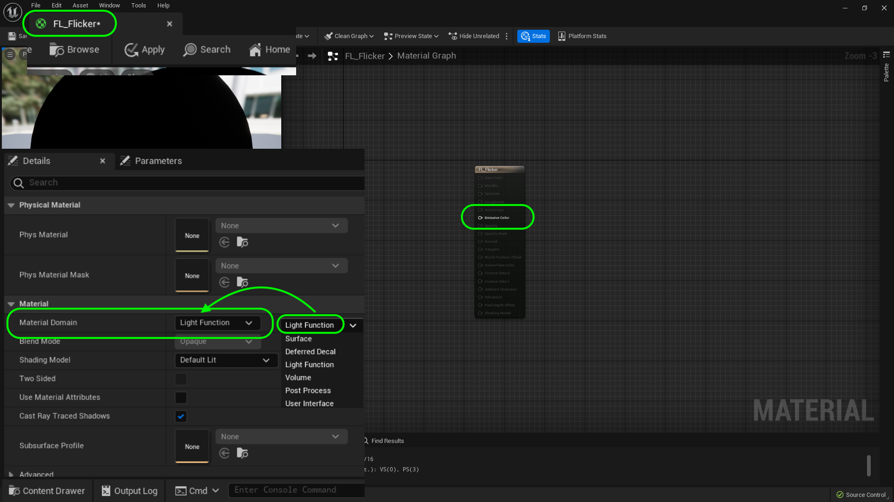
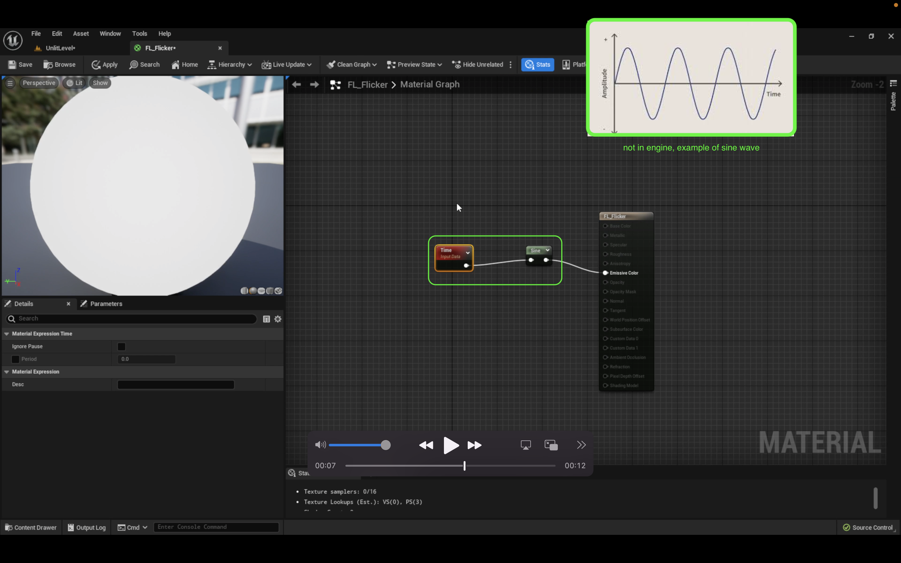
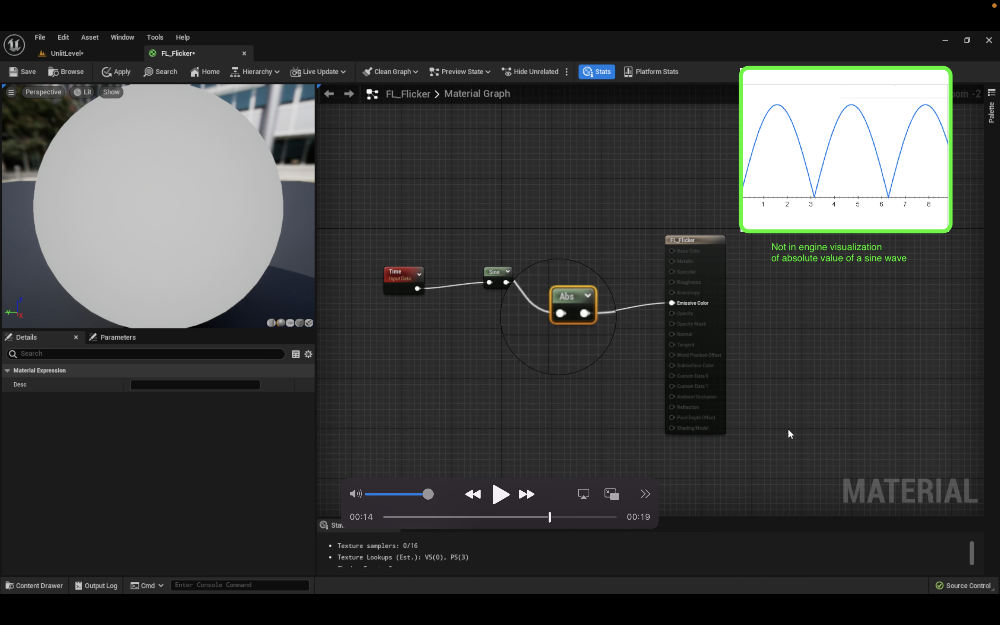
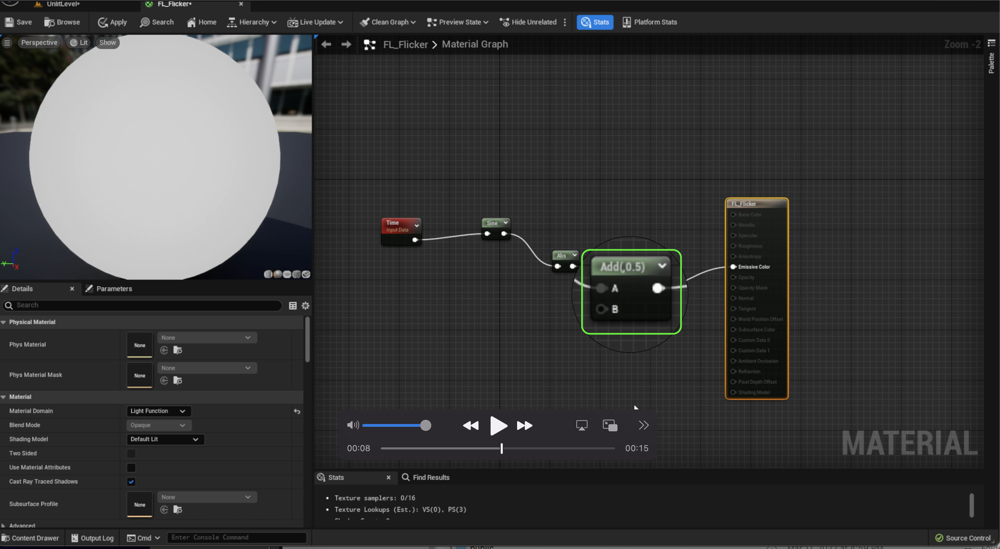
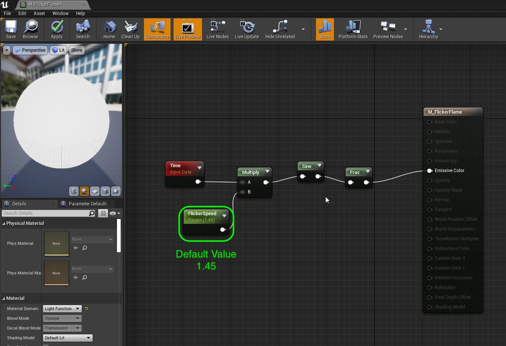
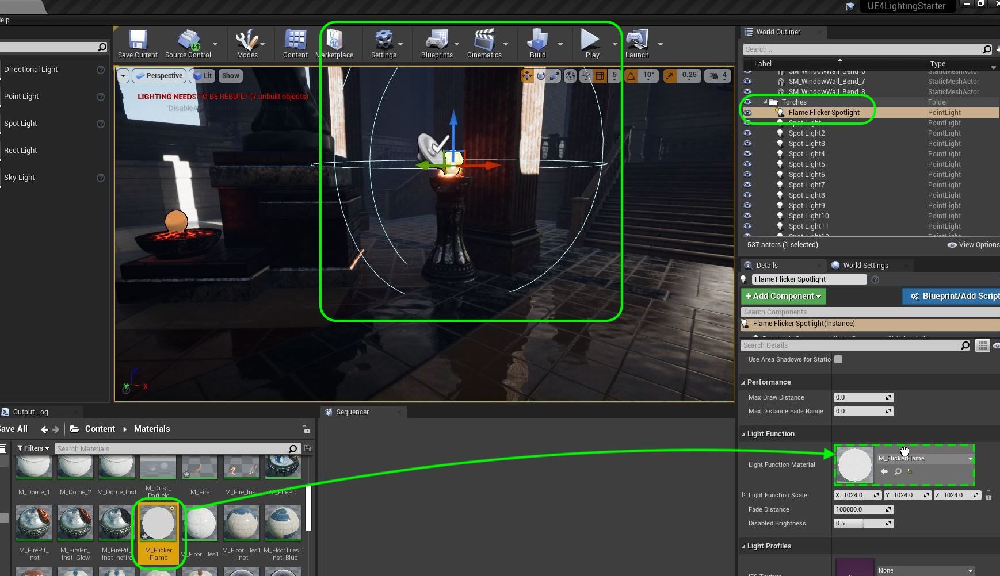
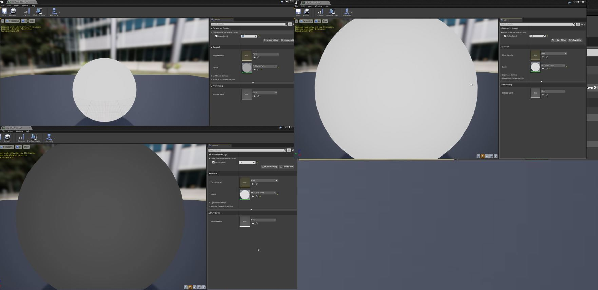
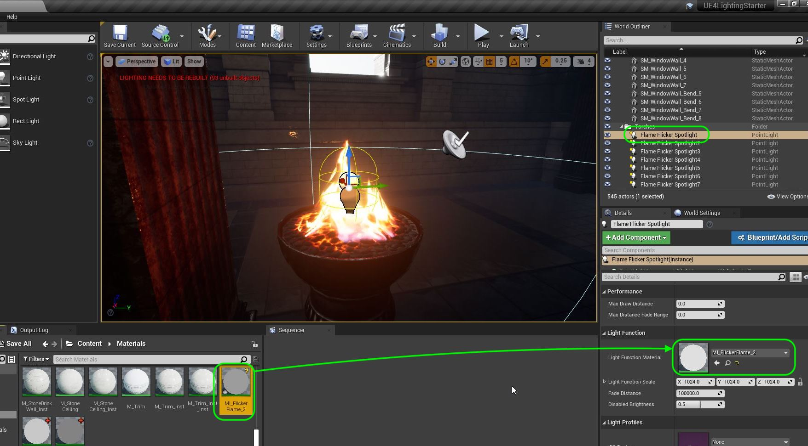
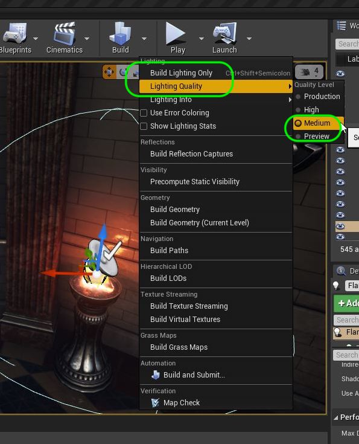
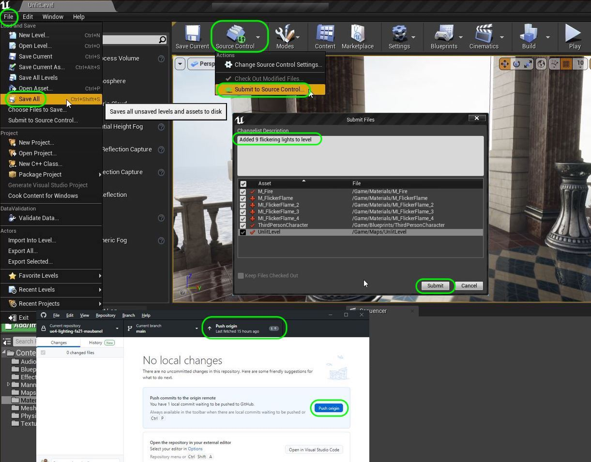

### Light Functions

[previous](../point-lights/README.md#user-content-point-lights) • [home](../README.md#user-content-ue4-lighting) • [next](../mobility/README.md#user-content-actor--light-mobility)

Now we have a back room with no incidental window light and just flames.  So lets add a point light with a light function that will exaggerate the indirect light of the flames.  A light function material allows us to alter what a light does. In this case it will be to change the intensity to look like flickering fire light.

 

---

##### `Step 1.`\|`ITL`|:small_blue_diamond:

Lets create a new **Material** in the **Materials** folder.  Click on <kbd>+ Add</kbd> and select a new **Material** and call it `FL_Flicker`. Open up the material and click on the Material node.  Change the **Material Domain** to `Light Function`.  This will turn off all the pins except for emission (as you cannot use any texture effects on the light - just affect the luminance).  

##### `Step 2.`\|`ITL`|:small_blue_diamond: :small_blue_diamond: 

Add a **Time** node to animate the light with.  This returns time in milliseconds. Then add a Sine node that converts that value into a sine.  If you know what a sine wave is, it will return a value between -1 and 1.  Connect the pins and send the output of the **Sine** node to the **Emissive Color** node in the material.

##### `Step 3.`\|`ITL`|:small_blue_diamond: :small_blue_diamond: :small_blue_diamond:

You will notice that since it goes from -1 to 1 that half of the time it is is completely off, less than 0.  Lets fix that.

https://user-images.githubusercontent.com/5504953/189472736-de500525-1eb0-4796-8961-b3672cac7b77.mp4

##### `Step 4.`\|`ITL`|:small_blue_diamond: :small_blue_diamond: :small_blue_diamond: :small_blue_diamond:

If we add an **Abs** node at the end before the shader we will make sure the value is always positive.  This absolute node returns a positive unsigned value regardless of the sign passed in. So '-.5` becomes `.5`.  Notice how it changes the shape of the curve.

##### `Step 5.`\|`ITL`| :small_orange_diamond:

Now the value is always positive. Now the problem the light goes to `0`.  We want it to flicker but not turn off completely.

https://user-images.githubusercontent.com/5504953/189472860-bd3d5456-5aa1-4b4e-91ed-060f455d2d6e.mp4

##### `Step 6.`\|`ITL`| :small_orange_diamond: :small_blue_diamond:

So lets shift the whole curve up by .5.  So at the end put an **Add** node and set the **Value** to `0.5`.  This changes the range of the absolute sine from `.5` to `1.5`.

##### `Step 7.`\|`ITL`| :small_orange_diamond: :small_blue_diamond: :small_blue_diamond:

Now the issue is that we have shifted the value, it is flickering too slowly.

https://user-images.githubusercontent.com/5504953/189473173-ea5cf95a-fd72-4698-b7e0-d86cd2b5b804.mp4

##### `Step 8.`\|`ITL`| :small_orange_diamond: :small_blue_diamond: :small_blue_diamond: :small_blue_diamond:

##### `Step 9.`\|`ITL`| :small_orange_diamond: :small_blue_diamond: :small_blue_diamond: :small_blue_diamond: :small_blue_diamond:

Now right click on the **Sine** node and select **Start Previewing Node**.  Look at the flashing. Another way to look at it is by pressing **Stop Previewing Node**. Connect the output of the **Sine** node to the **Emmissive Color**.  Now this is a very smooth animation and might be ok for police lights.  For a flame we want a more eratic animation.

https://user-images.githubusercontent.com/5504953/131685325-ff8abaf0-e36d-418e-b9e9-ecbb755e9856.mp4

Add a **Frac** node between the **Sine** and the **Emissive Color** nodes.

> The [Frac](https://docs.unrealengine.com/4.26/en-US/RenderingAndGraphics/Materials/ExpressionReference/Math/#frac) expression takes in values and outputs the fractional portion of those values. In other words, for an input value "X", the result is "X minus Floor of X". The output value will range from zero to one, inclusive on the low end, but not the high end. See also Ceil and Floor.  Examples: Frac of (0.2) is (0.2). Frac of (-0.2) is (0.8). Frac of (0.0,1.6,1.0) is (0.0,0.6,0.0) - Unreal Manual

This will give us some apparent randomness to the fades giving more eratic output.

##### `Step 10.`\|`ITL`| :large_blue_diamond:

Now look at the result, it gives us something much closer to what we are looking for. 

https://user-images.githubusercontent.com/5504953/131687015-ab95adc2-a934-4eea-9809-920367c3104a.mp4

##### `Step 11.`\|`ITL`| :large_blue_diamond: :small_blue_diamond: 

One of the big challenges we face is too much symmetry in a level.  If we place all these lights then they will all have the exact same flicker at the same time.  Lets set up the possibility to extend this in a material instance with a variable to adjust the speed.  This way we can ensure that a room doesn't have the same flicker on two flames.

Add a **Scalar Parameter** and call it `FlickerSpeed`.  Set the **Default Value** to `1.45`.  This is a good speed.

##### `Step 12.`\|`ITL`| :large_blue_diamond: :small_blue_diamond: :small_blue_diamond: 

Now we can see that we have something usable.  Press the <kbd>Apply</kbd> key.

https://user-images.githubusercontent.com/5504953/131688042-0e1d22c6-1d6b-4302-8b0d-0ca357c51cdd.mp4

##### `Step 13.`\|`ITL`| :large_blue_diamond: :small_blue_diamond: :small_blue_diamond:  :small_blue_diamond: 

Now select the **Flame Flicker Light** Spot Light from the **World Outliner** and drag and drop **M_FlickerFlame** into the **Light Function | Light Function Material**.

##### `Step 14.`\|`ITL`| :large_blue_diamond: :small_blue_diamond: :small_blue_diamond: :small_blue_diamond:  :small_blue_diamond: 

Now play the game and look at the light in action. I find the light much brighter than the flame appears to be.  Lets fix that.

https://user-images.githubusercontent.com/5504953/131690436-807e490c-2095-4e31-8bf2-69ed67beb52a.mp4

##### `Step 15.`\|`ITL`| :large_blue_diamond: :small_orange_diamond: 

I backed off the **Intensity** from `10` to `2` lumens.  This provides a more subtle and realistic effect. The flicker also relects in the mannequin's surface, super cool!

https://user-images.githubusercontent.com/5504953/131690553-f30e19aa-350f-4292-8f1a-b83128bcc5bb.mp4

##### `Step 16.`\|`ITL`| :large_blue_diamond: :small_orange_diamond:   :small_blue_diamond: 

Lets now place 8 more flickering lights (for a total of 9 lights) on the remaining fires.  In my case it is **SM_FirePit_4**, **SM_FirePit_6**, **SM_FirePit_8**, **SM_FirePit_18**, **SM_FirePit_22**, **SM_FirePit_24**, **SM_FirePit_25** and **SM_FirePit_28** (the one I did above was **SM_FirePit2**). Duplicate 8 more lights. Copy and paste the position of the torch with each light and adjust the position. 

https://user-images.githubusercontent.com/5504953/131701352-f6e18cdd-2afb-4141-8e0d-f29f46851764.mp4

##### `Step 17.`\|`ITL`| :large_blue_diamond: :small_orange_diamond: :small_blue_diamond: :small_blue_diamond:

Right click on **M_FlickerFlame** and create 3 **Material Instances**.  Turn on **Flicker Speed** and set it to `1.3`,  `1.6` and `1.8`. Now with the original master material we have 4 different speeds. 

##### `Step 18.`\|`ITL`| :large_blue_diamond: :small_orange_diamond: :small_blue_diamond: :small_blue_diamond: :small_blue_diamond:

Go to all of your **Flame Flicker Spotlight** actors and mix up the **Light Function Materials** assigning an equal amount of the 4.  Make sure no two lights close to each other or in the same vincinity have the same material.

##### `Step 19.`\|`ITL`| :large_blue_diamond: :small_orange_diamond: :small_blue_diamond: :small_blue_diamond: :small_blue_diamond: :small_blue_diamond:

Now you might notice that the generated shadows created in the lighting build are not of high quality.  We have been using a fast preview lighting model.  If you click on the arrow next to the **Build** button, you can adjust the **Lighting Quality** from `Preview` to `Medium`.  We can do this occasionally to get a better sense of how it will look to be more critical of our work.  Press **Build Lighting Only**.

##### `Step 20.`\|`ITL`| :large_blue_diamond: :large_blue_diamond:
 Now run the game and look at all the firelight.  See how it adds a bit of life to the scene.  It is especially important in levels that are fairly bare with few people have enough elements in the scene that look alive to give it some life.  This is a nice addition.  You notice the shadows are better rendered in our baking process.  You can return to a **Preview** lighting quality to make future light builds faster.

https://user-images.githubusercontent.com/5504953/131703962-9481e5fb-6c37-4ae9-aaea-5dfa9f5d88c9.mp4

##### `Step 21.`\|`ITL`| :large_blue_diamond: :large_blue_diamond: :small_blue_diamond:

Press **File | Save All** and press **Source Control |  Submit to Source Control...** and enter a **Description** then press the <kbd>Submit</kbd> button. Open up **GitHub Desktop** and press the <kbd>Push</kbd> button. Now we are updated.

<!--  -->

| [previous](../point-lights/README.md#user-content-point-lights)| [home](../README.md#user-content-ue4-lighting) | [next](../mobility/README.md#user-content-actor--light-mobility)|
|---|---|---|
