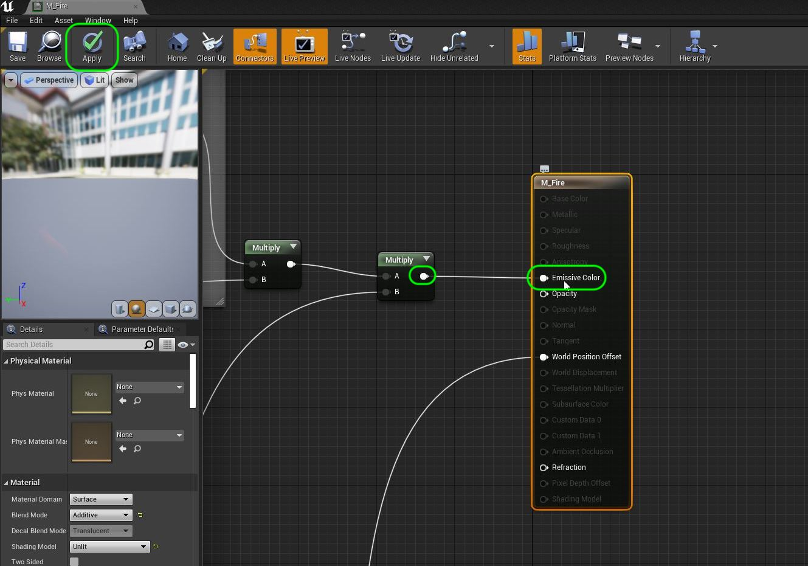
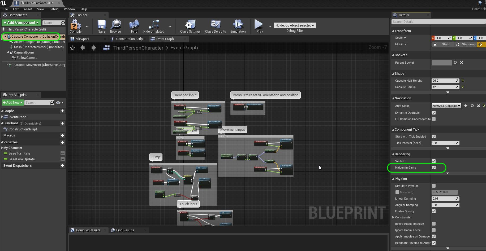
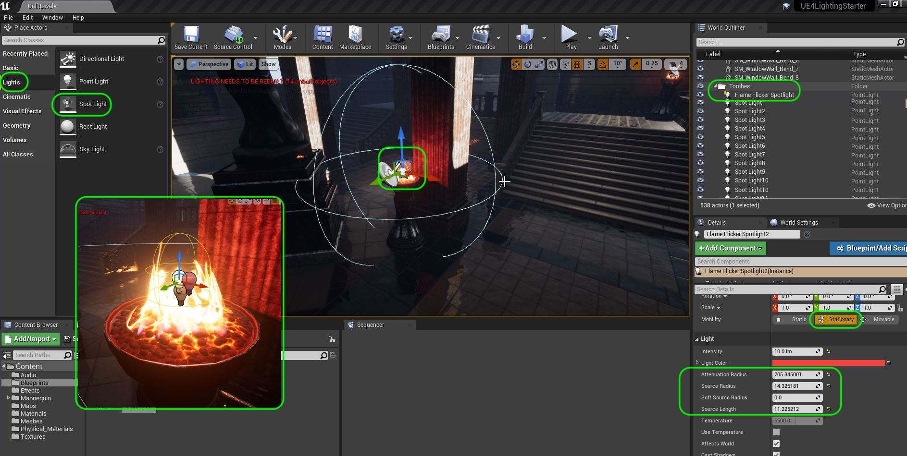
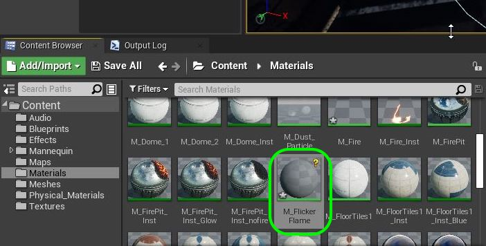
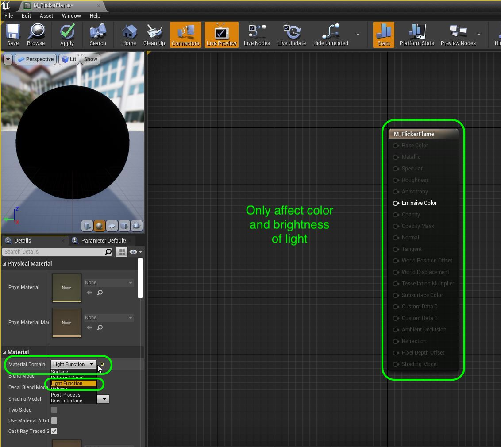

### Light Functions

[previous](../point-lights/README.md#user-content-point-lights) • [home](../README.md#user-content-ue4-lighting) • [next](../)

We are going to turn on an emissive particle system effect for the flames.  We will then create a **Light Function** to animate a flicker on the wall to accentuate what the particle system is already doing and make it look even better!

 

---

##### `Step 1.`\|`ITL`|:small_blue_diamond:

We have another effect that I turned off as it did emit light.  Open up **Materials | M_Fire** and connect the output of the **Multiply** pin into the **Emissive Color** pin in the main shader node.

##### `Step 2.`\|`FHIU`|:small_blue_diamond: :small_blue_diamond: 

I used the same mannequin as the level design assignment and we had the collision volume rendering.  Open up **Blueprints | ThirdPersonCharacter** and select the **Capsule Component**.  Go to **Rendering | Hidden In Game** and select `true` by ticking the box.

##### `Step 3.`\|`ITL`|:small_blue_diamond: :small_blue_diamond: :small_blue_diamond:

Run the game and you will see that some of the torches have a particle flame on top of them.  Look at the flicker.  We will add another light and make it more prominent.

https://user-images.githubusercontent.com/5504953/131667822-4aed95df-9ce8-44d2-9924-599e1bf721bc.mp4

##### `Step 4.`\|`ITL`|:small_blue_diamond: :small_blue_diamond: :small_blue_diamond: :small_blue_diamond:

Lets creat a flickering light for the flames. We want the flames to cast a slightly less saturated yelowish glow that has a flicker in the light. We will create a special kind of material to achieve this look. First start by dropping a **Light | Spot Light** on top of the other one on a torch with a flame. Center it and call it `Flame Flicker Spotlight.` Place it in the **Torches** folder. 

Now this light will not be moving or rotating but we will be affecting its brightness dynamically to simulate a flicker.  So we can't use a **Static** mobility type. We can only use **Stationary** or **Movable**.  Now again this is mainly for the wall and not the player so select `Stationary`.

Pick a color that matches the flame. I adjusted the **Attenuation Radius** to just affect the rear wall.  I chnage the shape to look like a capsule as this matches the shape of the flame better.  This was a combination of **Source Radius** and **Source Length**.

##### `Step 5.`\|`ITL`| :small_orange_diamond:

To preview what it might look like click the **Light | Affect World** setting in the Spot Light to simulate a flicker.  Make any adjustments to the above settings to your taste.

https://user-images.githubusercontent.com/5504953/131670011-b83fecf7-eda9-415f-8114-146486a9e142.mp4

##### `Step 6.`\|`ITL`| :small_orange_diamond: :small_blue_diamond:

Add a new **Material** in **Materials** called `M_FlickerFlame`.

##### `Step 7.`\|`ITL`| :small_orange_diamond: :small_blue_diamond: :small_blue_diamond:

A material normally affects a polygon surface and we can apply a lot of effects to it (normal map, ao, base color, roughness etc...). But we can create a material that affects a light and not a Polygonal surface. Go to **Material Domain** and change it from **Surface** to a `Light Function`. This will now affect a light and how it emits through the **only** channel in the graph is now the **Emissive Color**. We cannot use any other polygonal rendering technique.  This is fine as all we want to do is animate the brightness of the light in an eratic fashion.

##### `Step 8.`\|`ITL`| :small_orange_diamond: :small_blue_diamond: :small_blue_diamond: :small_blue_diamond:

##### `Step 9.`\|`ITL`| :small_orange_diamond: :small_blue_diamond: :small_blue_diamond: :small_blue_diamond: :small_blue_diamond:

##### `Step 10.`\|`ITL`| :large_blue_diamond:

##### `Step 11.`\|`ITL`| :large_blue_diamond: :small_blue_diamond: 

##### `Step 12.`\|`ITL`| :large_blue_diamond: :small_blue_diamond: :small_blue_diamond: 

##### `Step 13.`\|`ITL`| :large_blue_diamond: :small_blue_diamond: :small_blue_diamond:  :small_blue_diamond: 

##### `Step 14.`\|`ITL`| :large_blue_diamond: :small_blue_diamond: :small_blue_diamond: :small_blue_diamond:  :small_blue_diamond: 

##### `Step 15.`\|`ITL`| :large_blue_diamond: :small_orange_diamond: 

##### `Step 16.`\|`ITL`| :large_blue_diamond: :small_orange_diamond:   :small_blue_diamond: 

##### `Step 17.`\|`ITL`| :large_blue_diamond: :small_orange_diamond: :small_blue_diamond: :small_blue_diamond:

##### `Step 18.`\|`ITL`| :large_blue_diamond: :small_orange_diamond: :small_blue_diamond: :small_blue_diamond: :small_blue_diamond:

##### `Step 19.`\|`ITL`| :large_blue_diamond: :small_orange_diamond: :small_blue_diamond: :small_blue_diamond: :small_blue_diamond: :small_blue_diamond:

##### `Step 20.`\|`ITL`| :large_blue_diamond: :large_blue_diamond:

##### `Step 21.`\|`ITL`| :large_blue_diamond: :large_blue_diamond: :small_blue_diamond:

___

| [previous](../point-lights/README.md#user-content-point-lights)| [home](../README.md#user-content-ue4-lighting) | [next](../)|
|---|---|---|
