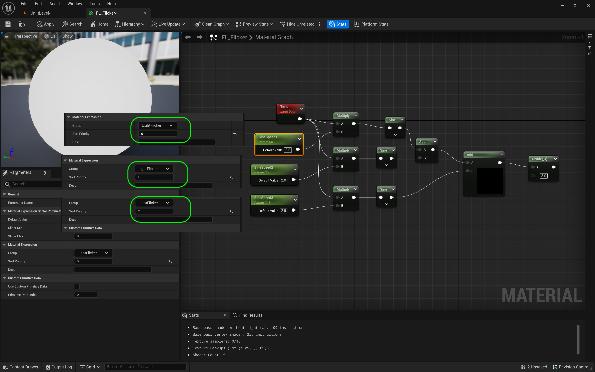
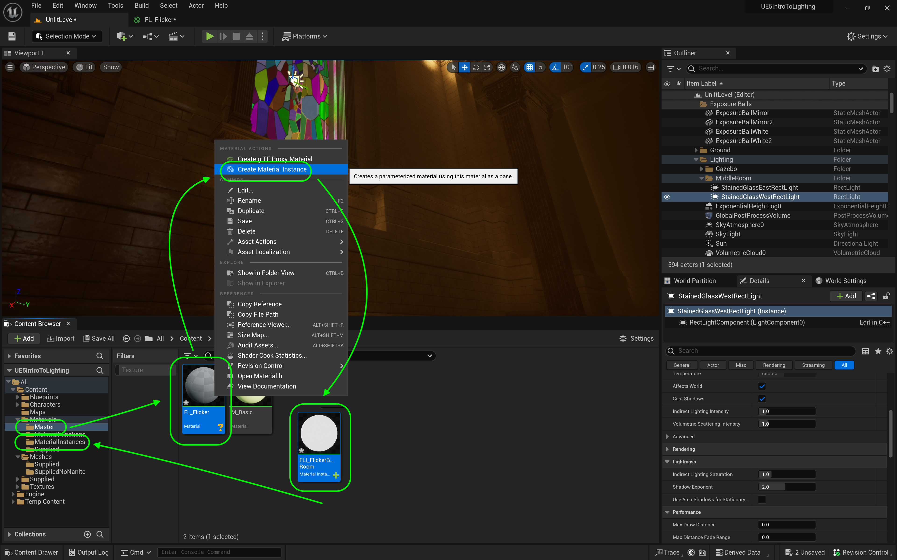

### Light Functions

[previous](../point-lights/README.md#user-content-point-lights) • [home](../README.md#user-content-ue4-lighting) • [next](../mobility/README.md#user-content-actor--light-mobility)

Now we have a back room with no incidental window light and just flames.  So lets add a point light with a light function that will exaggerate the indirect light of the flames.  A light function material allows us to alter what a light does. In this case it will be to change the intensity to look like flickering fire light.

 

---

##### `Step 1.`\|`ITL`|:small_blue_diamond:

Lets create a new **Material** in the **Materials** folder.  Click on <kbd>+ Add</kbd> and select a new **Material** and call it `FL_Flicker`. Open up the material and click on the Material node.  Change the **Material Domain** to `Light Function`.  This will turn off all the pins except for emission (as you cannot use any texture effects on the light - just affect the luminance).  

##### `Step 2.`\|`ITL`|:small_blue_diamond: :small_blue_diamond: 

Add a **Time** node to animate the light with.  This returns time in milliseconds. Then add a Sine node that converts that value into a sine.  If you know what a sine wave is, it will return a value between -1 and 1.  Connect the pins and send the output of the **Sine** node to the **Emissive Color** node in the material.

##### `Step 3.`\|`ITL`|:small_blue_diamond: :small_blue_diamond: :small_blue_diamond:

You will notice that since it goes from -1 to 1 that half of the time it is is completely off, less than 0.  Lets fix that.

https://user-images.githubusercontent.com/5504953/189472736-de500525-1eb0-4796-8961-b3672cac7b77.mp4

##### `Step 4.`\|`ITL`|:small_blue_diamond: :small_blue_diamond: :small_blue_diamond: :small_blue_diamond:

If we add an **Abs** node at the end before the shader we will make sure the value is always positive.  This absolute node returns a positive unsigned value regardless of the sign passed in. So '-.5` becomes `.5`.  Notice how it changes the shape of the curve.

##### `Step 5.`\|`ITL`| :small_orange_diamond:

Now the value is always positive. Now the problem the light goes to `0`.  We want it to flicker but not turn off completely.

https://user-images.githubusercontent.com/5504953/189472860-bd3d5456-5aa1-4b4e-91ed-060f455d2d6e.mp4

##### `Step 6.`\|`ITL`| :small_orange_diamond: :small_blue_diamond:

So lets shift the whole curve up by .5.  So at the end put an **Add** node and set the **Value** to `0.5`.  This changes the range of the absolute sine from `.5` to `1.5`.

##### `Step 7.`\|`ITL`| :small_orange_diamond: :small_blue_diamond: :small_blue_diamond:

Now the issue is that we have shifted the value, it is flickering too slowly.

https://user-images.githubusercontent.com/5504953/189473173-ea5cf95a-fd72-4698-b7e0-d86cd2b5b804.mp4

##### `Step 8.`\|`ITL`| :small_orange_diamond: :small_blue_diamond: :small_blue_diamond: :small_blue_diamond:

 So lets multiply the time node to speed up the flicker. Set the **Default Value** to `3.0` to triple the speed.

##### `Step 9.`\|`ITL`| :small_orange_diamond: :small_blue_diamond: :small_blue_diamond: :small_blue_diamond: :small_blue_diamond:

Now it flashes much quicker.  But it is a constant curve.  Flickering should be an assymetrical flashing, so a straight absolute sine wave is to perfect.  We need to add more randomness.

https://user-images.githubusercontent.com/5504953/189473330-e3d307d7-a1d6-4d66-a4bf-2f9916607ddf.mp4

##### `Step 10.`\|`ITL`| :large_blue_diamond:

Right click on the open graph and select an **Add** node.  Take the output of the first and second **Sine** nodes and add them together.  Put a second **Add** node next to it with the output of the first one in the **A** side of the second add node.

##### `Step 11.`\|`ITL`| :large_blue_diamond: :small_blue_diamond: 

Connect **Time** to two multiply nodes.

##### `Step 12.`\|`ITL`| :large_blue_diamond: :small_blue_diamond: :small_blue_diamond: 

Now this gives us a really nice effect.  Lets turn these constants into parameters that we can edit in a light function instance material!

https://user-images.githubusercontent.com/5504953/189475041-2e5bb478-76c8-43e2-964d-7908fc0b523b.mp4

##### `Step 13.`\|`ITL`| :large_blue_diamond: :small_blue_diamond: :small_blue_diamond:  :small_blue_diamond: 

Add three **Scalar Paremeter** nodes.  Call them `SineSpeed1`, `SineSpeed2` and `SineSpeed3`. Make them a **Default Value** of `3`, `2` and `2.5`. 

##### `Step 14.`\|`ITL`| :large_blue_diamond: :small_blue_diamond: :small_blue_diamond: :small_blue_diamond:  :small_blue_diamond: 

Add two more scalar parameters. Call the first `SineShift` and set it to `0.5` and plug it into the **B** side of the second **Add** node.  The second is set to `Brightness` with a default value of `10` and sent into the **Multiply | B**. Clean up the nodes and add a comment.

##### `Step 15.`\|`ITL`| :large_blue_diamond: :small_orange_diamond: 

Here is the final material function. Press the <kbd>Apply</kbd> button.

https://user-images.githubusercontent.com/5504953/189475278-d77596d2-cc46-4ab9-bf96-e238fee9a9ba.mp4

##### `Step 16.`\|`ITL`| :large_blue_diamond: :small_orange_diamond:   :small_blue_diamond: 

Right click on **FL_Flicker** and select **Create Material Instance**.  Call it `MI_FlickerBackRoom`.

##### `Step 17.`\|`ITL`| :large_blue_diamond: :small_orange_diamond: :small_blue_diamond: :small_blue_diamond:

Go to the very back room and above the large fire pit add a **Light | Point Light** to the room.  Add it to a new folder called `BackRoom` in the **Lighting** folder. Call the light `BackLight`.

##### `Step 18.`\|`ITL`| :large_blue_diamond: :small_orange_diamond: :small_blue_diamond: :small_blue_diamond: :small_blue_diamond:

Now match the orange glow coming off of the embers in the large fire pit.  I used the eydropper tool to pick a dark rich orange for the glow (remember the emission multiplier brings it closer to white).

##### `Step 19.`\|`ITL`| :large_blue_diamond: :small_orange_diamond: :small_blue_diamond: :small_blue_diamond: :small_blue_diamond: :small_blue_diamond:

Add **MFI_FlickerBackRoom** to the **Light Function Material** slot on the point light.  Change the **Intensity** to a subtle value. Adjust the **Indirect Lighting** value and look around to see how it propagates throughout the dark back hallway.

https://user-images.githubusercontent.com/5504953/189475940-771fd6e2-585f-40e3-b741-33ee20ea0900.mp4

##### `Step 20.`\|`ITL`| :large_blue_diamond: :large_blue_diamond:

https://user-images.githubusercontent.com/5504953/189476317-43dba461-6b6c-49f5-9ee8-ae4108ff03d3.mp4

<!--  -->

| [previous](../point-lights/README.md#user-content-point-lights)| [home](../README.md#user-content-ue4-lighting) | [next](../mobility/README.md#user-content-actor--light-mobility)|
|---|---|---|
