### Actor & Light Mobility

[previous](../light-functions/README.md#user-content-light-functions) • [home](../README.md#user-content-ue4-lighting) • [next](../)

Lets take a more in depth look at what happens when we adjust actor mobility for meshes as well as lights. These all have dramatic impacts on the look and performance of our game.

> The [Mobility](https://docs.unrealengine.com/4.26/en-US/Basics/Actors/Mobility/) setting controls whether an Actor will be allowed to move or change in some way during gameplay. This primarily applies to Static Mesh Actors and Light Actors. - Unreal Manual

 

---

##### `Step 1.`\|`ITL`|:small_blue_diamond:

OK, lets look at static lights and static objects.  

> For [Static Mesh Actors](https://docs.unrealengine.com/4.26/en-US/Basics/Actors/Mobility/), this means they will have their shadows contribute to pre-calculated lightmaps using Lightmass to generate and process them. This mobility makes them ideal for structural or decorative meshes that never need to relocate during gameplay. Note, however, that their Materials can still be animated.

> For [Light Actors](https://docs.unrealengine.com/4.26/en-US/Basics/Actors/Mobility/), this means it will contribute to pre-calculated lightmaps using Lightmass. They will illuminate the scene for Static and Stationary Actors and for Movable ones, use an indirect lighting method (like Indirect Lighting Samples or Volumetric Lightmaps) to illuminate these dynamic objects.

Add a **Light | Spot Light** to the scene in the middle room to the left of the doorway to the back hallway. and keep the default values.  Set the **Mobility** to `Static`. Place it high enough that the player can walk under it. 

Create a new folder called **Mobility** and put the actor in it and rename it as `StaticSpotLight`.

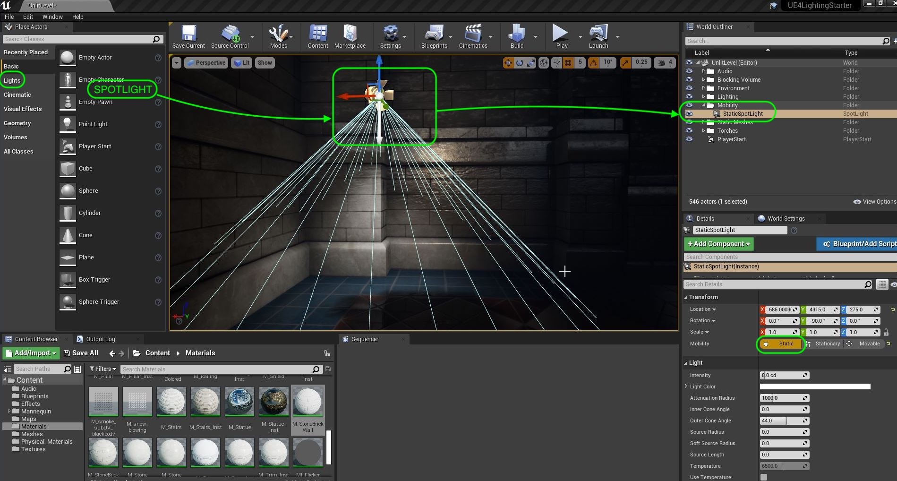

##### `Step 2.`\|`FHIU`|:small_blue_diamond: :small_blue_diamond: 

Add a **All Classes | Text Render** node and change the text to `Static Light`.  Place and rotate it on top of the spotlight.  Call it `SaticLightText` and change the render color to a shade of yellow.  Change the size to something larger such as `64`.

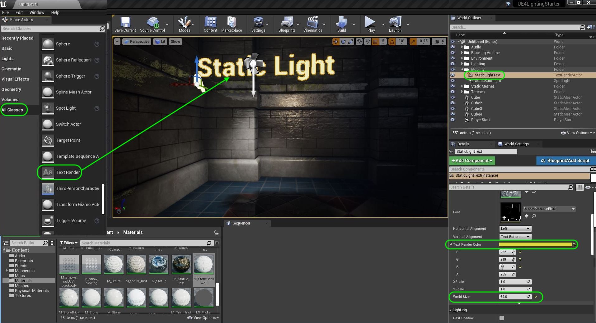

##### `Step 3.`\|`ITL`|:small_blue_diamond: :small_blue_diamond: :small_blue_diamond:

Add four **Cubes** under the light and place them in an interesting manner.  Change the **Scale** to `0.5` on the **XYZ** axes. Make sure the mobibility is set to **Static**.  Add a **M_StoneBrickWall** material to each cube.  Press the <kbd>Build</kbd> button to rebuild the static lights in the scene (including the one we just added)

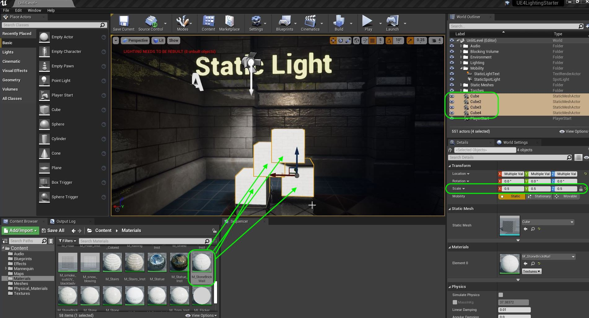

##### `Step 4.`\|`ITL`|:small_blue_diamond: :small_blue_diamond: :small_blue_diamond: :small_blue_diamond:

Play the game and look at the lighting on the boxes and the shadow cast on the floor.  Look at how nicely the shadow dithers.

https://user-images.githubusercontent.com/5504953/131712876-bf8b114b-faa0-4b4f-87b1-dc4a9022f805.mp4

##### `Step 5.`\|`ITL`| :small_orange_diamond:

Now the lighting on the cubes and the shadow on the ground are baked.  If we move the actors the lighting disappears on the cubes and the shadow stays on the ground.  This is because the build process baked those shadows into the lightmaps.

The static meshes for pieces that we never animate and do not get affected by physics should be set to static.  That way we get terrific shadows baked into the ground.

https://user-images.githubusercontent.com/5504953/131713084-f6f3b6a6-7851-4713-ab79-779d671321d9.mp4

##### `Step 6.`\|`ITL`| :small_orange_diamond: :small_blue_diamond:

If you are happy with how the four cubes look you can select all four **Cubes** in the **World Outliner** and right click then select **Merge Actors**.

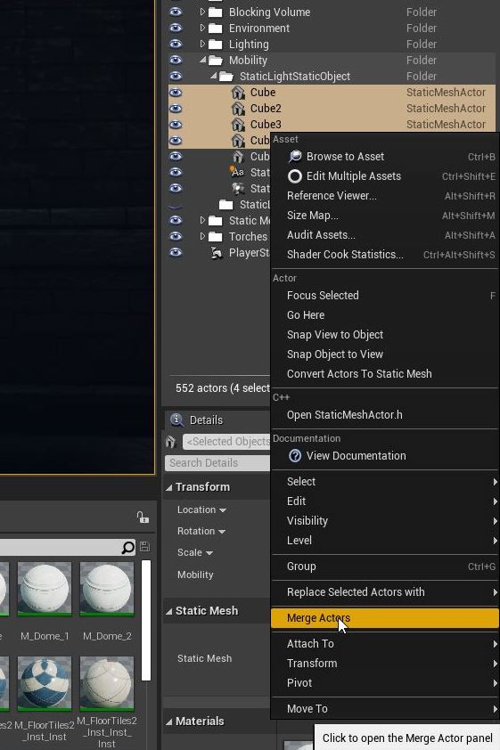

##### `Step 7.`\|`ITL`| :small_orange_diamond: :small_blue_diamond: :small_blue_diamond:

Leave all the defaults the same and in the **Merge Actors** pop-up select **Merge Actors**.

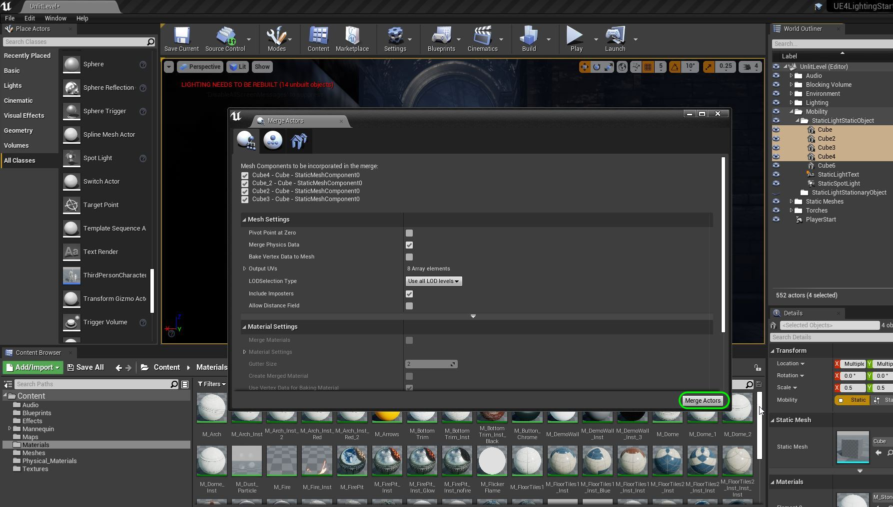

##### `Step 8.`\|`ITL`| :small_orange_diamond: :small_blue_diamond: :small_blue_diamond: :small_blue_diamond:

Select the **Meshes** folder and call the file `SM_ShadowCubes` and press the <kbd>Save</kbd> button. 
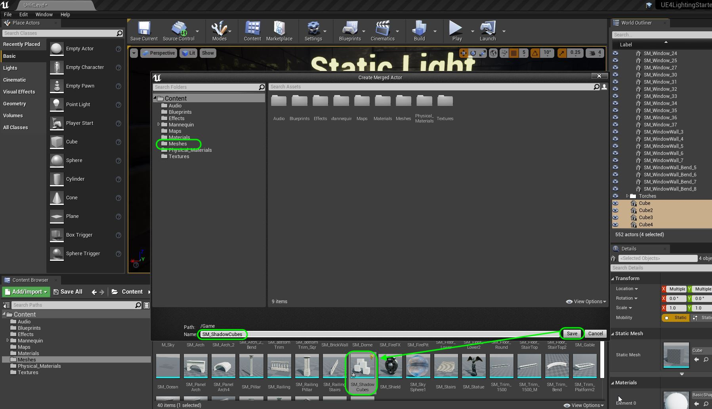

##### `Step 9.`\|`ITL`| :small_orange_diamond: :small_blue_diamond: :small_blue_diamond: :small_blue_diamond: :small_blue_diamond:

Delete the four cubes.  Replace them with the single mesh `SM_ShadowCubes`.  Press the <kbd>Build</kbd> button again.  Edit the text on the **Text Render** object to `Static Light Static Objects`.  The   is for line break and Unreal text takes this html markup.

Right click on **Mobility** folder and add a new subfolder.  Call it `StatiLightStaticObject`.  Drag the three objects used into this subfolder.

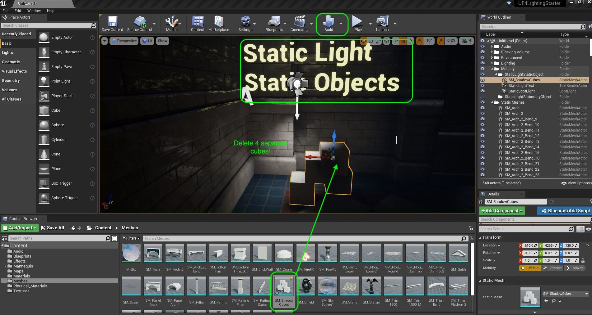

##### `Step 10.`\|`ITL`| :large_blue_diamond:

> [Stationary Mobility](https://docs.unrealengine.com/4.26/en-US/Basics/Actors/Mobility/) for Static Mesh Objects means that they can be changed but not moved. They do not contribute to pre-calculated lightmaps using Lightmass and are lit like Movable Actors when lit by a Static or Stationary Light. However, when lit by a Movable Light, they will use a Cached Shadow Map to reuse for the next frame when the light is not moving, which can improve performance for projects using dynamic lighting. -UE4 Manual

Duplicate the cubes, text and spot light from the **World Outliner**.  Move the copies to the right and put them in a folder called `StaticLightStationaryObject`. Change the **StaticLightText2** **Text** to `Static Light Stationary Object`. Make sure that **SM_ShadowCubes2** is set to `Stationary`.  Press the <kbd>Build</kbd> button.

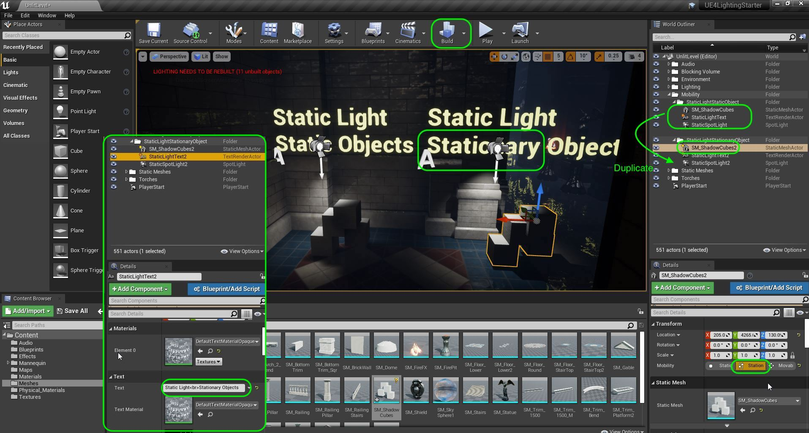

##### `Step 11.`\|`ITL`| :large_blue_diamond: :small_blue_diamond: 

Notice that a static light does not cast light on a stationary or movable object.  Even if the player goes underneath this light they will not get a shadow. Notice that this looks wrong.  We should mostly use static lights with static objects that both don't get changed dynamically.  Now remember a static mesh that has a **Mobility** of static can still have an animated material (the model can't move). Notice that the self shadowing on the cubes doesn't look right.  They are a lot brighter than the static ones and again look wrong.

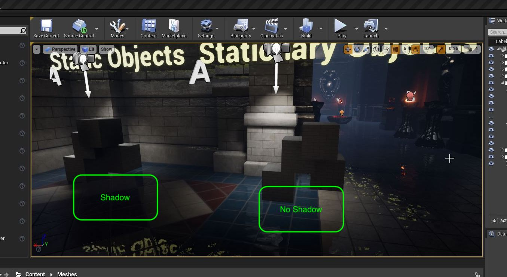

##### `Step 12.`\|`ITL`| :large_blue_diamond: :small_blue_diamond: :small_blue_diamond: 

> [Movable](https://docs.unrealengine.com/4.26/en-US/Basics/Actors/Mobility/) Static Mesh Actors means that they cast a fully dynamic shadow that does not cast pre-calculated shadows into the lightmap. When lit by Lights with Static mobility, they will use an indirect lighting method (like Indirect Lighting Samples or Volumetric Lightmaps) to illuminate them. For Lights with Stationary or Movable mobility, they will only cast a dynamic shadow. This is the typical setting for any non-deforming mesh element that needs to added, removed, or moved in the scene. - UE4 Manual

Duplicate the cubes, text and spot light from the **World Outliner**.  Move the copies to the right and put them in a folder called `StaticLightMovableObject`. Change the **StaticLightText3** **Text** to `Static Light Movable Object`. Make sure that **SM_ShadowCubes3** is set to `Movable`.  Press the <kbd>Build</kbd> button.

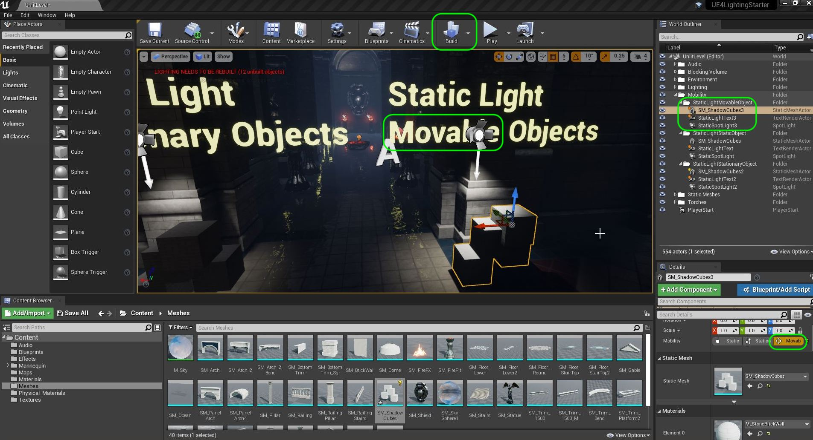

##### `Step 13.`\|`ITL`| :large_blue_diamond: :small_blue_diamond: :small_blue_diamond:  :small_blue_diamond: 

Since shadows can't be baked for movable objects (the shadows have to move around) as predicted this static light doesn't cast a shadow.  Avoid using this type of light if the actor passes under it with such a prominent light like in this scene.  This exacerbates the issue. Notice that the self shadowing on the cubes doesn't look right.  They are a lot brighter than the static ones and again look wrong.

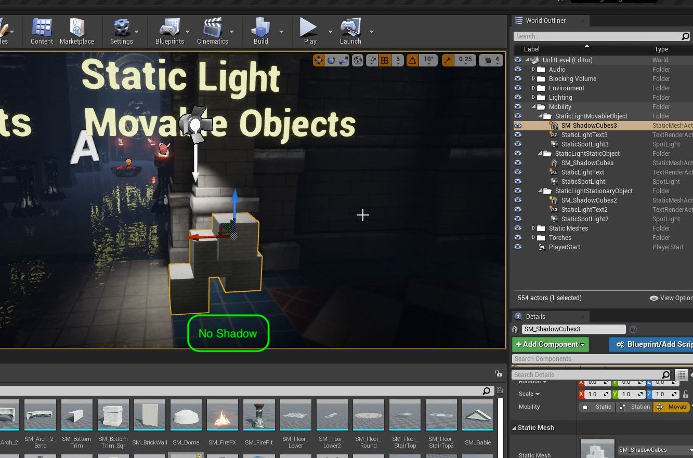

##### `Step 14.`\|`ITL`| :large_blue_diamond: :small_blue_diamond: :small_blue_diamond: :small_blue_diamond:  :small_blue_diamond: 

> [Stationary](https://docs.unrealengine.com/4.26/en-US/Basics/Actors/Mobility/) for Light Actors means they can change in some way during gameplay, such as having their color changed or their intensity changed to be brighter or softer or even completely off. Stationary lights still contribute to pre-calculated lightmaps using Lightmass but can also cast dynamic shadows for moving objects. Note that care must be used to not have too many Stationary Lights affecting a given Actor. See Stationary Lights for more details. - UE4 Manual

Duplicate the cubes, text and spot light from the **World Outliner**.  Move the copies to the right and put them in a folder called `StationaryLightStaticObject`. Change the **StaticLightText4** **Text** to `Stationary Light Static Object`. Make sure that **SM_ShadowCubes4** is set to `Static` and **StaticSpotLight4** is set to `Stationary`.  Press the <kbd>Build</kbd> button.

##### `Step 15.`\|`ITL`| :large_blue_diamond: :small_orange_diamond: 

Run the game and look at the stationary light versus static light on the static object.  The shadows on the ground are so much nicer with the baked lighting in the static light.  There is a fall off and dithering.  With the stationary light though the shadow is sharper and is crisp on the edges which doesn't fit this environment as well. The movable objects don't look right at all and clearly can't work with just static lighting.  Now a stationary light is more expensive than a static one, but less expensive than a movable light.

https://user-images.githubusercontent.com/5504953/131724522-9875ec56-8555-458e-a569-e5502d626682.mp4

##### `Step 16.`\|`ITL`| :large_blue_diamond: :small_orange_diamond:   :small_blue_diamond: 

Duplicate the cubes, text and spot light from the **World Outliner**.  Move the copies to the right and put them in a folder called `StationaryLightStationaryObject`. Change the **StaticLightText5** **Text** to `Stationary Light Stationary Object`. Make sure that **SM_ShadowCubes4** is set to `Stationary` and **StaticSpotLight4** is set to `Stationary`.  Press the <kbd>Build</kbd> button.

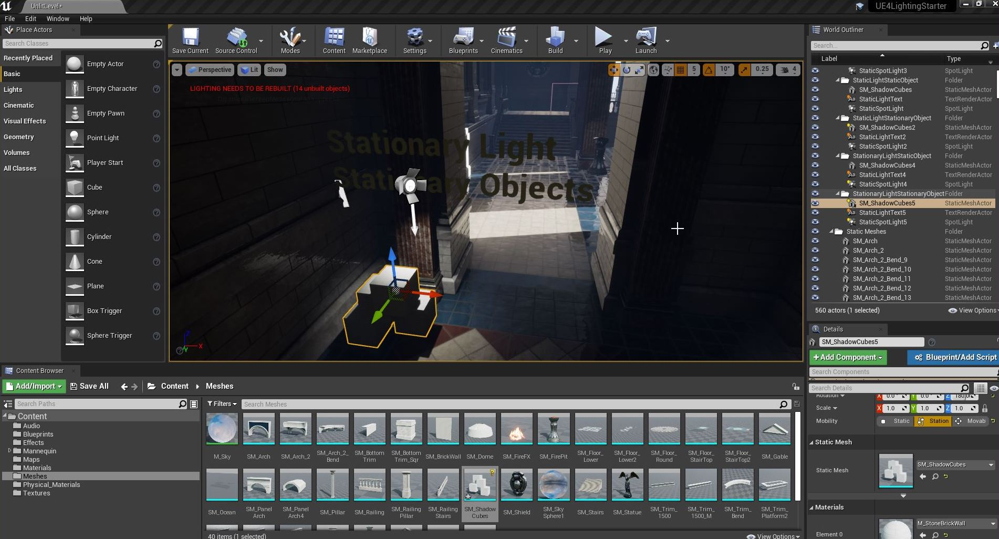

##### `Step 17.`\|`ITL`| :large_blue_diamond: :small_orange_diamond: :small_blue_diamond: :small_blue_diamond:

There is not a large difference between the static object and the stationary object with the stationary light.  It does an equally good job with both.

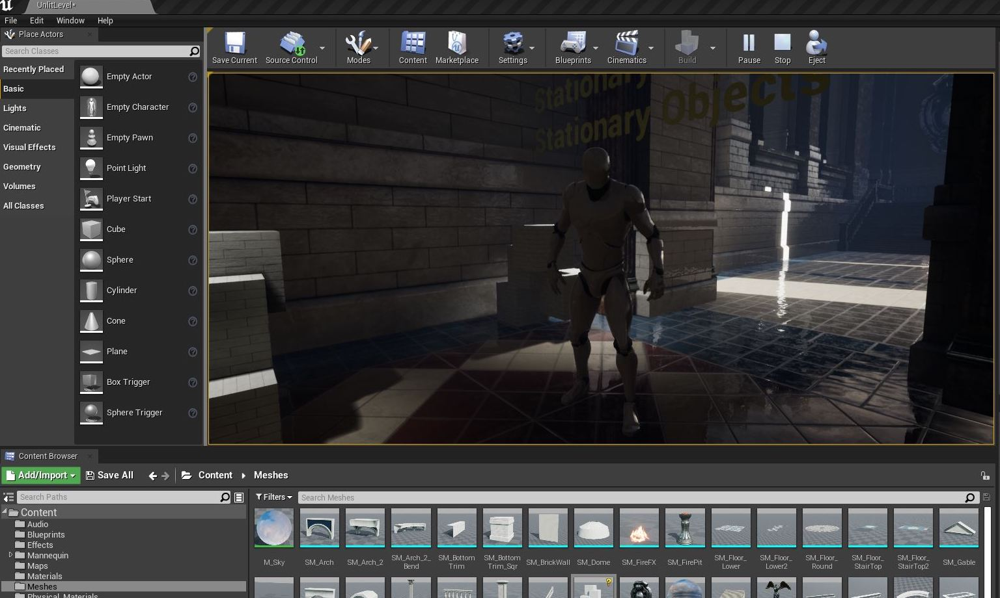

##### `Step 18.`\|`ITL`| :large_blue_diamond: :small_orange_diamond: :small_blue_diamond: :small_blue_diamond: :small_blue_diamond:

Duplicate the cubes, text and spot light from the **World Outliner**.  Move the copies to the right and put them in a folder called `StationaryLightMovableObject`. Change the **StaticLightText6** **Text** to `Stationary Light Movable Object`. Make sure that **SM_ShadowCubes4** is set to `Stationary` and **StaticSpotLight4** is set to `Stationary`.  Press the <kbd>Build</kbd> button.

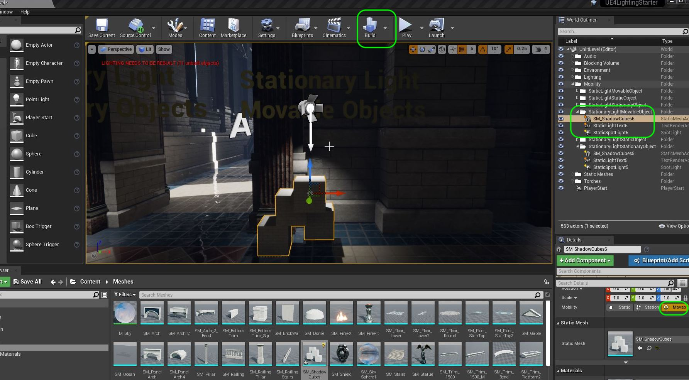

##### `Step 19.`\|`ITL`| :large_blue_diamond: :small_orange_diamond: :small_blue_diamond: :small_blue_diamond: :small_blue_diamond: :small_blue_diamond:

##### `Step 20.`\|`ITL`| :large_blue_diamond: :large_blue_diamond:

##### `Step 21.`\|`ITL`| :large_blue_diamond: :large_blue_diamond: :small_blue_diamond:

___

| [previous](../light-functions/README.md#user-content-light-functions)| [home](../README.md#user-content-ue4-lighting) | [next](../)|
|---|---|---|
