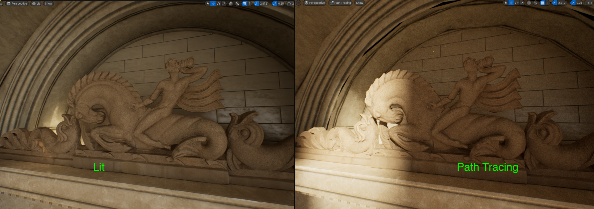

### Path Tracing

[previous](../post-process/README.md#post-process-volumes) • [home](../README.md#user-content-ue5-lighting) • [next](../sky-texture/README.md#customize-clouds)

For any beauty shots or portfolio stills there is a render mode that is not **real time** (not for a game) but will make the highest quality renders that the engine is capable of.  It is called the [Path Tracer](https://docs.unrealengine.com/5.2/en-US/path-tracer-in-unreal-engine/).

> The Path Tracer is a progressive, hardware-accelerated rendering mode that mitigates the disadvantages of real-time features with physically correct and compromise-free global illumination, reflection and refraction of materials, and more. It shares the ray tracing architecture built into Unreal Engine, with minimal to no additional setup required to achieve clean, photoreal renders.

 

---

##### `Step 1.`\|`ITL`|:small_blue_diamond:

For portfolio pieces you can also use a higher resolution renderer that is not real time.  Put a hero piece close to a nice lighting area and click the **Lit** button and select **Path Tracing**.  

>The Path Tracer is a progressive, hardware-accelerated rendering mode that mitigates the disadvantages of real-time features with physically correct and compromise-free global illumination, reflection and refraction of materials, and more. It shares the ray tracing architecture built into Unreal Engine, with minimal to no additional setup required to achieve clean, photoreal renders. - [Unreal Manual](https://docs.unrealengine.com/5.0/en-US/path-tracer-in-unreal-engine/)

You cannot play in this mode, but it makes for great portfolio renders!

##### `Step 2.`\|`ITL`|:small_blue_diamond: :small_blue_diamond: 

Frame up a shop and change the rendered from **Lit** to `Path Tracing`. Notice that it is very pixelated and there is a progress bar at the bottom.  It takes a long time to render (minutes not seconds).

##### `Step 3.`\|`ITL`|:small_blue_diamond: :small_blue_diamond: :small_blue_diamond:

Lets make our first attempt at path tracing.  Switch from **Ligt** to `Path Tracing` and you will notice that it is going to the fallback model as nanites are *not* supported in this mode.

https://github.com/maubanel/UE5-Lighting/assets/5504953/f5687efb-3258-4dfb-a496-126968e36afc

##### `Step 4.`\|`ITL`|:small_blue_diamond: :small_blue_diamond: :small_blue_diamond: :small_blue_diamond:

This is even more evident on the model on the top of the mantle in the very top of the gazebo.  The fallback model popping in is obvious when switching to Path Tracing mode.  Now click on the model and 

##### `Step 5.`\|`ITL`| :small_orange_diamond:

##### `Step 6.`\|`ITL`| :small_orange_diamond: :small_blue_diamond:

##### `Step 7.`\|`ITL`| :small_orange_diamond: :small_blue_diamond: :small_blue_diamond:

##### `Step 8.`\|`ITL`| :small_orange_diamond: :small_blue_diamond: :small_blue_diamond: :small_blue_diamond:

##### `Step 9.`\|`ITL`| :small_orange_diamond: :small_blue_diamond: :small_blue_diamond: :small_blue_diamond: :small_blue_diamond:

##### `Step 10.`\|`ITL`| :large_blue_diamond:

##### `Step 11.`\|`ITL`| :large_blue_diamond: :small_blue_diamond: 

##### `Step 12.`\|`ITL`| :large_blue_diamond: :small_blue_diamond: :small_blue_diamond: 

##### `Step 13.`\|`ITL`| :large_blue_diamond: :small_blue_diamond: :small_blue_diamond:  :small_blue_diamond: 

##### `Step 14.`\|`ITL`| :large_blue_diamond: :small_blue_diamond: :small_blue_diamond: :small_blue_diamond:  :small_blue_diamond: 

##### `Step 15.`\|`ITL`| :large_blue_diamond: :small_orange_diamond: 

##### `Step 16.`\|`ITL`| :large_blue_diamond: :small_orange_diamond:   :small_blue_diamond: 

##### `Step 17.`\|`ITL`| :large_blue_diamond: :small_orange_diamond: :small_blue_diamond: :small_blue_diamond:

##### `Step 18.`\|`ITL`| :large_blue_diamond: :small_orange_diamond: :small_blue_diamond: :small_blue_diamond: :small_blue_diamond:

##### `Step 19.`\|`ITL`| :large_blue_diamond: :small_orange_diamond: :small_blue_diamond: :small_blue_diamond: :small_blue_diamond: :small_blue_diamond:

##### `Step 20.`\|`ITL`| :large_blue_diamond: :large_blue_diamond:

##### `Step 21.`\|`ITL`| :large_blue_diamond: :large_blue_diamond: :small_blue_diamond:

<!--  -->

| [previous](../post-process/README.md#post-process-volumes)| [home](../README.md#user-content-ue5-lighting) | [next](../sky-texture/README.md#customize-clouds)|
|---|---|---|
