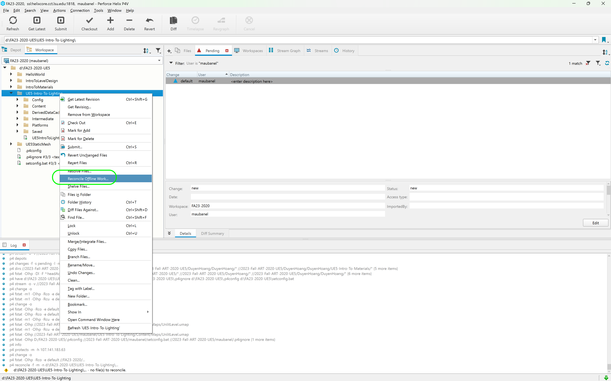

### Path Tracing

[previous](../post-process/README.md#post-process-volumes) • [home](../README.md#user-content-ue5-lighting) • [next](../sky-texture/README.md#customize-clouds)

For any beauty shots or portfolio stills there is a render mode that is not **real time** (not for a game) but will make the highest quality renders that the engine is capable of.  It is called the [Path Tracer](https://docs.unrealengine.com/5.2/en-US/path-tracer-in-unreal-engine/).

> The Path Tracer is a progressive, hardware-accelerated rendering mode that mitigates the disadvantages of real-time features with physically correct and compromise-free global illumination, reflection and refraction of materials, and more. It shares the ray tracing architecture built into Unreal Engine, with minimal to no additional setup required to achieve clean, photoreal renders.

 

---

##### `Step 1.`\|`ITL`|:small_blue_diamond:

For portfolio pieces you can also use a higher resolution renderer that is not real time.  Put a hero piece close to a nice lighting area and click the **Lit** button and select **Path Tracing**.  

>The Path Tracer is a progressive, hardware-accelerated rendering mode that mitigates the disadvantages of real-time features with physically correct and compromise-free global illumination, reflection and refraction of materials, and more. It shares the ray tracing architecture built into Unreal Engine, with minimal to no additional setup required to achieve clean, photoreal renders. - [Unreal Manual](https://docs.unrealengine.com/5.0/en-US/path-tracer-in-unreal-engine/)

You cannot play in this mode, but it makes for great portfolio renders!

##### `Step 2.`\|`ITL`|:small_blue_diamond: :small_blue_diamond: 

Frame up a shop and change the rendered from **Lit** to `Path Tracing`. Notice that it is very pixelated and there is a progress bar at the bottom.  It takes a long time to render (minutes not seconds).

##### `Step 3.`\|`ITL`|:small_blue_diamond: :small_blue_diamond: :small_blue_diamond:

Lets make our first attempt at path tracing.  Switch from **Ligt** to `Path Tracing` and you will notice that it is going to the fallback model as nanites are *not* supported in this mode.

https://github.com/maubanel/UE5-Lighting/assets/5504953/f5687efb-3258-4dfb-a496-126968e36afc

##### `Step 4.`\|`ITL`|:small_blue_diamond: :small_blue_diamond: :small_blue_diamond: :small_blue_diamond:

This is even more evident on the model on the top of the mantle in the very top of the gazebo.  The fallback model popping in is obvious when switching to Path Tracing mode.  Now click on the model in the game and in the **Details Panel** right click on the model and select **Browse to Asset**.  Open up the model and change the **Fallback Relative Error** to `0.0`.  Press the **Apply** button.  This will minimize the degradation that takes place but will take minutes to render.  Please do not leave these settings as they are **NOT** appropriate for a game, so undo these changes when you have finished path rendering. 

https://github.com/maubanel/UE5-Lighting/assets/5504953/1826b70c-6320-49c8-8ab2-991201691c0c

##### `Step 5.`\|`ITL`| :small_orange_diamond:

Now change from **Lit** to **Path Tracing** and let it render.  In this case I increased the depth of field and tilted the model to accentuate the render.

https://github.com/maubanel/UE5-Lighting/assets/5504953/47ad667e-418a-455a-9169-9111827645f9

##### `Step 6.`\|`ITL`| :small_orange_diamond: :small_blue_diamond:

You need to adjust the lighting and exposure as the resulst can be different, in this one case very dramatic.  Try it for a few more screenshots.

##### `Step 7.`\|`ITL`| :small_orange_diamond: :small_blue_diamond: :small_blue_diamond:

Select the **File | Save All** then press the #<kbd>Revision Control</kbd> button and select **Submit Content**.  If you are prompted, select **Check Out** for all items that are not checked out of source control. Update the **Changelist Description** message and with the latest changes. Make sure all the files are correct and press the <kbd>Submit</kbd> button. A confirmation will pop up on the bottom right with a message about a changelist was submitted with a commit number. Quit Unreal and make sure your **Pending** tab in **P4V** is empty. **Submit** any work that is still in the editor.

##### `Step 8.`\|`ITL`| :small_orange_diamond: :small_blue_diamond: :small_blue_diamond: :small_blue_diamond:

Sometimes not all files get submitted to Unreal especially for files that don't show up in the editor.  It is good practice one you submit in **Unreal** and quit the game to right click on the top most project folder and select **Reconcile Offline Work...**.

This will either give a message saying ther is nothing to reconcile or bring up a tab.  Make sure that these are **NOT** files in the **Intermediate** and **Saved** folders as these should be ignored from the `.p4ignore`.

If the files are in **Content** or **Configuration** then press the <kbd>Reconcile</kbd> button.  Then submit the changes with a message and press the <kbd>Submit</kbd> button.

<!--  -->

| [previous](../post-process/README.md#post-process-volumes)| [home](../README.md#user-content-ue5-lighting) | [next](../sky-texture/README.md#customize-clouds)|
|---|---|---|
