### Point Lights

[previous](../prep/README.md#user-content-lighting-prep) • [home](../README.md#user-content-ue4-lighting) • [next](../light-functions/README.md#user-content-light-functions)

We need to add a lightmass importance volume so that the game can optimise the lighting processing on the area that the player is navigating in. Lets look at adding light to the flames and embers throughout the level. We will add a static light for the embers and a dynamic one for the flames to add a bit of a realistic flicker. This will be using  a point light.  This is any light source like a lamp or flame that radiates light in all direction. 

 

---

##### `Step 1.`\|`ITL`|:small_blue_diamond:

Now lets add some immediate fog as we are on the ocean which often has a fog/mist.  The horizon is too straight and visible. Drag a **[Special Effects | Exponential Height Fog](https://docs.unrealengine.com/4.26/en-US/BuildingWorlds/FogEffects/HeightFog/)** into the level in the **Lighting** folder.  

> Exponential Height Fog creates more density in low places of a map and less density in high places. The transition is smooth, so you never get a hard cutoff as you increase altitude. Exponential Height Fog also provides two fog colors—one for the hemisphere facing the dominant directional light (or straight up if none exists), and another color for the opposite hemisphere.

Now the default **Fog Density** of `0.02` is not enough and I still see a hard line at the horizon.  I prefer a density setting of `0.05`.

Now press the <kbd>Build</kbd> button to rebuild the light. 

Run the game and see what we have set up.  Our basics are all in place to start diving into lighting a bit deeper.

https://user-images.githubusercontent.com/5504953/131570075-58a644c3-023c-4501-b3f0-607b23ca650c.mp4

When buidling lights look for errors in the **Message Log**.  We are getting one in our light buliding stating **! No importance volume found adn the scene is so large...**.  This means that the light baking will not yeild good results.

The issue here is that the sky sphere is 10,000 units large and when it is ray tracing it doesn't have the memory or time to light everything inside it.  This is not necessary as we only are in the building and are blocked from leaving it.

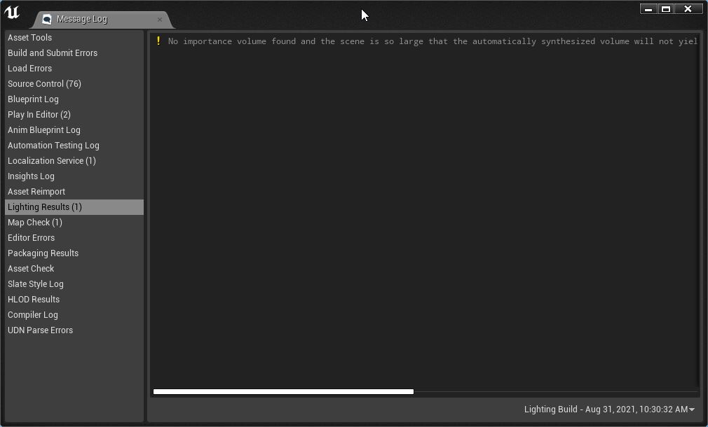

##### `Step 2.`\|`FHIU`|:small_blue_diamond: :small_blue_diamond: 

Add a **Volumes | Lightmass Importance Volume**  into the level.  Press the downward arrow in the top left of the editor game window and select **Layouts | Three Panes** to open up three game windows.  Set one to `Top` the other to `Left` and the third one to `Perspective`.
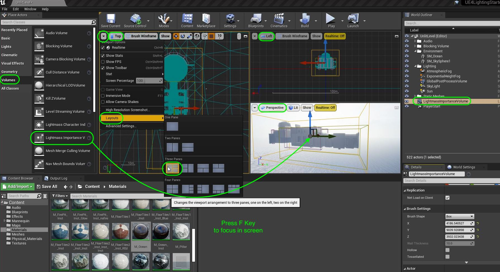

##### `Step 3.`\|`ITL`|:small_blue_diamond: :small_blue_diamond: :small_blue_diamond:

Now put the **Lightmass Importance Volume** in the **Lighting** folder.  Adjust the **Location** to the center of the building then adjust the **Brush Settings | X | Y | Z** to surround the building.  You don't need to get too close. 

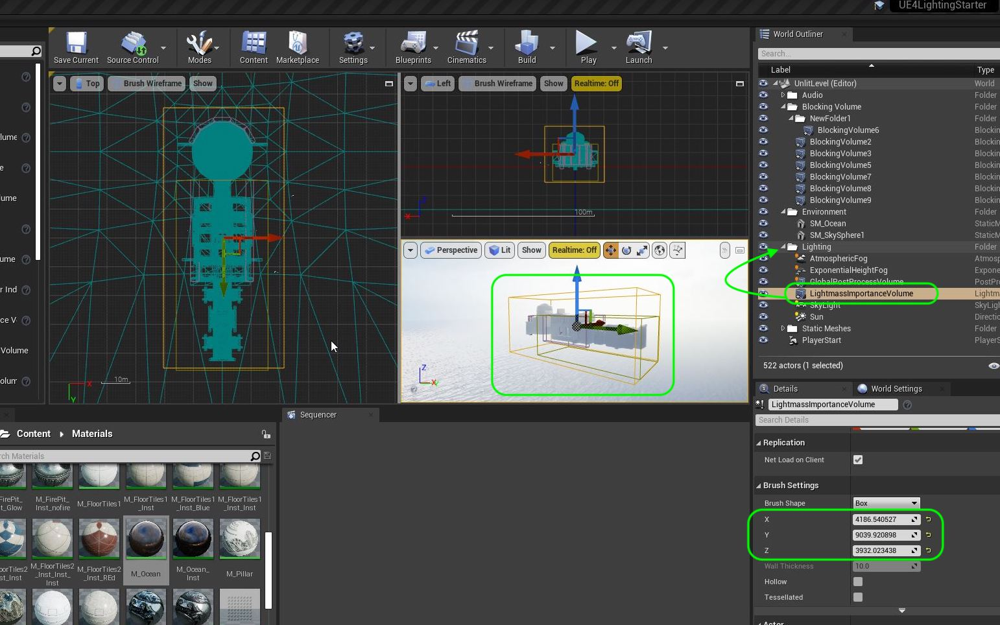

##### `Step 4.`\|`ITL`|:small_blue_diamond: :small_blue_diamond: :small_blue_diamond: :small_blue_diamond:

Press the **Arrow** next to the <kbd>Build</kbd> button and select **Build Lighting Only**. Now we no longer get a pop up with an error.  It is good when lighting to **ALWAYS** check for errors and respond to them in kind.

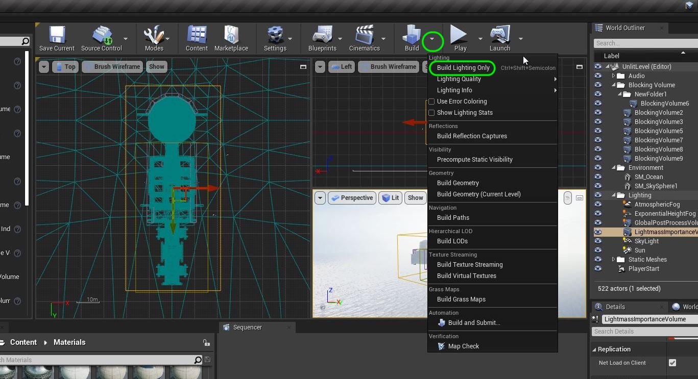

| `point.lights`\|`UE4 Lighting`| 
| :--- |
| :floppy_disk: &nbsp; &nbsp; For the embers with no flame we will use a point light. This is a light that radiates equally in all directions. *[Point Lights](https://docs.unrealengine.com/4.27/en-US/BuildingWorlds/LightingAndShadows/LightTypes/Point/) work much like a real world light bulb, emitting light in all directions from the light bulb's tungsten filament. However, for the sake of performance, Point Lights are simplified down emitting light equally in all directions from just a single point in space.* |

##### `Step 5.`\|`ITL`| :small_orange_diamond:

Lets turn on another emissive material in the level that is used to represent the embers on the top of the torches.  Open up **M_FirePit** and connect the output of the **Multiply** node to the **Emissive Color** node in the main shader. 

Press the <kbd>Apply</kbd> button.

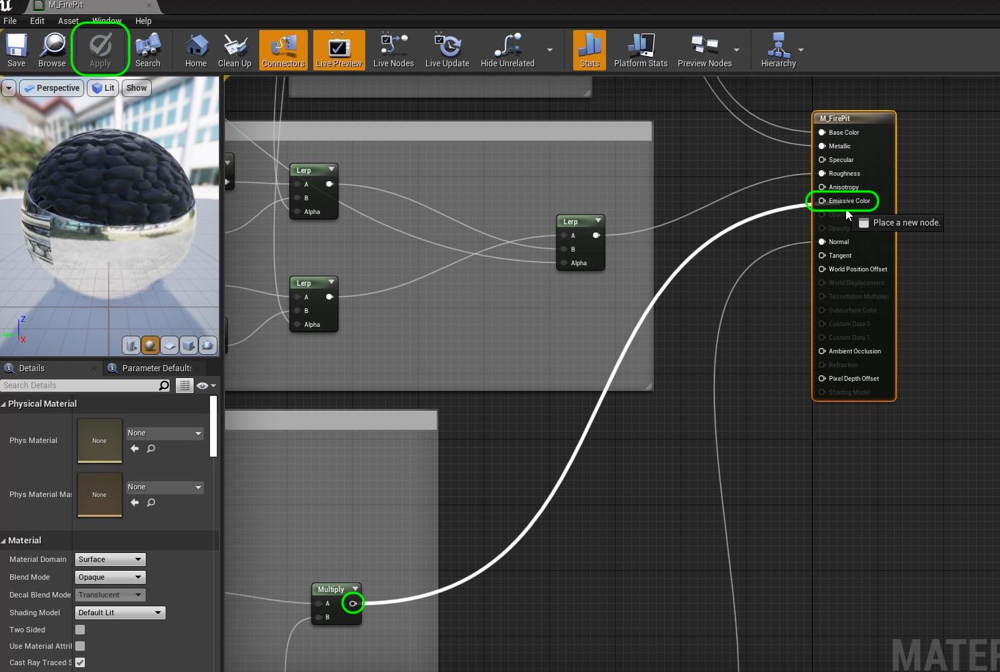

##### `Step 6.`\|`ITL`| :small_orange_diamond: :small_blue_diamond:

Now you should see some of the torches in the level are glowing.  Lets add a Point Light to light up the surrounding.

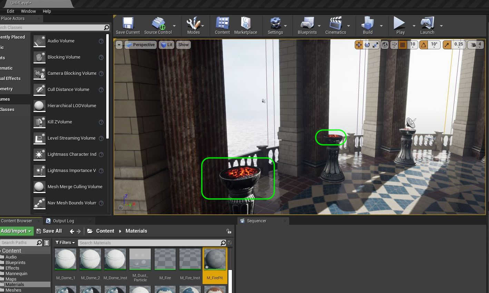

##### `Step 7.`\|`ITL`| :small_orange_diamond: :small_blue_diamond: :small_blue_diamond:

Add a **Light | Point Light** to the scene and position it on top of one of the embers that is in the shadows. Add a new folder called `Torches`.  Put the **Point Light** in it. Adjust the color to match the orange/red of the embers the best you can.

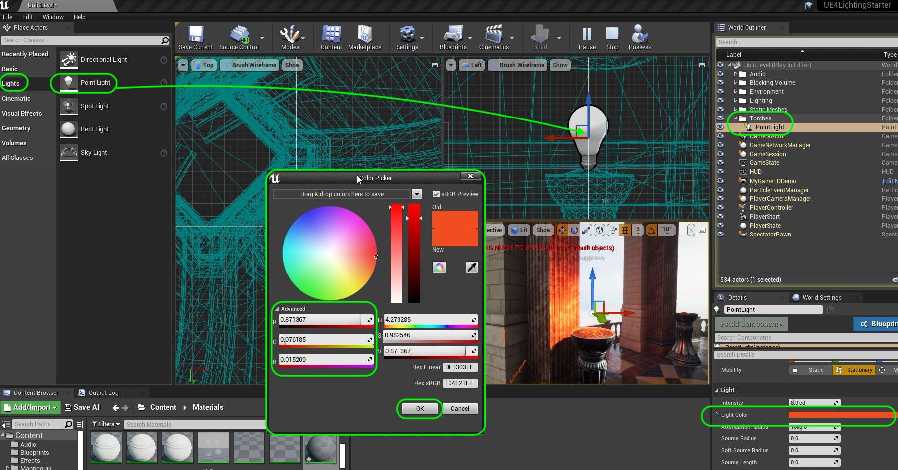

##### `Step 8.`\|`ITL`| :small_orange_diamond: :small_blue_diamond: :small_blue_diamond: :small_blue_diamond:

Select the advanced features of lighting (the small arrow at the bottom) and change intensity units to **Lumens**.  Many lights we use day to day are published in lumens so it is a common format. You can also use **Candelas**.  Do not use **Unitless** as this is legacy for old versions to work. Set the value to `3.2` lumens as it is a dim glow that we want.

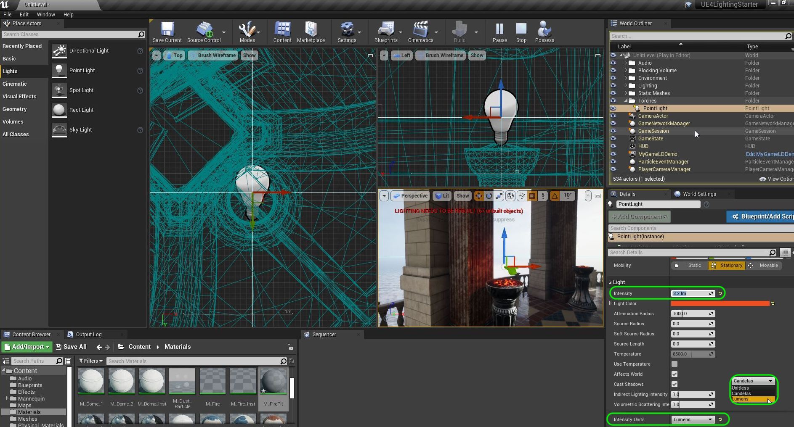

##### `Step 9.`\|`ITL`| :small_orange_diamond: :small_blue_diamond: :small_blue_diamond: :small_blue_diamond: :small_blue_diamond:

Now lets adjust the **Attenuation Radius**.  This is the distance the light will travel before it no longer affects the world.  It is the distance a light travels.  It is indicated with the light colored sphere.  I set mine to `165`.

I also set the **Source Radius**.  This is how large and what shape is the light emanating from.  It is the entire coal bed so I set mine to `27`. This is the inner yellow sphere. 

Position the light into the embers to cast the right shadow on the wall.

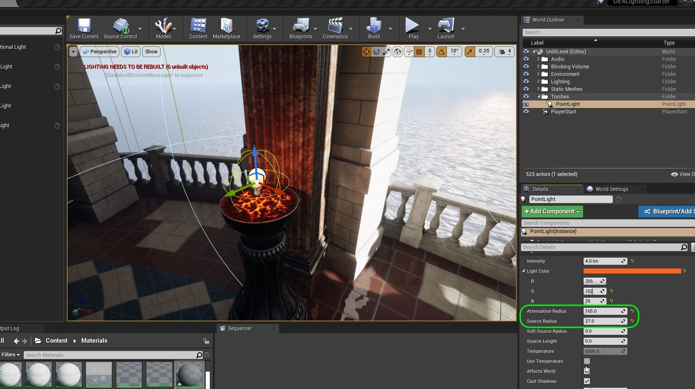

##### `Step 10.`\|`ITL`| :large_blue_diamond:

Now to see the effect of the light I need to turn it on or off.  Do not use the **Eye** icon in the **World Outliner** this will not affect the light. Instead go to the **Details** panel and turn **Light | Affects World** on and off and you can see what changes it makes.

When you are happy turn it back on.

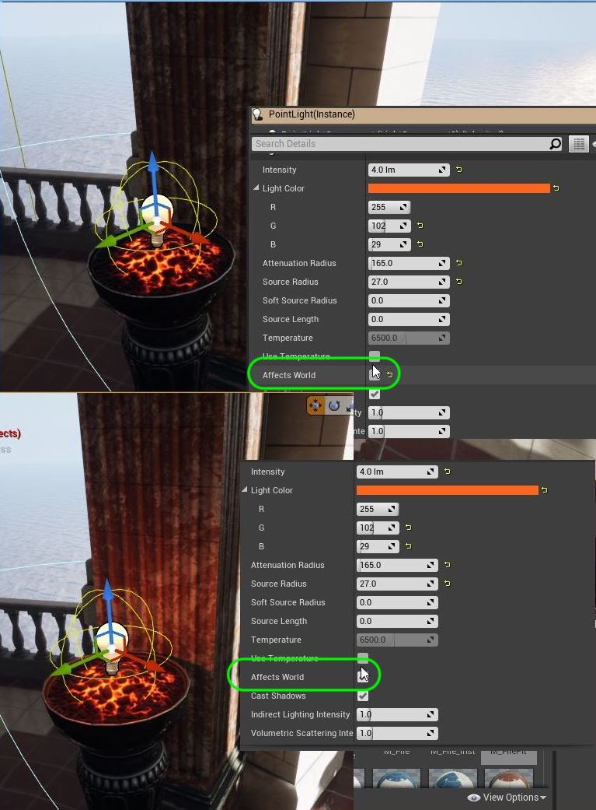

##### `Step 11.`\|`ITL`| :large_blue_diamond: :small_blue_diamond: 

Now lights have three settings for **Mobility**.  They are `Static`, `Stationary` and `Movable`.  These are very different.  From a performance standpoint, the least expensive is static, then next most expensive is stationary and the MOST expensive is movable.

> [Static Lights](https://docs.unrealengine.com/4.26/en-US/BuildingWorlds/LightingAndShadows/LightMobility/StaticLights/) are lights that cannot be changed or moved in any way at runtime. They are calculated only within Lightmaps, and once processed, have no further impact on performance. Movable objects cannot integrate with static lights, so the usefulness of static lights is limited. - Unreal Manual

> [Stationary Lights](https://docs.unrealengine.com/4.26/en-US/BuildingWorlds/LightingAndShadows/LightMobility/StationaryLights/) are lights that are intended to stay in one position, but are able to change in other ways, such as their brightness and color. This is the primary way in which they differ from Static Lights, which cannot change in any way during gameplay. However, it should be noted that runtime changes to brightness only affect the direct lighting. Indirect (bounced) lighting, since it is pre-calculated by Lightmass, will not change. - Unreal Manual

> [Movable Lights](https://docs.unrealengine.com/4.26/en-US/BuildingWorlds/LightingAndShadows/LightMobility/DynamicLights/) cast completely dynamic light and shadows. They can change position, rotation, color, brightness, falloff, radius, and just about every other property they have. None of the light they cast gets baked into the lightmaps, and do not support indirect lighting without a dynamic global illumination method. - Unreal Manual

Of the three light mobilities, Stationary lights tend to have the highest quality, medium mutability, and medium performance cost.

Look at the level where I have adjusted the brightness and put three point lights for the player to walk underneath.

Now we need to build lighting for lights that are marked at **Static** or **Stationary**. These bake the lighting and shadows of static objects in the texture itself. 

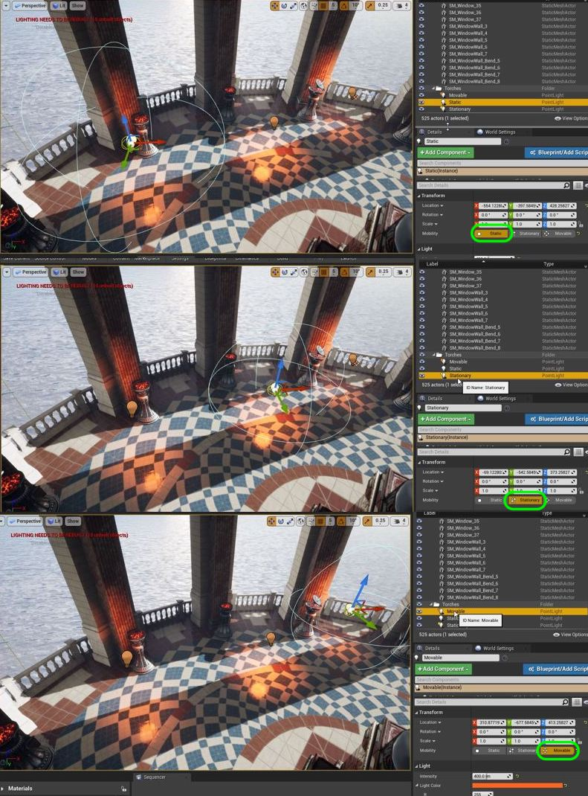

##### `Step 12.`\|`ITL`| :large_blue_diamond: :small_blue_diamond: :small_blue_diamond: 

Now when I move under the lights look at how the light affects the shadow on the ground and the lighting on the player.  The static light casts no shadow and it doesn't read correctly as one would expect it to affect the ground plane.  In this case the movable setting looks the best but stationary is a good comprimise.

https://user-images.githubusercontent.com/5504953/131582540-619753cf-a5e4-4eaa-acea-cbc7a2bfe841.mp4

##### `Step 13.`\|`ITL`| :large_blue_diamond: :small_blue_diamond: :small_blue_diamond:  :small_blue_diamond: 

Since this light does not animate and the object it is illuminating is static, we can bake this light into the texture. It will not be interacting with the player as they cannot get behind the torches.  So we will use the cheapest lighting mobility and set it to **Static**.

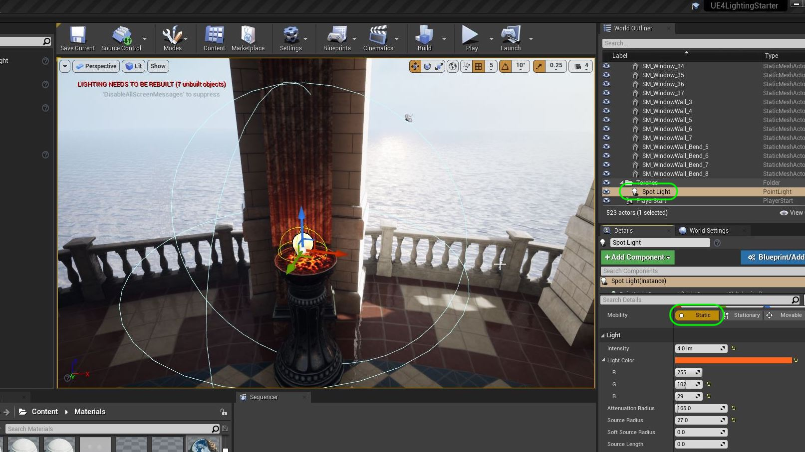

##### `Step 14.`\|`ITL`| :large_blue_diamond: :small_blue_diamond: :small_blue_diamond: :small_blue_diamond:  :small_blue_diamond: 

Press **Build | Build Lighting** then run and look at it in game. We want a subtle efect here but we can clearly see that the embers does have a small lighting effect that you don't see on the non-lit ember next to it. This adds a bit more realism.

https://user-images.githubusercontent.com/5504953/131583790-6aa24dda-0249-4b34-8315-bbfc7ad2c5bd.mp4

##### `Step 15.`\|`ITL`| :large_blue_diamond: :small_orange_diamond: 

Alt drag another copy of the ember light to each lantern that either has an ember. There is one stand that has neither and we will not place a light here. Check all the rooms for all the lanterns with glowing embers. I counted 14 additional lights.  You can copy the **Location** of the **FirePit** actor and paste it on the **Location** of a duplicated light.  This way I could ensure I had a light per location though some had no lit embers so no light.

https://user-images.githubusercontent.com/5504953/131666409-a2482b9f-4fef-4adc-beac-d7ffa48e5345.mp4

##### `Step 16.`\|`ITL`| :large_blue_diamond: :small_orange_diamond:   :small_blue_diamond: 

Press **File | Save All** and press **Source Control |  Submit to Source Control...** and enter a **Description** then press the <kbd>Submit</kbd> button. Open up **GitHub Desktop** and press the <kbd>Push</kbd> button. Now we are updated.

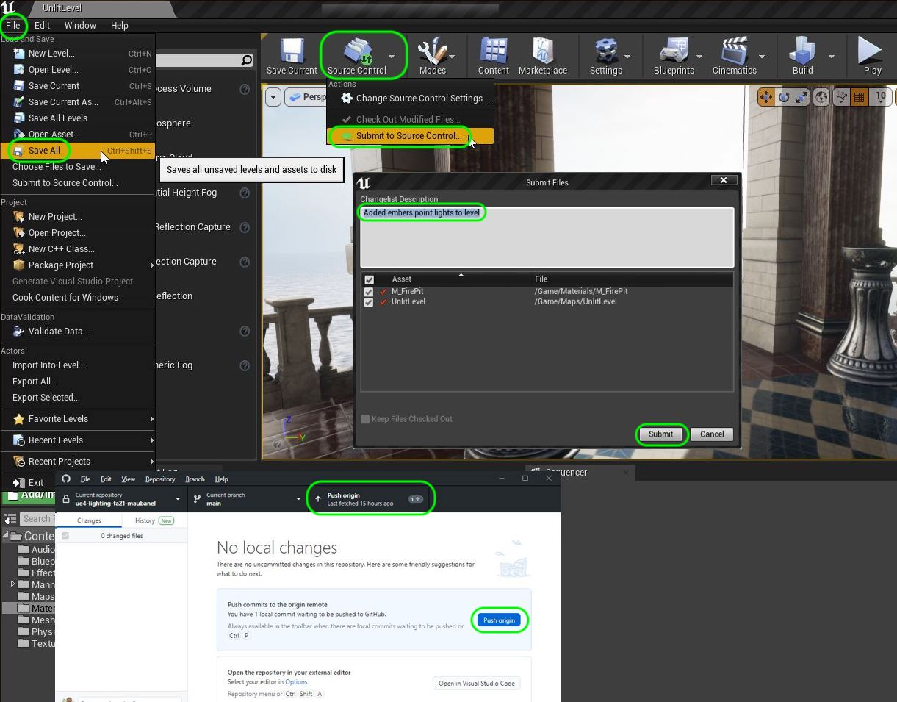

___

| [previous](../prep/README.md#user-content-lighting-prep)| [home](../README.md#user-content-ue4-lighting) | [next](../light-functions/README.md#user-content-light-functions)|
|---|---|---|
