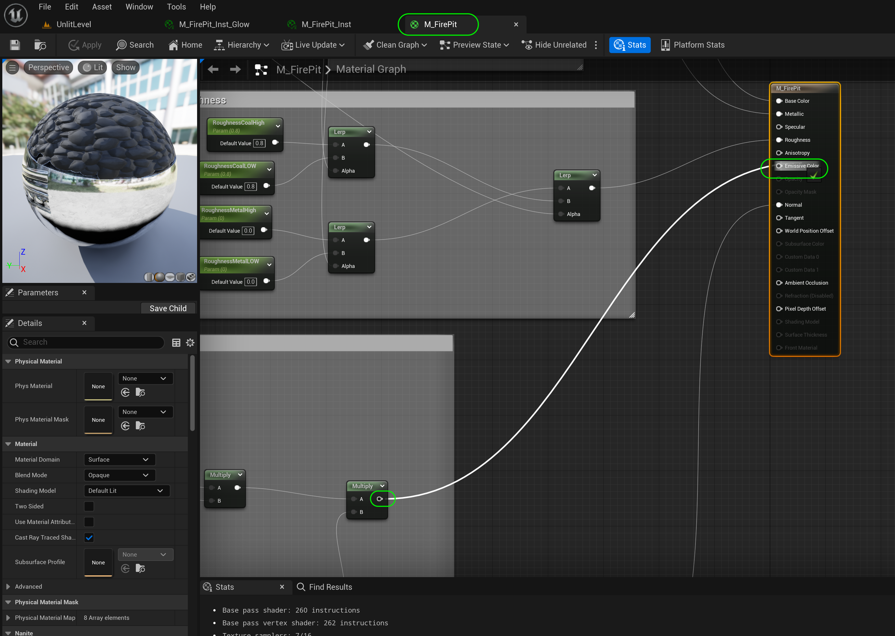
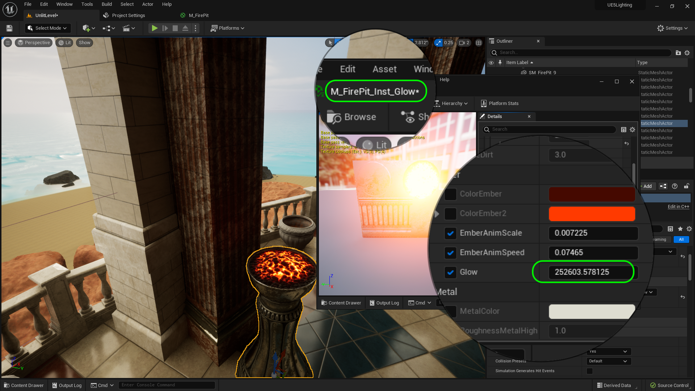
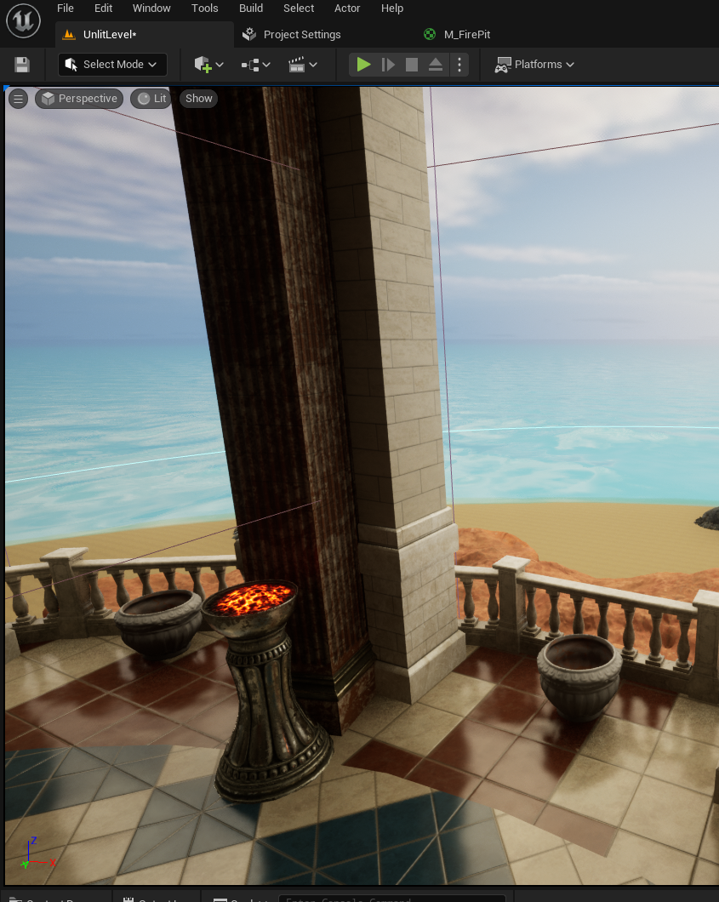
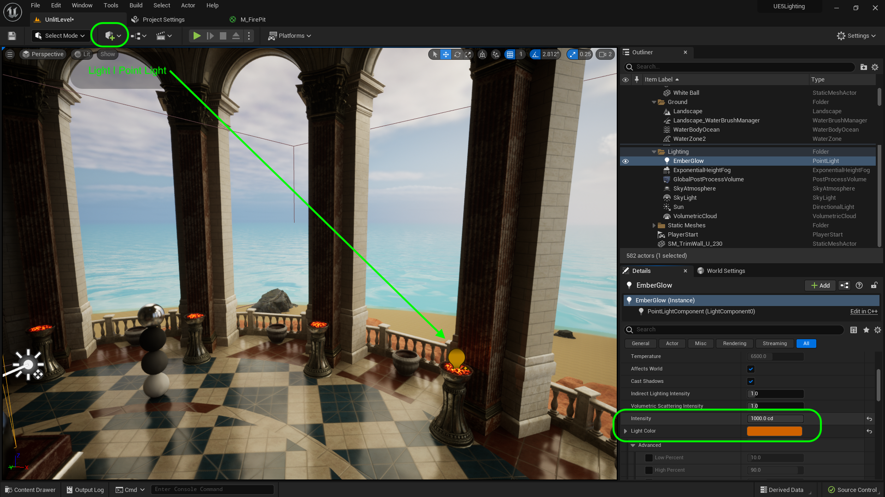

### Point Lights

[previous](../prep/README.md#user-content-lighting-prep) • [home](../README.md#user-content-ue4-lighting) • [next](../light-functions/README.md#user-content-light-functions)

Lets look at adding light to the flames and embers throughout the level. We will add a static light for the embers and a dynamic one for the flames to add a bit of a realistic flicker. This will be using  a point light.  This is any light source like a lamp or flame that radiates light in all direction. 

 

---

| `point.lights`\|`UE4 Lighting`| 
| :--- |
| :floppy_disk: &nbsp; &nbsp; For the embers with no flame we will use a point light. This is a light that radiates equally in all directions. *[Point Lights](https://docs.unrealengine.com/4.27/en-US/BuildingWorlds/LightingAndShadows/LightTypes/Point/) work much like a real world light bulb, emitting light in all directions from the light bulb's tungsten filament. However, for the sake of performance, Point Lights are simplified down emitting light equally in all directions from just a single point in space.* |

##### `Step 1.`\|`ITL`|:small_blue_diamond:

Lets turn on another emissive material in the level that is used to represent the embers on the top of the torches.  Open up **M_FirePit** and connect the output of the **Multiply** node to the **Emissive Color** node in the main shader. 

Press the <kbd>Apply</kbd> and <kbd>Save</kbd> buttons.

##### `Step 2.`\|`ITL`|:small_blue_diamond: :small_blue_diamond: 

Now open up **M_FirePit_Inst_Glow** material instance and increase the **Glow** scalr to a very large number.  The preview window does not reflect what we are seeing in game as we are in **EV100**. Now you should see an ember in every lantern except for one on the gazebo.

##### `Step 3.`\|`ITL`|:small_blue_diamond: :small_blue_diamond: :small_blue_diamond:

Now you should see some of the torches in the level are glowing.  Lets add a Point Light to light up the surrounding. Now these materials send a light but not enough.  We should add a point light (a radiating light like a light bulb).

##### `Step 4.`\|`ITL`|:small_blue_diamond: :small_blue_diamond: :small_blue_diamond: :small_blue_diamond:

So press the **Add Actor** button and select a **Light | Point Light** and drag it on top of the lantern.  Position it just inside the center of the embers.  Change the **Light Color** to match the orange of the glow and set the **Intensity** to an appropriate level that radiates subtly on the edge of the column.  Drag it into the **Lighting** folder and name it `Ember Glow`. Set the mobility to **Movable**.

##### `Step 5.`\|`ITL`| :small_orange_diamond:

Now lets adjust the **Attenuation Radius**.  This is the distance the light will travel before it no longer affects the world.  It is the distance a light travels before its light drops to 0.  It is indicated with the light colored sphere.  I set mine to `130`.

https://user-images.githubusercontent.com/5504953/189125482-355ed330-d096-4641-a3f8-07a8492c4843.mp4

##### `Step 6.`\|`ITL`| :small_orange_diamond: :small_blue_diamond:

I also set the **Source Radius**.  This is how large and what shape is the light emanating from.  It is the entire coal bed so I set mine to `27`. This is the inner yellow sphere. This not only affects how large a radius the light is emitted from, but it also shows up in the reflection.  Move the silver ball close to the light and see how the glow grows with the source radius.  Now the **Soft Source Radius** affects how soft the light is and since this is an ember and not a flame it looks a bit bright so we will soften the radius of the light.  This is easiest to see in the silver ball.

https://user-images.githubusercontent.com/5504953/189126555-622baf8f-be41-4ec8-858b-6af88d184571.mp4

##### `Step 7.`\|`ITL`| :small_orange_diamond: :small_blue_diamond: :small_blue_diamond:

*Press* the <kbd>Play</kbd> button and look at the light you created.  Notice the effect is quite subtle which is exactly what we want.  It is an ember and not a raging flame, so the light should be sublte.

https://user-images.githubusercontent.com/5504953/189105415-f286a91e-8e25-4a9d-aca5-9feb3d45db72.mp4

##### `Step 8.`\|`ITL`| :small_orange_diamond: :small_blue_diamond: :small_blue_diamond: :small_blue_diamond:

lt drag another copy of the ember light to each lantern that either has an ember. You should hvae a total of 7 lights on the gazebo. There is one stand that has neither and we will not place a light here. 

https://user-images.githubusercontent.com/5504953/189105474-e9cba197-f828-4548-9e4b-cdc71019ceec.mp4

##### `Step 9.`\|`ITL`| :small_orange_diamond: :small_blue_diamond: :small_blue_diamond: :small_blue_diamond: :small_blue_diamond:

Now lets organize the outliner a bit.  Put the 4 exposure balls inside a folder called.

##### `Step 10.`\|`ITL`| :large_blue_diamond:

##### `Step 11.`\|`ITL`| :large_blue_diamond: :small_blue_diamond: 

##### `Step 12.`\|`ITL`| :large_blue_diamond: :small_blue_diamond: :small_blue_diamond: 

##### `Step 13.`\|`ITL`| :large_blue_diamond: :small_blue_diamond: :small_blue_diamond:  :small_blue_diamond: 

##### `Step 14.`\|`ITL`| :large_blue_diamond: :small_blue_diamond: :small_blue_diamond: :small_blue_diamond:  :small_blue_diamond: 

##### `Step 15.`\|`ITL`| :large_blue_diamond: :small_orange_diamond: 

A

https://user-images.githubusercontent.com/5504953/131666409-a2482b9f-4fef-4adc-beac-d7ffa48e5345.mp4

##### `Step 16.`\|`ITL`| :large_blue_diamond: :small_orange_diamond:   :small_blue_diamond: 

<!--  -->

| [previous](../prep/README.md#user-content-lighting-prep)| [home](../README.md#user-content-ue4-lighting) | [next](../light-functions/README.md#user-content-light-functions)|
|---|---|---|
