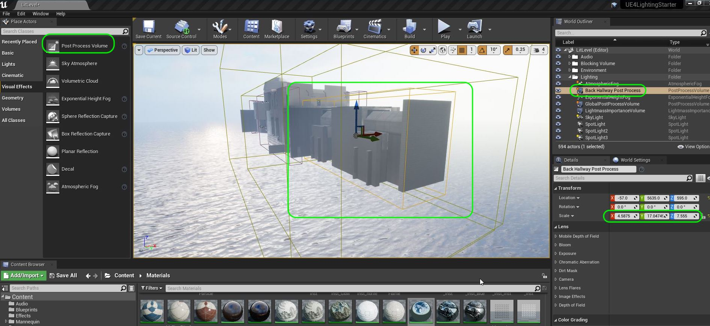
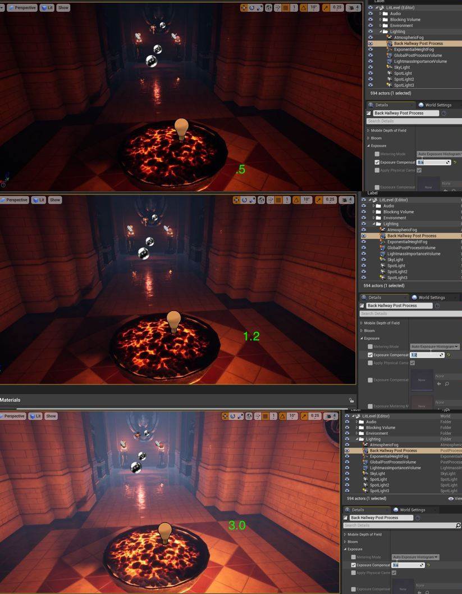

### Post Process Volumes

[previous](../rays-lights/README.md#user-content-rays-and-lights) • [home](../README.md#user-content-ue4-lighting) • [next](../)

Lets add a post production volume in each room and adjust some settings to finalize our look. These [Post Process Volumes](https://docs.unrealengine.com/4.26/en-US/RenderingAndGraphics/PostProcessEffects/) are a powerful way to add different effects and perform final grading.

 

---

##### `Step 1.`\|`ITL`|:small_blue_diamond:

Add another **Post Process Volume** and add it to the **Lighting Folder** and call it `Back Hallway Post Process` and scale the **X,Y,Z** to encompass the entire back hallway and overlap a little bit into the middle room. The overlapping volumes will fade between the two effect volumes. This way we will not make it affect the entire level.  We will do some seperate processing for this back hallway.

##### `Step 2.`\|`FHIU`|:small_blue_diamond: :small_blue_diamond: 

Now instead of adding more lights in the back hallway as there are no other light sources we can open up the iris and increase the exposure on the camera. In the **Post Production Volume | Lens | Exposure | Exposure Compensation** try out values above `1.0` and less than `1.0` while your camera is in the room. These do not need to be built as these effects take place right away. I picked a value around `1.2`.

##### `Step 3.`\|`ITL`|:small_blue_diamond: :small_blue_diamond: :small_blue_diamond:

##### `Step 4.`\|`ITL`|:small_blue_diamond: :small_blue_diamond: :small_blue_diamond: :small_blue_diamond:

##### `Step 5.`\|`ITL`| :small_orange_diamond:

##### `Step 6.`\|`ITL`| :small_orange_diamond: :small_blue_diamond:

##### `Step 7.`\|`ITL`| :small_orange_diamond: :small_blue_diamond: :small_blue_diamond:

##### `Step 8.`\|`ITL`| :small_orange_diamond: :small_blue_diamond: :small_blue_diamond: :small_blue_diamond:

##### `Step 9.`\|`ITL`| :small_orange_diamond: :small_blue_diamond: :small_blue_diamond: :small_blue_diamond: :small_blue_diamond:

##### `Step 10.`\|`ITL`| :large_blue_diamond:

##### `Step 11.`\|`ITL`| :large_blue_diamond: :small_blue_diamond: 

##### `Step 12.`\|`ITL`| :large_blue_diamond: :small_blue_diamond: :small_blue_diamond: 

##### `Step 13.`\|`ITL`| :large_blue_diamond: :small_blue_diamond: :small_blue_diamond:  :small_blue_diamond: 

##### `Step 14.`\|`ITL`| :large_blue_diamond: :small_blue_diamond: :small_blue_diamond: :small_blue_diamond:  :small_blue_diamond: 

##### `Step 15.`\|`ITL`| :large_blue_diamond: :small_orange_diamond: 

##### `Step 16.`\|`ITL`| :large_blue_diamond: :small_orange_diamond:   :small_blue_diamond: 

##### `Step 17.`\|`ITL`| :large_blue_diamond: :small_orange_diamond: :small_blue_diamond: :small_blue_diamond:

##### `Step 18.`\|`ITL`| :large_blue_diamond: :small_orange_diamond: :small_blue_diamond: :small_blue_diamond: :small_blue_diamond:

##### `Step 19.`\|`ITL`| :large_blue_diamond: :small_orange_diamond: :small_blue_diamond: :small_blue_diamond: :small_blue_diamond: :small_blue_diamond:

##### `Step 20.`\|`ITL`| :large_blue_diamond: :large_blue_diamond:

##### `Step 21.`\|`ITL`| :large_blue_diamond: :large_blue_diamond: :small_blue_diamond:

___

| [previous](../rays-lights/README.md#user-content-rays-and-lights)| [home](../README.md#user-content-ue4-lighting) | [next](../)|
|---|---|---|
