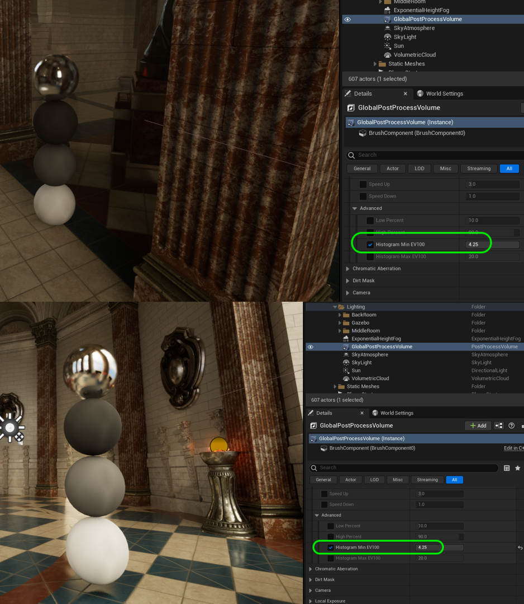
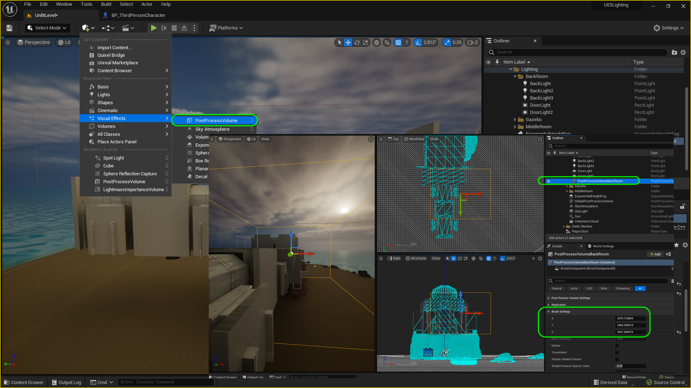
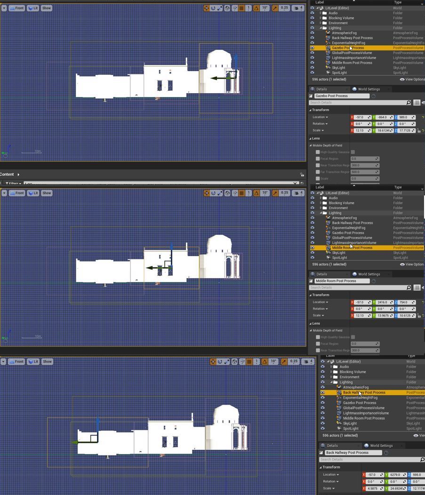
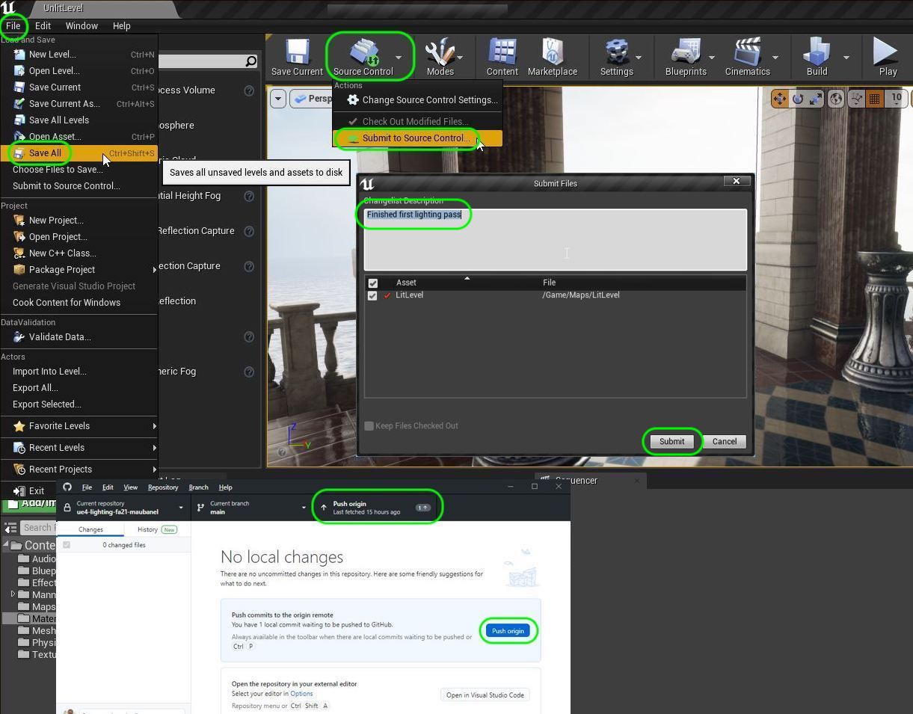

### Post Process Volumes

[previous](../baked-lighting-ii/README.md#user-content-baked-lighting-ii) • [home](../README.md#user-content-ue4-lighting) • [next](../sky-texture/README.md#user-content-changing-sky-texture)

We have used the Post Production Volume to adjust the overall settings.  We can isolate them to an area.  We have three areas in our level, so lets add a post production volume in each room and adjust some settings to finalize our look. These [Post Process Volumes](https://docs.unrealengine.com/5.0/en-US/post-process-effects-in-unreal-engine/) are a powerful way to add different effects and perform final grading.

 

---

##### `Step 1.`\|`ITL`|:small_blue_diamond:

Now lets turn the auto exposure back on and make some final tweaks first. We turned off auto iris to adjust lights, but now we can turn it back on and make some tweaks.  Go to the **Global Post Process Volume** anad change the **Metering Mode** to `Auto Exposure Histogram`.  Turn off **Apply Physical Camera Exposure** and adjust the **Exposure Compenstation** to taste.

https://user-images.githubusercontent.com/5504953/189538749-1158bdb7-9b95-4ddf-bf92-f2348ebfe44c.mp4

##### `Step 2.`\|`ITL`|:small_blue_diamond: :small_blue_diamond: 

Now since I used real EV values, open up **Advanced** and adjust the **HistogramMinEV100**.  I set mine to `4.25`.  Look at the gray balls both in the middle room and outdoors and see if it works for you?

##### `Step 3.`\|`ITL`|:small_blue_diamond: :small_blue_diamond: :small_blue_diamond:

Now move the **Player Start** actor back to the front room. Play the game and look at the light change.  I find the iris moves back and forth too quickly, lets adjust this.

https://user-images.githubusercontent.com/5504953/189539630-44b7844a-9a8f-4ba5-9487-3c18841c1bf0.mp4

##### `Step 4.`\|`ITL`|:small_blue_diamond: :small_blue_diamond: :small_blue_diamond: :small_blue_diamond:

Change the **Speed Up** to `5.0` and the **Speed Down to `3.0`.  Play and see the change is more gradual.

https://user-images.githubusercontent.com/5504953/189539639-fccda67d-a038-4729-ba8c-b0a7b78bdc40.mp4

##### `Step 5.`\|`ITL`| :small_orange_diamond:

Add another **Post Process Volume** and add it to the **Lighting Folder | Back Room** and call it `PostProcessVolumeBackRoom` and scale the **X,Y,Z** in the **Brush Settings** to encompass the entire back hallway and overlap a little bit into the middle room. The overlapping volumes will fade between the two effect volumes. This way we will not make it affect the entire level.  We will do some seperate processing for this back hallway.

##### `Step 6.`\|`ITL`| :small_orange_diamond: :small_blue_diamond:

Duplicate the back room post process volume and slide it to the middle room.  Ajust it so there is a good overlap between the two volumes (it will average them).  Adjust the size so it fits the room.  Now duplicate this and bring it to the Gazebo.  It is a lot taller so make sure it covers the entire volume. Move the middle volume to the **MiddleRoom** rolder and rename the volume to `PostProcessVolumeMiddleRoom`. Move the gazebo volume to the **Gazebo** rolder and rename the volume to `PostProcessVolumeGazebo`.

https://user-images.githubusercontent.com/5504953/189540271-c17f883a-6399-4a55-be8e-5cf4310179ac.mp4

##### `Step 7.`\|`ITL`| :small_orange_diamond: :small_blue_diamond: :small_blue_diamond:

Now instead of adding more lights in the back hallway as there are no other light sources we can open up the iris and increase the exposure on the camera. In the **Post Production Volume | Lens | Exposure | Exposure Compensation** try out values above `1.0` and less than `1.0` while your camera is in the room. These do not need to be built as these effects take place right away. I picked a value around `1.2`.

Now lets add a bit of dirt to the lens to enhance the effect in this back dark area. Select **Lens | Dirt Mask** and find the texture **T_ScreenDirt002** which is in the **Engine Content** so you need to allow this by clicking the **View Options** eyeball and selecting **Show Engine Content**. Select the **Engine Content** folder and filter for **T_ScreenDirt002**.  Assign it to the **Dirt Mask Texture**.

You an see the dusk mask texture and see that it just adds what looks like dirt and some lens abberations to this part of the scene. It is pretty subtle in game especially when we change the color.

Make the Dusk Mask Intensity equal around 90.0. Change the color tint to the color of dirt. Turn the mask texture on and off to see the full effect.

We can also add some lens flare to the back room as the flames would be quite hot in a dark room and cause some lens flares. I took the intensity way down to `0.25` and changed the tint to match the room.  I made the **Bokeh Size** `2.0`.

In the back room being dark you would have to open up the aperature on the lens which would increase the depth of field. You can adjust the focal distance to send more or less of the level out of focus. Notice that when you come in and leave the area that you notice a pop. We will add another post processing volume next to overlap this one which will blend between the two. Make sure the focus is long enough so that the player is still in focus.  It would be annoying if the mannequin was out of focus.  Subtle is better.

https://user-images.githubusercontent.com/5504953/131910605-c0c1703c-ff39-4d23-a2d9-a2303464d666.mp4

##### `Step 8.`\|`ITL`| :small_orange_diamond: :small_blue_diamond: :small_blue_diamond: :small_blue_diamond:

I added three more volumes for the middle room and Gazebo.  I have them as close to each other as possible.

##### `Step 9.`\|`ITL`| :small_orange_diamond: :small_blue_diamond: :small_blue_diamond: :small_blue_diamond: :small_blue_diamond:

Make subtle changes between them and test going between volumes.  Can you completely mask the changes?  Play with other settings as there are so many to play with to get different effects. Remember, subtle!

https://user-images.githubusercontent.com/5504953/131915480-dbca1927-5e78-4f5d-bb4b-38cf17287050.mp4

##### `Step 10.`\|`ITL`| :large_blue_diamond:

Press **File | Save All** and press **Source Control |  Submit to Source Control...** and enter a **Description** then press the <kbd>Submit</kbd> button. Open up **GitHub Desktop** and press the <kbd>Push</kbd> button. Now we are updated.

<!--  -->

| [previous](../baked-lighting-ii/README.md#user-content-baked-lighting-ii)| [home](../README.md#user-content-ue4-lighting) | [next](../sky-texture/README.md#user-content-changing-sky-texture)|
|---|---|---|
