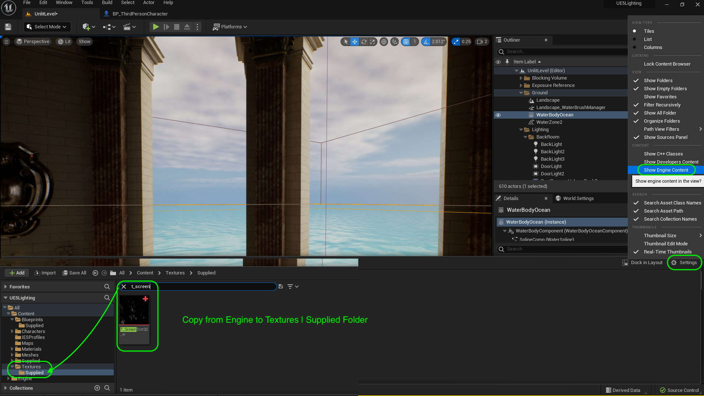
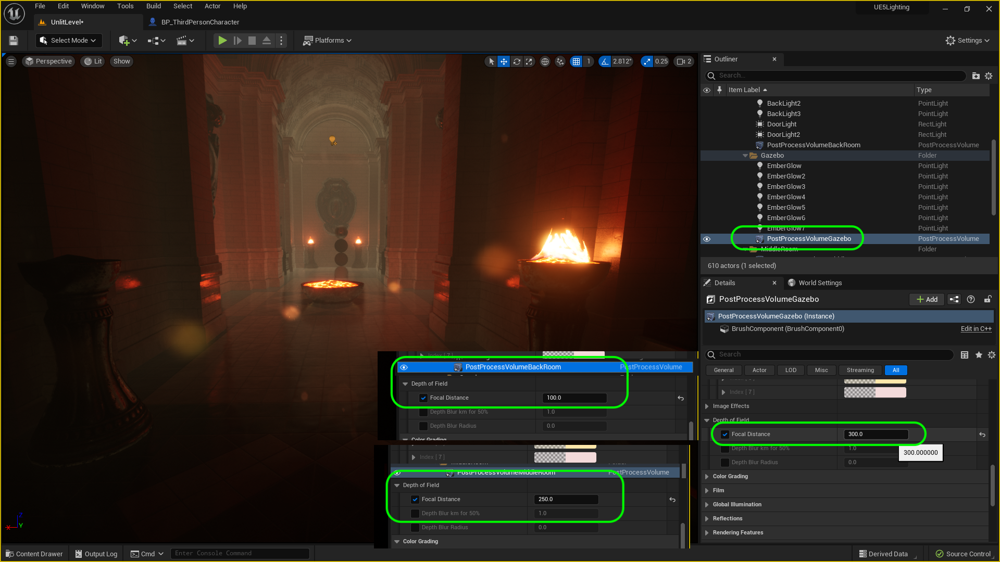
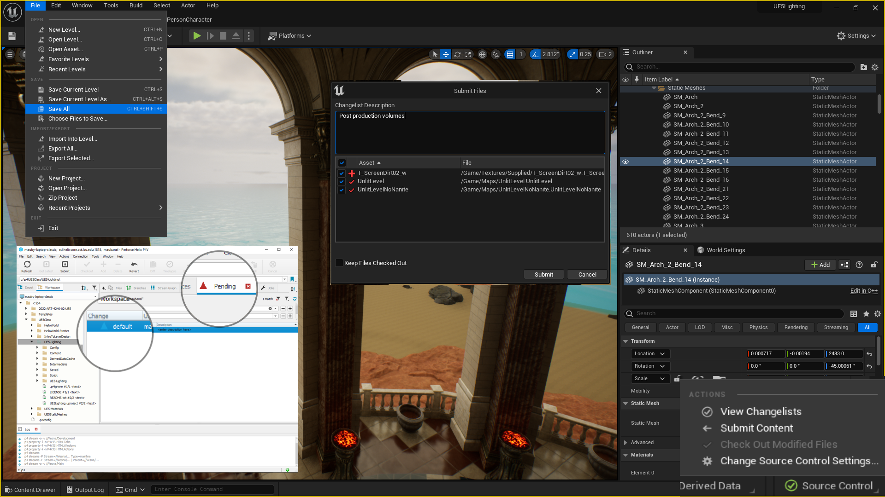

### Post Process Volumes

[previous](../baked-lighting-ii/README.md#user-content-baked-lighting-ii) • [home](../README.md#user-content-ue4-lighting) • [next](../spotlight/README.md#spot-light)

We have used the Post Production Volume to adjust the overall settings.  We can isolate them to an area.  We have three areas in our level, so lets add a post production volume in each room and adjust some settings to finalize our look. These [Post Process Volumes](https://docs.unrealengine.com/5.0/en-US/post-process-effects-in-unreal-engine/) are a powerful way to add different effects and perform final grading.

 

---

##### `Step 1.`\|`ITL`|:small_blue_diamond:

Add another **Post Process Volume** and add it to the **Lighting Folder | Back Room** and call it `PostProcessVolumeBackRoom` and scale the **X,Y,Z** in the **Brush Settings** to encompass the entire back hallway and overlap a little bit into the middle room. The overlapping volumes will fade between the two effect volumes. This way we will not make it affect the entire level.  We will do some seperate processing for this back hallway.

##### `Step 2.`\|`ITL`|:small_blue_diamond: :small_blue_diamond: 

Duplicate the back room post process volume and slide it to the middle room.  Ajust it so there is a good overlap between the two volumes (it will average them).  Adjust the size so it fits the room.  Now duplicate this and bring it to the Gazebo.  It is a lot taller so make sure it covers the entire volume. Move the middle volume to the **MiddleRoom** folder and rename the volume to `PostProcessVolumeMiddleRoom`. Move the gazebo volume to the **Gazebo** rolder and rename the volume to `PostProcessVolumeGazebo`.

https://github.com/maubanel/UE5-Lighting/assets/5504953/b1978849-0ad8-4ee0-bab8-64f36c510f37

##### `Step 3.`\|`ITL`|:small_blue_diamond: :small_blue_diamond: :small_blue_diamond:

CGI can produce unrealistically sharp edges that a camera can't capture in real life.  The chromatic abberation mimics the issues a lens has between high contrast surfaces (like the edge of the pillar and the bright sky). 

>Chromatic aberration, also known as color fringing, is a color distortion that creates an outline of unwanted color along the edges of objects in a photograph. Often, it appears along metallic surfaces or where there's a high contrast between light and dark objects, such as a black wall in front of a bright blue sky. -Adobe

This is to be used subtly. You shouldn't see it, it should just soften the high contrast lines a git.  For the front room I set **Chromatic Abberation | Intensity** to `.4`.  I set the back room to `.01` as there is little light in the first place.  In the middle room I sent it to `0.3`.  Now play the game and it should be VERY subtle.

https://github.com/maubanel/UE5-Lighting/assets/5504953/5f1ade13-ccb3-4454-b8b6-08c7a80792b6

##### `Step 4.`\|`ITL`|:small_blue_diamond: :small_blue_diamond: :small_blue_diamond: :small_blue_diamond:

Now lets add a bit of dirt to the lens to enhance the effect in this back dark area. This texture comes with **Engine Content** so you need to view this by clicking the **Settings** gear and selecting **Show Engine Content**. Select the **Engine** folder and filter for `T_ScreenDirt002`. Add `T_ScreenDirt002` to your **Dirt Map Texture** in all of your post volumes (gazebo, middle and back). 

##### `Step 5.`\|`ITL`| :small_orange_diamond:

Crank up the **Dirt Mask Intensity** to `500`.  You can see the dusk mask texture and see that it just adds what looks like dirt and some lens abberations to this part of the scene. 

We want a pretty subtle effect especially when we change the color. So on the **Gazebo** we will make it `10.0`, back room we will exagerate it to `20.0` and make it subtler in the middle room at `11.0`. 

https://github.com/maubanel/UE5-Lighting/assets/5504953/65d69870-acbb-4e15-b16c-c7e71444c584

##### `Step 6.`\|`ITL`| :small_orange_diamond: :small_blue_diamond:

Play the game and check the results.  It should be **VERY** subtle.

https://github.com/maubanel/UE5-Lighting/assets/5504953/54db02ab-6e52-499c-a910-856a444efa55

##### `Step 7.`\|`ITL`| :small_orange_diamond: :small_blue_diamond: :small_blue_diamond:

We can also add some lens flare to the back room as the flames would be quite hot in a dark room and cause some lens flares. 

>A lens flare happens when light is scattered or flared in a lens system, often in response to a bright light, producing a sometimes undesirable artifact in the image.  - [Wikipedia](https://en.wikipedia.org/wiki/Lens_flare)

I took the intensity way down to `0.01` in the front room, `0.02` in the middle room and `0.0` in the back room. Run the game and tune to your liking.

https://github.com/maubanel/UE5-Lighting/assets/5504953/9908a65f-af47-49f7-8162-1661cc514d9c

##### `Step 8.`\|`ITL`| :small_orange_diamond: :small_blue_diamond: :small_blue_diamond: :small_blue_diamond:

> The focal length of the lens is the distance between the lens and the image sensor when the subject is in focus - Nikon

This value is read in `cm`.  So we will set the gazebo post process volume's **Focal Distance** to `300` (300cm or 3m or ~10 feet).  The scene will be in crisp focus up to 10 feet.  For the middle room it is set at `250` and the rear at `70` (or 1 meter). 

##### `Step 9.`\|`ITL`| :small_orange_diamond: :small_blue_diamond: :small_blue_diamond: :small_blue_diamond: :small_blue_diamond:

Now play the game and tune to your taste (many games have no depth of field). 

https://github.com/maubanel/UE5-Lighting/assets/5504953/23ec7029-2c71-486b-8c94-c89675ffa78a

##### `Step 10.`\|`ITL`| :large_blue_diamond:

You can grade the game to the exact look your want.  There is a whole color grading section. I am adjusting the **Color Grade | Global | Contrast** on the rear room as an example where I want the dark and flames to have a bit higher contrast.  I also just tweak the color balance and add some orange to the grade. Run and tune to taste, and make any other color correction changes to the other rooms. I like a slightly increased contrast across the board.

https://github.com/maubanel/UE5-Lighting/assets/5504953/c5d2eb00-3b56-4a09-8007-da3803376131

##### `Step 11.`\|`ITL`| :large_blue_diamond: :small_blue_diamond: 

Select the **File | Save All** then press the <kbd>Source Control</kbd> button and select **Submit Content**.  If you are prompted, select **Check Out** for all items that are not checked out of source control. Update the **Changelist Description** message and with the latest changes. Make sure all the files are correct and press the <kbd>Submit</kbd> button. A confirmation will pop up on the bottom right with a message about a changelist was submitted with a commit number. Quit Unreal and make sure your **Pending** tab in **P4V** is empty. **Submit** any work that is still in the editor.

<!--  -->

| [previous](../spotlight/README.md#spot-light)| [home](../README.md#user-content-ue4-lighting) | [next](../path-tracing/README.md#path-tracing)|
|---|---|---|
