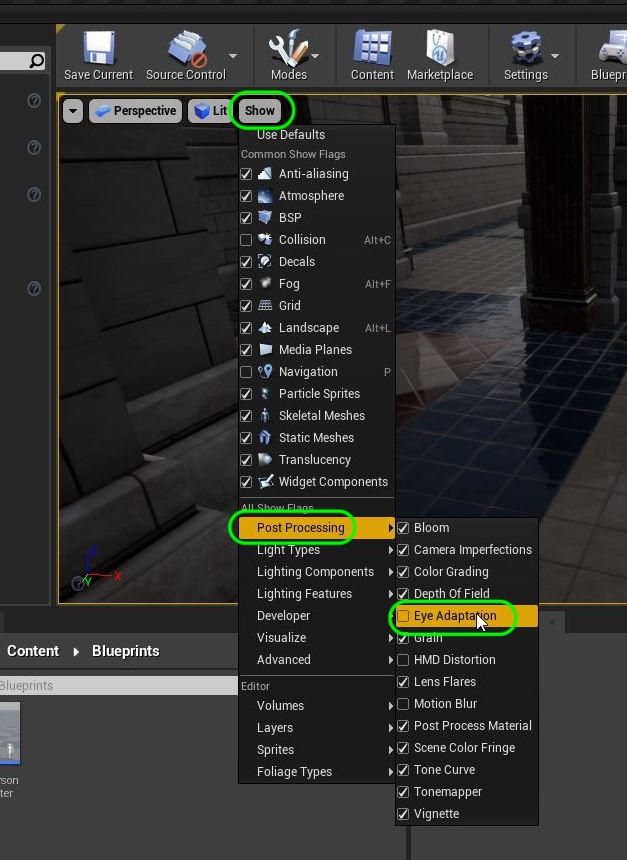
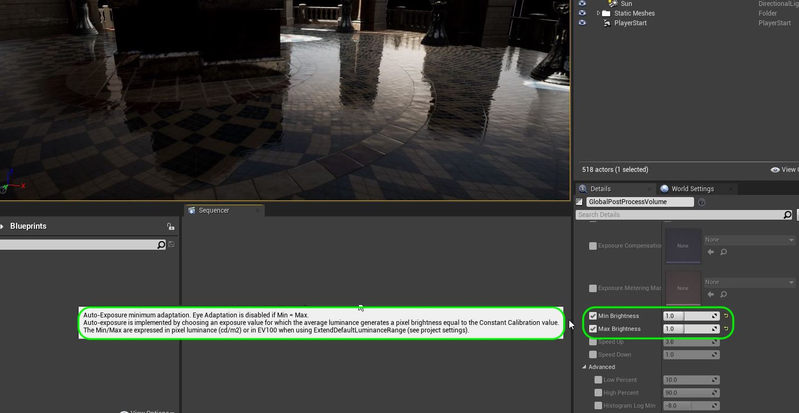
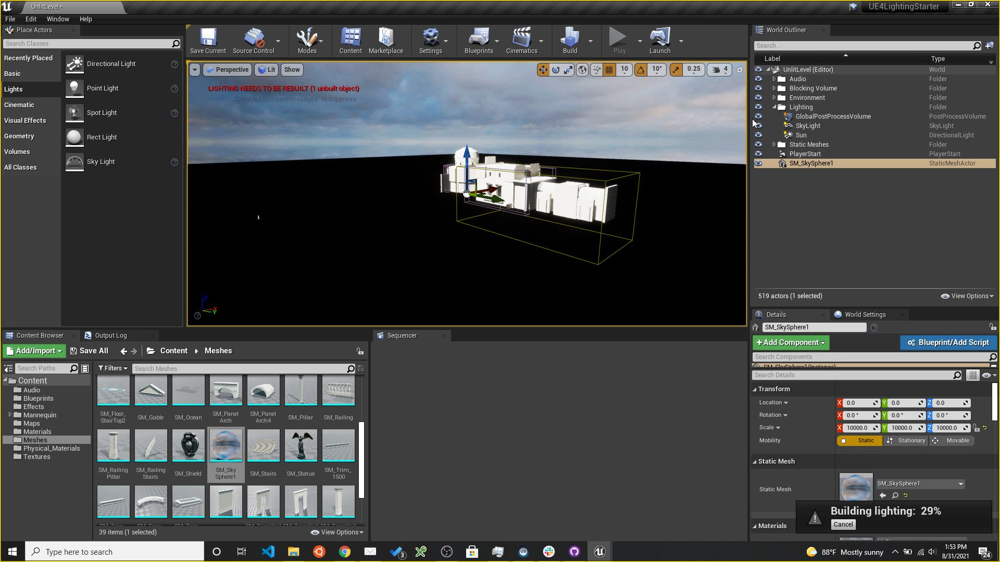
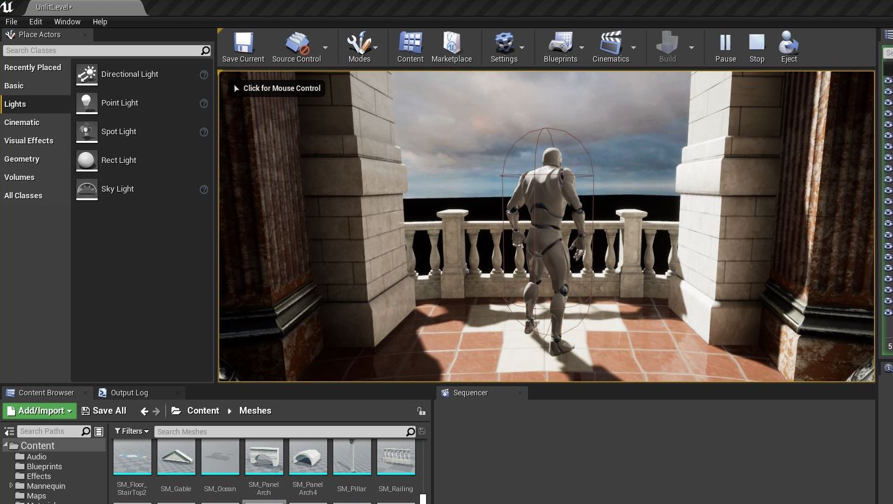
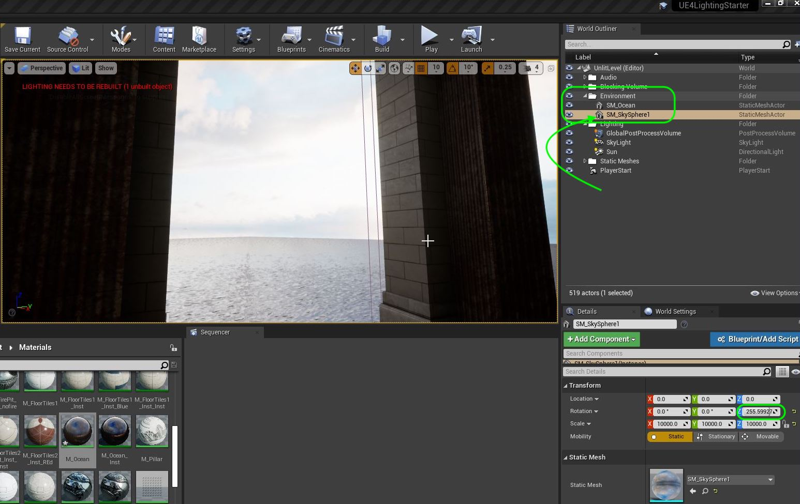
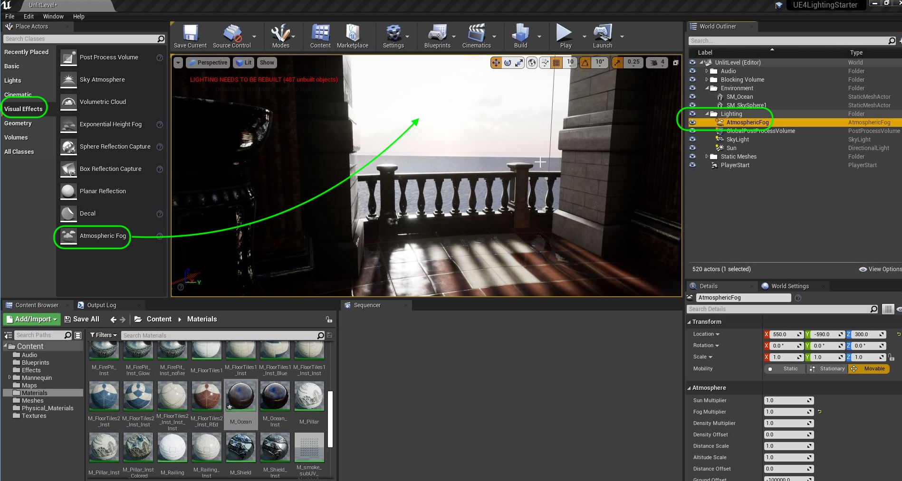

### Lighting Prep

[previous](../setting-up/README.md#user-content-setting-up) • [home](../README.md#user-content-ue4-lighting) • [next](../)

Lets get ready to start lighting the scene. Before we can begin we need to turn on the skybox, water and fog. We need to add a lightmass importance volume so that the game can optimise the lighting processing on the area that the player is navigating in. We will also add a post processing volume to kill the auto iris so that we can light with a fixed exposure. We will rotate the sun to match the skybox.

 

---

##### `Step 1.`\|`ITL`|:small_blue_diamond:

Since most of this scene is lit by sun through openings in this structure we will add a **Place Actors | Lights | Directional Light** to the level. We will also add a folder called `Lighting` to the **World Outliner**. We will rename the light to `Sun` and move it inside the new **Lighting** folder. Ensure the mobility is **Stationary** and we will explain this later.

The placement is irrelevant of where you put the light in the level.  It will light the entire scene.  I have put it next to the building so I don't click on it by accident.  The [Directional Light](https://docs.unrealengine.com/4.27/en-US/BuildingWorlds/LightingAndShadows/LightTypes/Directional/).

> The Directional Light simulates light that is being emitted from a source that is infinitely far away. This means that all shadows cast by this light will be parallel, making this the ideal choice for simulating sunlight. 

##### `Step 2.`\|`ITL`|:small_blue_diamond: :small_blue_diamond: 

Since this is acting like a light that is infinitely long the only important thing is the angle it is facing (time of day).  So this is the **White Line** that we see.  When we set up the skybox we will adjust this match the sun.

Notice that it is lighting the outside walls in the direction it is facing and leaving hard shadows.  There are no bounces or fills in this scene.

##### `Step 3.`\|`ITL`|:small_blue_diamond: :small_blue_diamond: :small_blue_diamond:

Press the **Build** to build the lights.  Now run the game and walk through the level.  You will notice that the front and mid room have outdoor lighting (windows and archways).  The backroom does not have any outside light so it is unlit.

Notice that the scene adapts to the lighting and goes from bright to dark.  We will turn that off while we are lighting then adjust it for final tweaking to our liking at the end.

https://user-images.githubusercontent.com/5504953/131544371-b0dd5838-8dd4-4ca2-be31-68e8a984304e.mp4

##### `Step 4.`\|`ITL&G`|:small_blue_diamond: :small_blue_diamond: :small_blue_diamond: :small_blue_diamond:

We don't want the auto iris exposure built in the game affect our lighting settings.  It is hard to light when it opens up to iris to light the scene. So lets go add a **Volumes | Post Process Volume** to the level.  Go to **Post Process Volume Settings | Infinite Extent** and tick the box to `true`.  We want to have this volume affect every object in the world even if it falls outside this box.

Call it `GlobalPostProcessingVolume` and move it to the **Lighting** folder. 

##### `Step 5.`\|`ITL&G`| :small_orange_diamond:

In **GlobalPostProcessingVolume** go to **Lens | Exposure** and change **Min Brightness** and **Max Brightness** to both be `1.0`.  The tool tip says that if **Min = Max** that **Eye Adaption** is disabled which is what we want!

##### `Step 6.`\|`ITL`| :small_orange_diamond: :small_blue_diamond:

Now when we run around we can really see how limiting the directional light is.  There is no fill or spill and it only affects where the sun directly hits.  For indirect lighting we need another lighting actor.

https://user-images.githubusercontent.com/5504953/131555655-3ebac7a5-b681-4f17-9bdc-ed03427e359c.mp4

##### `Step 7.`\|`ITL`| :small_orange_diamond: :small_blue_diamond: :small_blue_diamond:

 Add a [Lights | Sky Light](https://docs.unrealengine.com/4.27/en-US/BuildingWorlds/LightingAndShadows/LightTypes/SkyLight/) to the outside of the room (doesn't matter where it goes it affects the entire screen).  Move it to the **Lighting** folder. 

> The Sky Light captures the distant parts of your level and applies that to the scene as a light. That means the sky's appearance and its lighting/reflections will match, even if your sky is coming from atmosphere, or layered clouds on top of a skybox, or distant mountains. You can also manually specify a cubemap to use. - Unreal Manual

In this case we will change **Source Type** to `SLS Specified Cubemap` as this is the same one we will use on our sky sphere in a few moments. Select `Sky54a2048` as the cubemap texture.  It will use this to figure out the fill lighting in the scene so the bright and dark spots correspond with the sky.

##### `Step 8.`\|`ITL`| :small_orange_diamond: :small_blue_diamond: :small_blue_diamond: :small_blue_diamond:

Now when you run the game the back room is still black but we have a bit more fill light in the first two rooms.  We will leave these default setting for now as we are still adding big pieces that affect our lighting.

https://user-images.githubusercontent.com/5504953/131558153-4862e2e2-feba-49c3-9b6e-2819daf6f77d.mp4

##### `Step 9.`\|`ITL`| :small_orange_diamond: :small_blue_diamond: :small_blue_diamond: :small_blue_diamond: :small_blue_diamond:

Now lets add a sky to the game so the light is coming from somewhere. Drag a **Meshes | SM_SkySphere1** to the level.  Change the **Location** to `0, 0, 0` and **Scale** to `10000, 10000, 10000`. Press the <kbd>Build</kbd> button to rebuild the lighting.

##### `Step 10.`\|`ITL`| :large_blue_diamond:

Now there is a sky but no ground plane.  So now our light seems to be coming from the sky and the scene makes a bit more sense. This is water with an emissive texture.  Lets fix that yet.

##### `Step 11.`\|`ITL`| :large_blue_diamond: :small_blue_diamond: 

To see the ocean we need to open up **Materials | M_Ocean** and connect the **RBG** pin of the **Texture Sampmle** node and connect it to the **Emissive Color**.  By making the ocean emissive it recreates the effect of reflecting the sky in it.  That is why we need to wear sunglasses when out of the water on a sunny day!

Press the <kbd>Apply</kbd> button.

##### `Step 12.`\|`ITL`| :large_blue_diamond: :small_blue_diamond: :small_blue_diamond: 
 
 Now when we run the game that our outdoors is complete!

##### `Step 13.`\|`ITL`| :large_blue_diamond: :small_blue_diamond: :small_blue_diamond:  :small_blue_diamond: 

Now lets have the sun in the sky sphere point at the back porch to give direct sunlight streaming into the porch area. Move **SM_SkySphere1** in **World Outliner** to the **Environment** folder.  Rotate the **Rotation | Z** transform by `255.6` degrees. This will have the sun facing in at the porch.

##### `Step 14.`\|`ITL`| :large_blue_diamond: :small_blue_diamond: :small_blue_diamond: :small_blue_diamond:  :small_blue_diamond: 
 
 OK, now lets change the angle of the **Sun** actor to match the new position of the sun. It is late in the day so I found that the **Rotation | Y** of `338.39` and a **Rotation | Z** of `154.79` works well.

##### `Step 15.`\|`ITL`| :large_blue_diamond: :small_orange_diamond: 

Now lets add a [Visual Effects | Atmospheric Fog](https://docs.unrealengine.com/4.26/en-US/BuildingWorlds/FogEffects/AtmosphericFog/) to the level in the **Lighting** folder.  Thist will add some realism to the skyline and top the sun when looking at it.. 

> Atmospheric Fog gives an approximation of light scattering through a planetary atmosphere. This can give your outdoor levels a much more realistic look. This total effect includes the following:   The dominant directional light in your level will receive a sun disc effect in the sky. This will be placed infinitely far away, opposite the light's direction.  A sky color that will vary depending on the altitude of the sun (or put another way, how close the dominant directional light's vector gets to being parallel with the ground).
  Control over scattering and decay settings, allowing for full control of your atmospheric density. - Unreal Documentation

We will leave the default settings as is for now.

##### `Step 16.`\|`ITL`| :large_blue_diamond: :small_orange_diamond:   :small_blue_diamond: 

Now to get the best effect it needs to be turned on in the **Sun**. Open the **Atmosphere and Cloud** section and turn `on` **Atmosphere Sun Light**.  You can rotate the sun and see how the haze moves with the sun.

##### `Step 17.`\|`ITL`| :large_blue_diamond: :small_orange_diamond: :small_blue_diamond: :small_blue_diamond:

Now lets add some immediate fog as we are on the ocean which often has a fog/mist.  The horizon is too straight and visible. Drag a **[Special Effects | Exponential Height Fog](https://docs.unrealengine.com/4.26/en-US/BuildingWorlds/FogEffects/HeightFog/)** into the level in the **Lighting** folder.  

> Exponential Height Fog creates more density in low places of a map and less density in high places. The transition is smooth, so you never get a hard cutoff as you increase altitude. Exponential Height Fog also provides two fog colors—one for the hemisphere facing the dominant directional light (or straight up if none exists), and another color for the opposite hemisphere.

Now the default **Fog Density** of `0.02` is not enough and I still see a hard line at the horizon.  I prefer a density setting of `0.05`.

Now press the <kbd>Build</kbd> button to rebuild the light. 

##### `Step 18.`\|`ITL`| :large_blue_diamond: :small_orange_diamond: :small_blue_diamond: :small_blue_diamond: :small_blue_diamond:

##### `Step 19.`\|`ITL`| :large_blue_diamond: :small_orange_diamond: :small_blue_diamond: :small_blue_diamond: :small_blue_diamond: :small_blue_diamond:

##### `Step 20.`\|`ITL`| :large_blue_diamond: :large_blue_diamond:

##### `Step 21.`\|`ITL`| :large_blue_diamond: :large_blue_diamond: :small_blue_diamond:

___

| [previous](../setting-up/README.md#user-content-setting-up)| [home](../README.md#user-content-ue4-lighting) | [next](../)|
|---|---|---|
