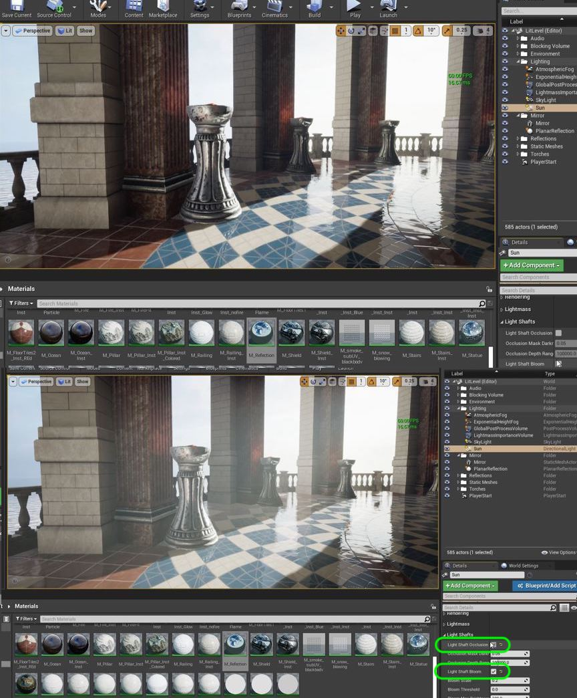
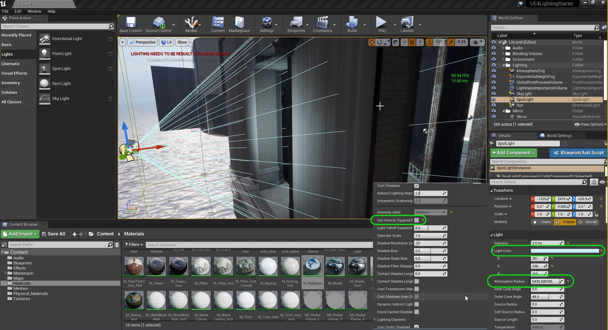
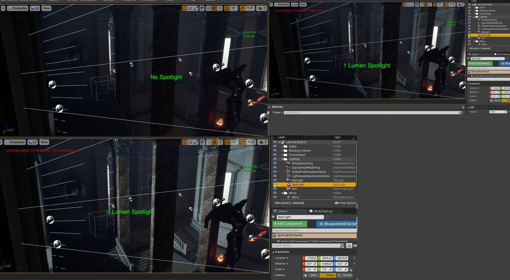
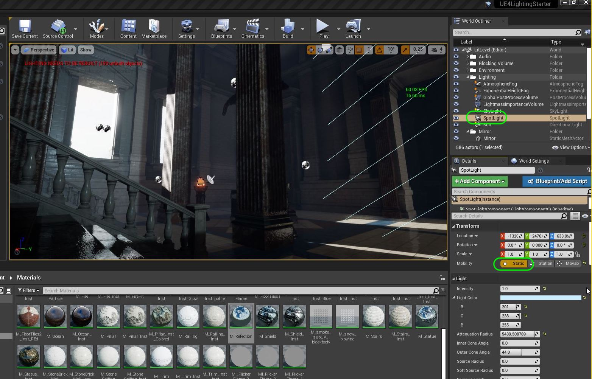
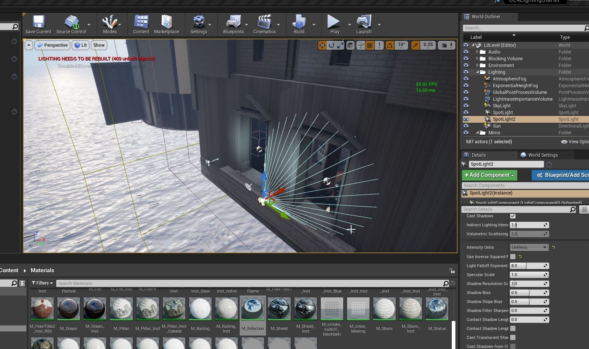
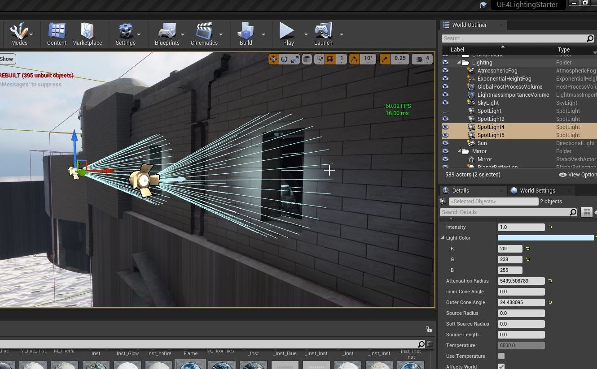
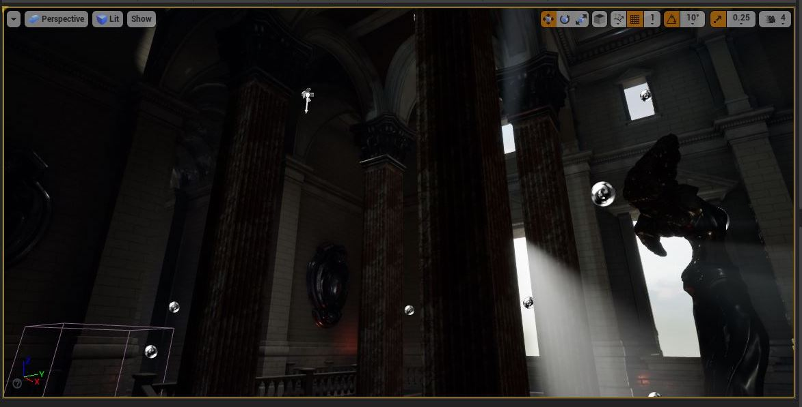
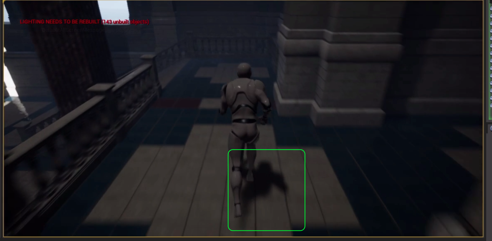

### Rays and Lights

[previous](../reflection/README.md#user-content-reflection-captures) • [home](../README.md#user-content-ue4-lighting) • [next](../)

Lets look at adding some light shafts that interact with the sund and fog. Lets also look at some more lights to make our level really shine!

In the center room next to the gazebo we will want lights that resemble sun coming in through the windows. We are placing directional lights to act like ambient sunlight in the room. Also on the other side of the room we will use rect lights to light the inside frame with ambient light without affecting the room.

 

---

##### `Step 1.`\|`ITL`|:small_blue_diamond:

To make the outdoors look a lot more dramatic lets add some lens effects.  Go to the **Sun** (directional light) and turn on **Light Shaft Occlusion** and **Light Shaft Bloom**.  Look at how the sun picks up the fog and makes it look much more like we are on the ocean.

##### `Step 2.`\|`FHIU`|:small_blue_diamond: :small_blue_diamond: 

You can play with the settings and see different results.  But we essentially get some nice rays!

https://user-images.githubusercontent.com/5504953/131884060-ce78d8f6-1a10-47b2-9d0e-d3f1ac560bbe.mp4

##### `Step 3.`\|`ITL`|:small_blue_diamond: :small_blue_diamond: :small_blue_diamond:

Now lets go to the outside right of the building (looking from the Gazebo) to the large window in the middle room.  Normally in the day light would be coming in.  But since the sun isn't pointing here it is not contributing much light.  Lets add a spot light and rotate and point it at the window.

Change the color to a sky color and adjust the attenuation radius (look inside the room) so it affects the whole room.  I lowered the intensity to `3.0` lumens.  Also, since this is the sun I set **Use Inverse Square** falloff to `false`.  This stops the light from falling off like a house light as this is the sun whose fall off is too small for our eye to see.

##### `Step 4.`\|`ITL`|:small_blue_diamond: :small_blue_diamond: :small_blue_diamond: :small_blue_diamond:

Now I adjusted the brightness as since this is opposite the sun's direction I lowered it to `1.0` lumens.  I still get a bit more detail in the inside architecture that is nice!

##### `Step 5.`\|`ITL`| :small_orange_diamond:

Put the spotlight in the **Lighting** folder. I played the game and ran around.  In my case, my character was not casting any extra shadows due to this light so I changed it to **Static**.  This way it doesn't take any more real time and is baked.  Press the <Build> button to rebuild the lights.

##### `Step 6.`\|`ITL`| :small_orange_diamond: :small_blue_diamond:

Duplicate the light and move it to the next window.

##### `Step 7.`\|`ITL`| :small_orange_diamond: :small_blue_diamond: :small_blue_diamond:

Make two lights set to `0.1` lumens and a very narrow **Outer Core Angle** for the two lights for the small windows above the large ones. 

##### `Step 8.`\|`ITL`| :small_orange_diamond: :small_blue_diamond: :small_blue_diamond: :small_blue_diamond:

Now I get some very subtle fill lighting indoors that adds a bit more detail to my scene.

##### `Step 9.`\|`ITL`| :small_orange_diamond: :small_blue_diamond: :small_blue_diamond: :small_blue_diamond: :small_blue_diamond:

I don't like the very dark area when we enter the middle room.  It has no light going to the player.  I added a spotlight from the ceiling to give this area a bit of light.

https://user-images.githubusercontent.com/5504953/131890978-dd445c22-d6e4-444a-88bd-10c7c5a9d4c5.mp4

##### `Step 10.`\|`ITL`| :large_blue_diamond:

I like the lighting effect, it is subtle but I can see the player.  Now one side effect I really don't like is the sharp shadow.  For ambient light this is way to sharp.  Lets fix that.

##### `Step 11.`\|`ITL`| :large_blue_diamond: :small_blue_diamond: 

On the light adjust the **Shadow Resolution Scale**. I used a cube to test it and found `.2` about right.

##### `Step 12.`\|`ITL`| :large_blue_diamond: :small_blue_diamond: :small_blue_diamond: 

##### `Step 13.`\|`ITL`| :large_blue_diamond: :small_blue_diamond: :small_blue_diamond:  :small_blue_diamond: 

##### `Step 14.`\|`ITL`| :large_blue_diamond: :small_blue_diamond: :small_blue_diamond: :small_blue_diamond:  :small_blue_diamond: 

##### `Step 15.`\|`ITL`| :large_blue_diamond: :small_orange_diamond: 

##### `Step 16.`\|`ITL`| :large_blue_diamond: :small_orange_diamond:   :small_blue_diamond: 

##### `Step 17.`\|`ITL`| :large_blue_diamond: :small_orange_diamond: :small_blue_diamond: :small_blue_diamond:

##### `Step 18.`\|`ITL`| :large_blue_diamond: :small_orange_diamond: :small_blue_diamond: :small_blue_diamond: :small_blue_diamond:

##### `Step 19.`\|`ITL`| :large_blue_diamond: :small_orange_diamond: :small_blue_diamond: :small_blue_diamond: :small_blue_diamond: :small_blue_diamond:

##### `Step 20.`\|`ITL`| :large_blue_diamond: :large_blue_diamond:

##### `Step 21.`\|`ITL`| :large_blue_diamond: :large_blue_diamond: :small_blue_diamond:

___

| [previous](../reflection/README.md#user-content-reflection-captures)| [home](../README.md#user-content-ue4-lighting) | [next](../)|
|---|---|---|
