### Reflection Captures

[previous](../dynamics-mobility/README.md#user-content-add-dynamics-to-mobility) • [home](../README.md#user-content-ue4-lighting) • [next](../)

Now before we zero on on any more fine point lighting, we need to address the reflective surfaces in the scene. They get reflections mapped into them and without a Reflection Capture Volume it will reflect the world color (black) back into it making it look unlit. Lets fix this and see how we deal with reflections to help finish lighting the scene.

 

---

##### `Step 1.`\|`ITL`|:small_blue_diamond:

The reflections add a lot to the lighting of a scene especially in reflective surfaces like we have in this level (the VERY reflective floor).  Now Unreal uses reflection maps to cast that image into the scene.

To see what is reflecting select the **Lit** button and switch to **Reflections**.  This shows what will be reflected.  Notice on the gazebo that it is NOT reflecting any geometry but just the sky.  The floor reflects solid sky even though there is a roof on the gazebo.

https://user-images.githubusercontent.com/5504953/131835752-8d8634f7-3dca-4bef-9704-7805efe01895.mp4

##### `Step 2.`\|`FHIU`|:small_blue_diamond: :small_blue_diamond: 

Lets test this out to see if it is what is happening.  Lets put a mirror ball to see the reflections while running the game.  Create a new **Material** in the **Matierals** folder called `M_Reflection`.

Connect a **Constant** of `1` to **Base Color** (pure white), `1` to **Metalic** (pure reflective metal) and `0` to **Roughness** so that it reflects as much light as possible.  Press the <kbd>Apply</kbd> button. You should have a mirror ball

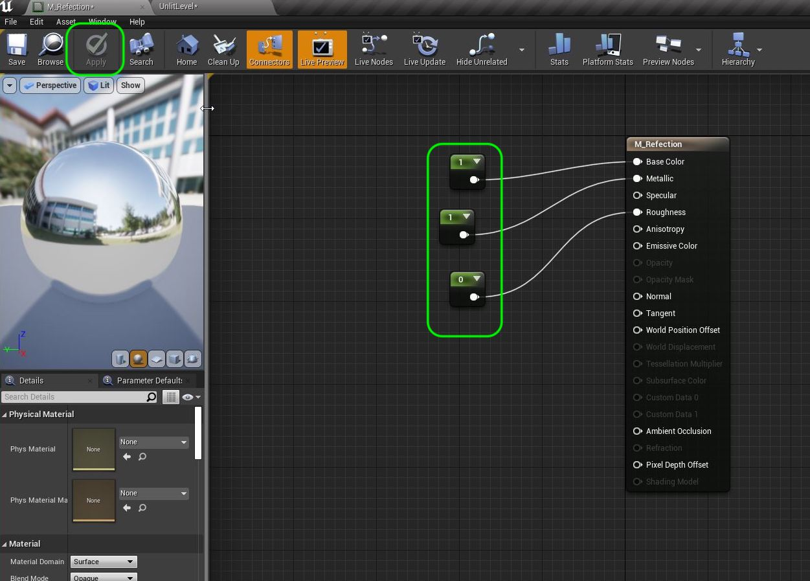

##### `Step 3.`\|`ITL`|:small_blue_diamond: :small_blue_diamond: :small_blue_diamond:

Now add a **Sphere** to the level and put the **M_Reflection** material on it. Change the scale to `2.0, 2.0, 2.0`.  This way we can see it properly. Notice that it is not reflecting the inside of the gazebo (except the floor).

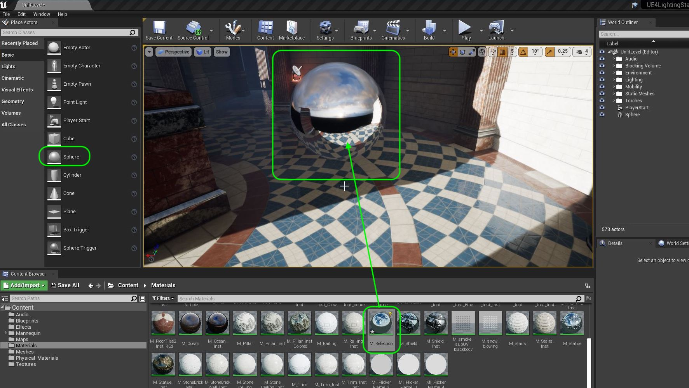

##### `Step 4.`\|`ITL`|:small_blue_diamond: :small_blue_diamond: :small_blue_diamond: :small_blue_diamond:

Now if you play the game and go around the sphere you will notice that it is not reflecting anything but sky and floor.  There is also a black reflection in the horizon.  Not very pleasant!

https://user-images.githubusercontent.com/5504953/131838101-33666902-fca6-49cc-8ff3-7e21b1ce40b0.mp4

##### `Step 5.`\|`ITL`| :small_orange_diamond:

> The [Sphere Reflection Capture](https://docs.unrealengine.com/4.27/en-US/Resources/ContentExamples/Reflections/1_4/) volume is used to capture reflections to reflect into surfaces.   The primarily used reflection capture is the Sphere Reflection Capture. Many of these can be placed around the world with almost no performance impact as they are calculated before run time. - UE4 Manual

Full reflection documentation can be found at [Reflection Environment](https://docs.unrealengine.com/4.27/en-US/BuildingWorlds/LightingAndShadows/ReflectionEnvironment/)

Add a **Sphere Reflection Capture** actor to the gazebo above the statue. Place it in a new folder called **Reflections**.

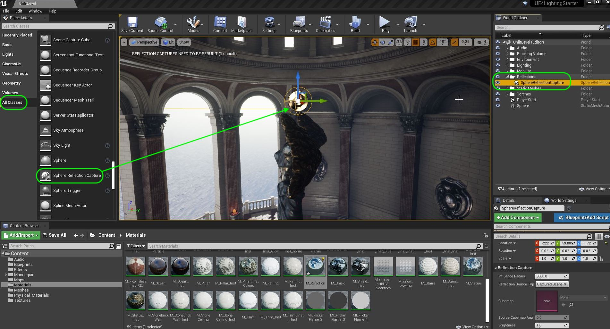

##### `Step 6.`\|`ITL`| :small_orange_diamond: :small_blue_diamond:

The sphere reflection camera takes a 360 degree shot of where it is centered and uses that for the reflection map.  We want to set the distance it photographs to just beyond the gazebo (It starts to reduce the effect the close you get to the end of the volume). Set the **Influence Radius** to just a bit larger than the gazebo itself. 

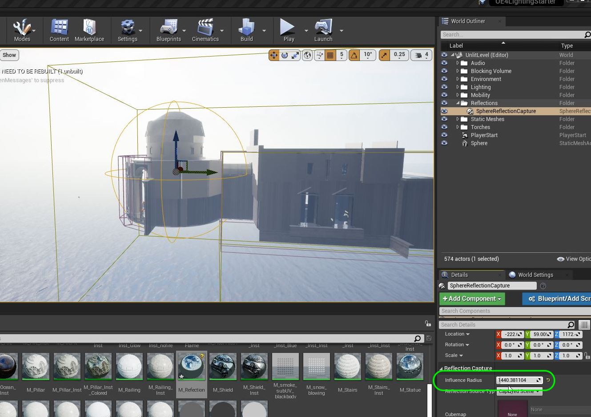

##### `Step 7.`\|`ITL`| :small_orange_diamond: :small_blue_diamond: :small_blue_diamond:

Now press the arrow key next the **Build** button and select **Build Reflection Captures**.  Notice that we now see the interior.  There are still some black spots though.

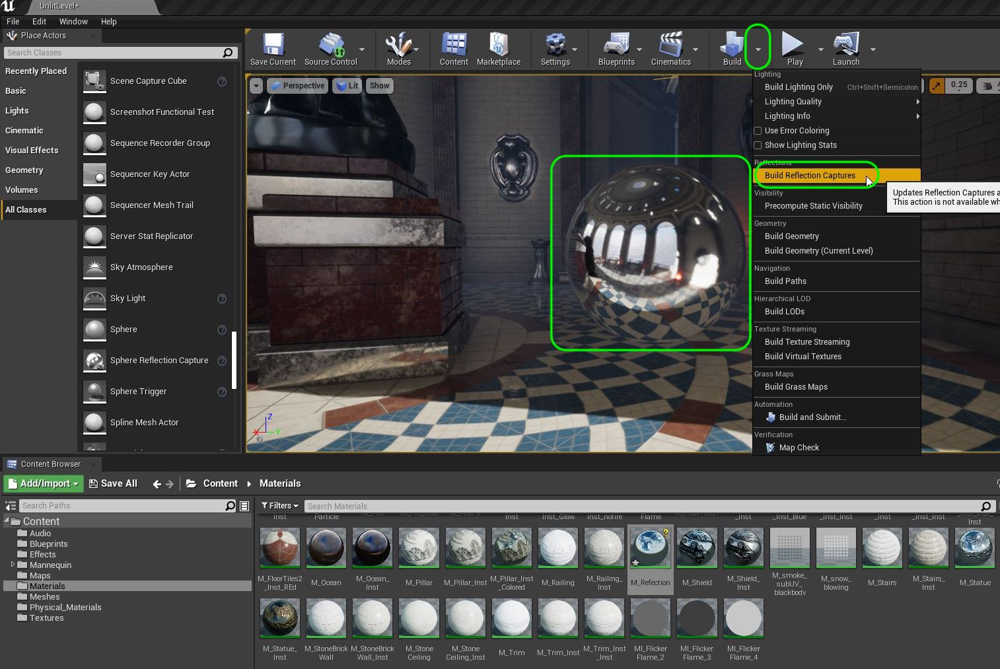

Check out the level with the ball and also switching the **Reflection** view.  This is still showing black reflecting into the scene.

https://user-images.githubusercontent.com/5504953/131840594-b1a8f8dd-45d8-4104-9dd0-54fe5b4a12b3.mp4

##### `Step 8.`\|`ITL`| :small_orange_diamond: :small_blue_diamond: :small_blue_diamond: :small_blue_diamond:

Now we keep refining the process by adding volumes.  What we have to worry about is that the 360 view from the first one will have some areas of occlusion.  The statue blocks it from getting what is behind it.  We need to strategically place them to fill out all voids and avoid issues in transitionp points between volumes.  Clever placed **Sphere Reflection Capture** volumes takes  some trial and error.  Looking at the ball and makin adjustments to the size in **Relections** mode is very helpful.

Add a second reflection capture and switch to **Reflections** view.  Position it between the statue and the wall with the black area at roughly player height (this is the viewpoint the player experiences).  Adjust the size until the reflection is the right scale and replaces the black.  Press the **Build | Build Reflection Caputures** and run around.  I was able to get rid of those black voids I had previously.

https://user-images.githubusercontent.com/5504953/131842299-03bd7852-a0f5-49d7-93f6-e91fec95dda5.mp4

##### `Step 9.`\|`ITL`| :small_orange_diamond: :small_blue_diamond: :small_blue_diamond: :small_blue_diamond: :small_blue_diamond:

Now lets move the camera to the other side of the statue.  I find the reflection map very blurry.  Lets add a third **Sphere Reflection Volume** to this side.

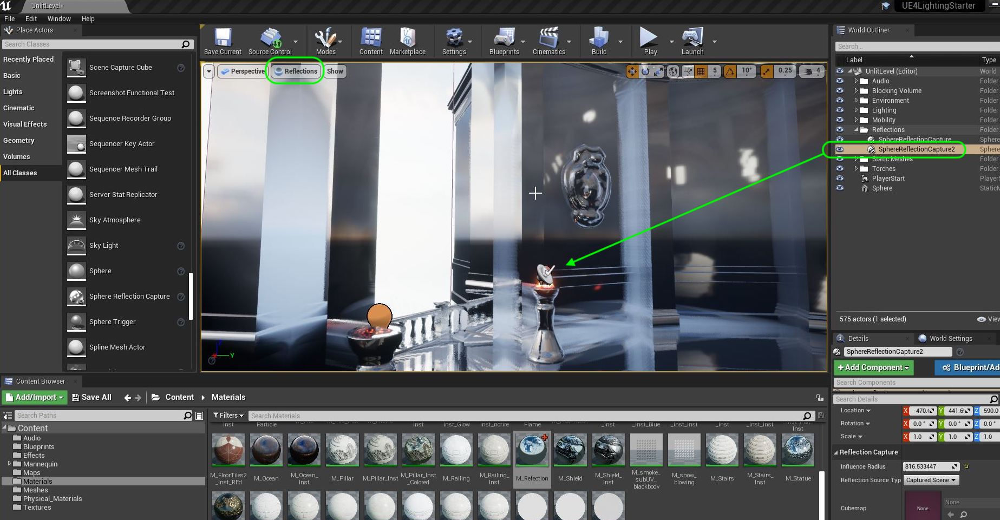

##### `Step 10.`\|`ITL`| :large_blue_diamond:

Now adjust the size of the **Influence Radius** to get a better reflection. Move the relection sphere to the other side of the room.  As you are workign with reflections keep moving the ball around to better see them.

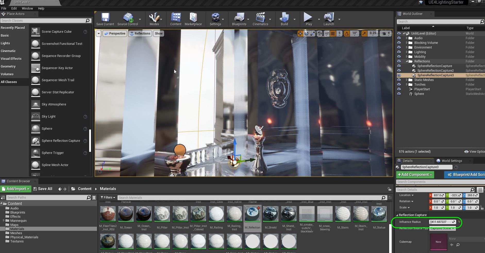

Press the **Build | Build Reflection Caputures** and run around to see the third capture volume.

https://user-images.githubusercontent.com/5504953/131844633-ca242938-fc94-42da-8df7-15c08cf6c980.mp4

##### `Step 11.`\|`ITL`| :large_blue_diamond: :small_blue_diamond: 

In **Reflection** mode go around a eliminate any fuzzy or black areas by includuding a **Sphere Reflection Capture** volume with the appropriate radius in those spots.

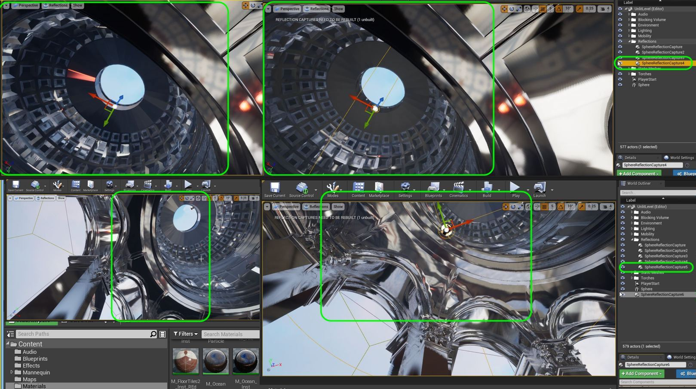

##### `Step 12.`\|`ITL`| :large_blue_diamond: :small_blue_diamond: :small_blue_diamond: 

I put a sphere to cover the hallway between the gazebo and the central room.  This is for reflecting the hallway back into those two spaces.

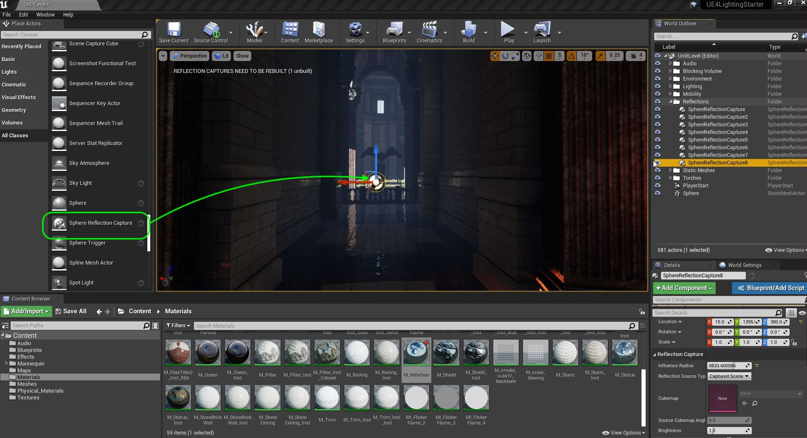

##### `Step 13.`\|`ITL`| :large_blue_diamond: :small_blue_diamond: :small_blue_diamond:  :small_blue_diamond: 

To get reflections inside the hallway itself we need to use two smaller reflection volumes to cover just the two walls and floor.

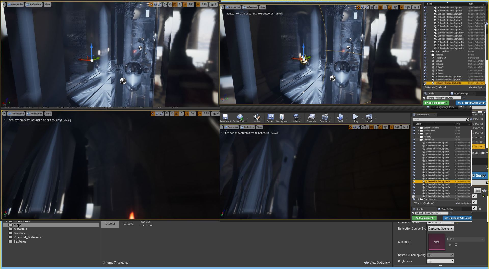

##### `Step 14.`\|`ITL`| :large_blue_diamond: :small_blue_diamond: :small_blue_diamond: :small_blue_diamond:  :small_blue_diamond: 

Before we add reflection volumes to the middle and back rooms, press **File | Save All**.  Go to **Maps** and rename the level to `TestLevel`.  Right click and press **Duplicate** to make a copy of this level.  Call it `Lit Level`.  Double lick `Lit Level` to open it up (press save if prompted to save all current changes to now named **Test Level**).

Delete the **Mobility** folder and its contents to get rid of all those test lights as we want to finish lighting and reflection volumes without these items as they are not supposed to be in this space (but they will be saved in the **Test Level**)

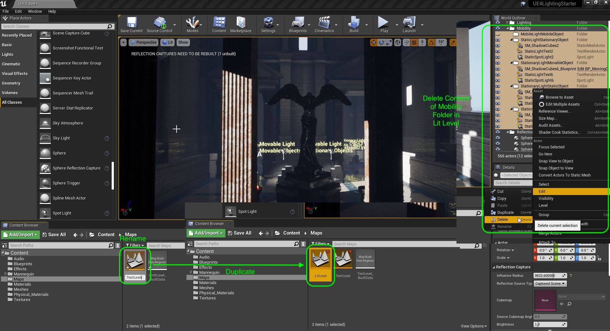

##### `Step 15.`\|`ITL`| :large_blue_diamond: :small_orange_diamond: 

Add capture volumes to the middle room.  Use your **Reflections** view to fix any issues you see. Notice that with no volumes we just reflect the sky in an interior space which is completely wrong.  Placing these is tricky as you can get some double reflections depending on the overlap.  This takes a **LOT** of trial and error.

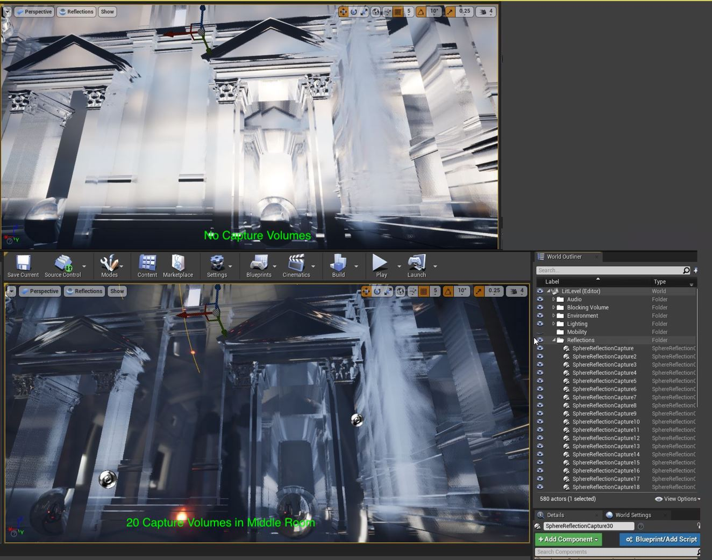

Now place reflective balls throughout the room and take a look.

https://user-images.githubusercontent.com/5504953/131867364-109acbda-9449-4c29-b1f5-2b620e2bc3c8.mp4

##### `Step 16.`\|`ITL`| :large_blue_diamond: :small_orange_diamond:   :small_blue_diamond: 

Repeat this for the final dark hallway. In the end I used 37 capture volumes.

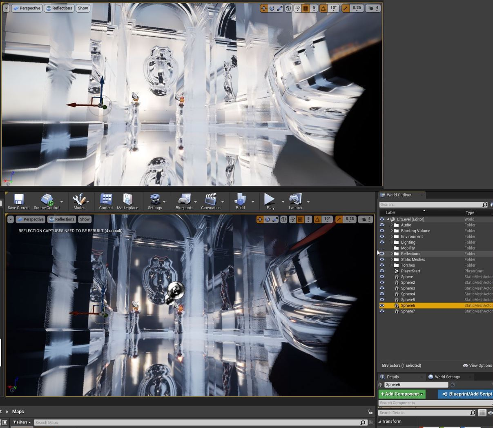

https://user-images.githubusercontent.com/5504953/131869409-eea03535-6eb0-4e93-97d4-042e751fab07.mp4

##### `Step 17.`\|`ITL`| :large_blue_diamond: :small_orange_diamond: :small_blue_diamond: :small_blue_diamond:

Now these reflections are fairly inexpensive.  We need to be carefull about how many reflections we create as the texture size will add up.  There is also another kind of reflection [Planar Reflections](https://docs.unrealengine.com/4.26/en-US/BuildingWorlds/LightingAndShadows/PlanarReflections/).

> UE4 has support for real-time Planar Reflection that can give more accurate looking reflections than Screen Space Reflections (SSR) provide but come with a higher rendering cost. This higher rendering cost is due to how Planar Reflection works, as Planar Reflection actually renders the level again from the direction of the reflection. - UE4 Manual

This increases the render time dramatically. For those who are not doing intense games and are doing visualizations or virtual productions, this is a powerful mode that can make water and reflective survaces look SO much more realistic.

Before turning on this feature lets make this our default map.  Open up **Settings | Project Settings | Maps and Modes** and put the **Lit Level** as our two default ones.

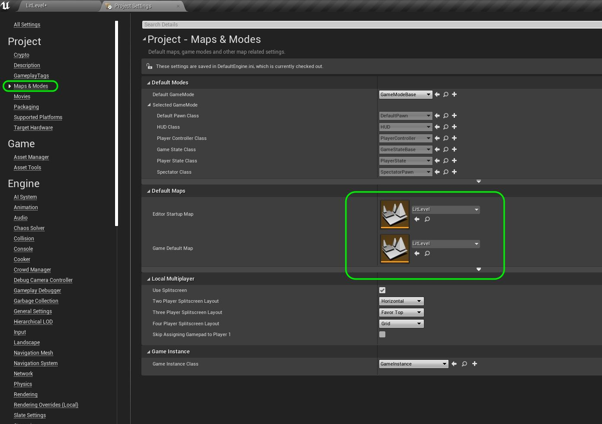

##### `Step 18.`\|`ITL`| :large_blue_diamond: :small_orange_diamond: :small_blue_diamond: :small_blue_diamond: :small_blue_diamond:

To turn it on support for planar reflections, go to **Settings | Project Settings** and check the box for **Engine | Rendering | Support global clip plane for Planar Reflections**.  It will require a rebooting of the game for this option to take effect.  In my case it took a long time to reboot. It launched a bunch of shader compilers so it looks like it had to rebuild ALL the shaders.

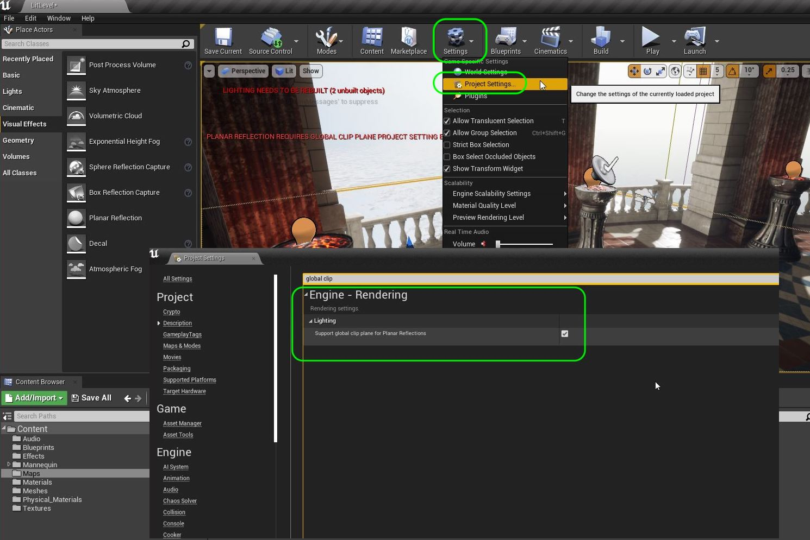

##### `Step 19.`\|`ITL`| :large_blue_diamond: :small_orange_diamond: :small_blue_diamond: :small_blue_diamond: :small_blue_diamond: :small_blue_diamond:

After rebooting and a long rebuilding of materials we are ready to go.  This effect would be best for puddles, a mirror or water.  Lets put a cube in the area and scale it putting the **M_Reflection** material on it.

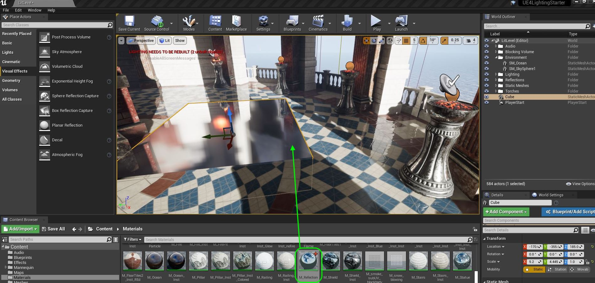

##### `Step 20.`\|`ITL`| :large_blue_diamond: :large_blue_diamond:

##### `Step 21.`\|`ITL`| :large_blue_diamond: :large_blue_diamond: :small_blue_diamond:

___

| [previous](../dynamics-mobility/README.md#user-content-add-dynamics-to-mobility)| [home](../README.md#user-content-ue4-lighting) | [next](../)|
|---|---|---|
