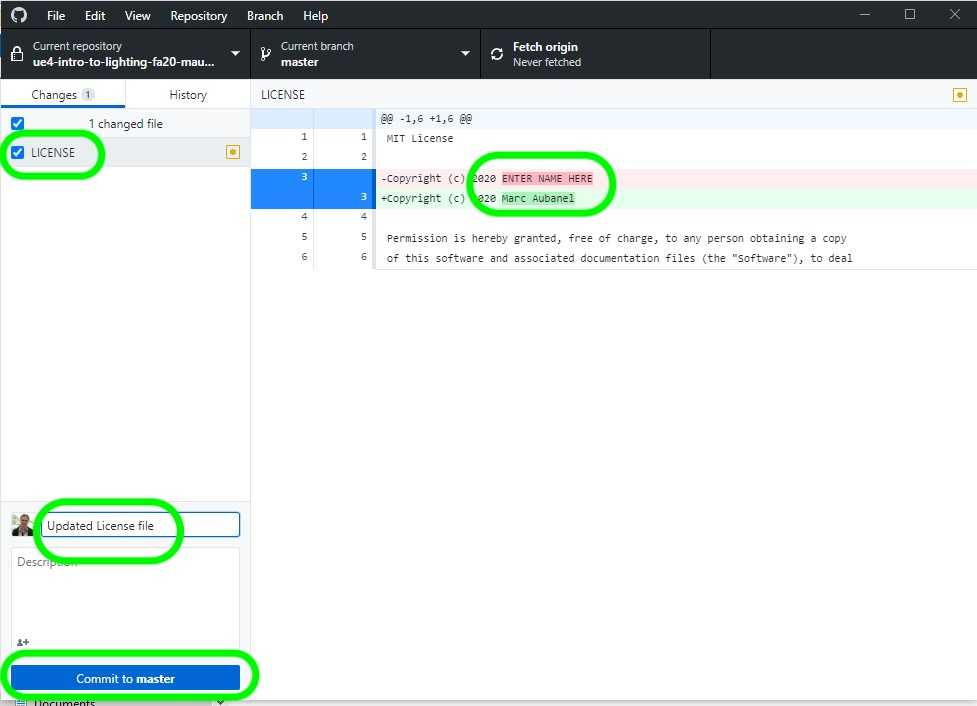

### Setting Up

[previous](../) • [home](../README.md#user-content-ue4-lighting) • [next](../)

We will be working with a level that has already ben grey blocked and modelled. It is a finished level minus the lighting. This was created by the team at Unreal and included in their Content Example project. You will also have a first person character to move through the environment.

 

---

| `required.software`\|`UE4 Materials`| 
| :--- |
| :floppy_disk: &nbsp; &nbsp; You will need to install the latest version of _UE4 4.26.x_ by downloading the [Epic Games Launcher](https://www.epicgames.com/store/en-US/download). You will also need a [GitHub](https://github.com/) account which is free to sign up for as we will be using version control. You will also need a mac or PC that is powerful enough to run unreal. If you are on a PC you will have to download and install [git](https://git-scm.com/downloads) (on a mac it may prompt you to install git as well but you can do it through the terminal). We will also install [Github Desktop](https://desktop.github.com) as it provides a GUI interface so you don't have to worry about command line. Once git is installed you will also need to download and install the [Git LFS (Large File System)](https://git-lfs.github.com) as well for both PC and mac.  You will also need access to Maya 2020..\n\nLets make sure you can see hidden folders. On the PC follow these [Windows 10 Turn on Hidden Folders](https://support.microsoft.com/en-us/help/4028316/windows-view-hidden-files-and-folders-in-windows-10) directions. On the Mac it is a bit more involved so go and [turn on hidden folders on Mac](https://ianlunn.co.uk/articles/quickly-showhide-hidden-files-mac-os-x-mavericks).|

##### `Step 1.`\|`SUU&G`|:small_blue_diamond:

If you have not installed the required software go and add [Epic Games Launcher](https://www.epicgames.com/store/en-US/download), [git](https://git-scm.com/downloads) (PC only), [Github Desktop](https://desktop.github.com), [Git LFS (Large File System)](https://git-lfs.github.com) (Large File System) on your mac or PC. Make sure you have a valid GitHub account. Make sure it has a 4.2X in front of the version so that we know this walk through will be compatible with your version of Unreal.

##### `Step 2.`\|`FHIU`|:small_blue_diamond: :small_blue_diamond: 

After you accept the [GitHub Classroom](https://classroom.github.com/a/WqCC8uOJ) invitation, go to the new GitHub repository and click on the green Code button and select Open with GitHub Desktop then confirm that you will open in desktop then pick a directory and press Clone.

##### `Step 3.`\|`SUU&G`|:small_blue_diamond: :small_blue_diamond: :small_blue_diamond:

Go to the directory in where you installed the project and open the LICENSE file in a text editor. If you want to change the type of license now is the time to do so. If you want to keep the MIT license then just replace `ENTER NAME HERE` with your legal name. Press save and quit.

##### `Step 4.`\|`SUU&G`|:small_blue_diamond: :small_blue_diamond: :small_blue_diamond: :small_blue_diamond:

This file has changed and is **NOT** in the Content folder. So go to **GitHub Dekstop** and add a commit message and commit the change to your local repository.

##### `Step 5.`\|`SUU&G`| :small_orange_diamond:

The project should load up in the Room/Level **Basic Materials**. It should look like a pitch black room as there are no lights. Also, the game will be building the shaders. You might want to wait for all the shaders to render before moving on.

##### `Step 6.`\|`SUU&G`| :small_orange_diamond: :small_blue_diamond:

##### `Step 7.`\|`SUU&G`| :small_orange_diamond: :small_blue_diamond: :small_blue_diamond:

##### `Step 8.`\|`SUU&G`| :small_orange_diamond: :small_blue_diamond: :small_blue_diamond: :small_blue_diamond:

##### `Step 9.`\|`SUU&G`| :small_orange_diamond: :small_blue_diamond: :small_blue_diamond: :small_blue_diamond: :small_blue_diamond:

##### `Step 10.`\|`SUU&G`| :large_blue_diamond:

##### `Step 11.`\|`SUU&G`| :large_blue_diamond: :small_blue_diamond: 

##### `Step 12.`\|`SUU&G`| :large_blue_diamond: :small_blue_diamond: :small_blue_diamond: 

##### `Step 13.`\|`SUU&G`| :large_blue_diamond: :small_blue_diamond: :small_blue_diamond:  :small_blue_diamond: 

##### `Step 14.`\|`SUU&G`| :large_blue_diamond: :small_blue_diamond: :small_blue_diamond: :small_blue_diamond:  :small_blue_diamond: 

##### `Step 15.`\|`SUU&G`| :large_blue_diamond: :small_orange_diamond: 

##### `Step 16.`\|`SUU&G`| :large_blue_diamond: :small_orange_diamond:   :small_blue_diamond: 

##### `Step 17.`\|`SUU&G`| :large_blue_diamond: :small_orange_diamond: :small_blue_diamond: :small_blue_diamond:

##### `Step 18.`\|`SUU&G`| :large_blue_diamond: :small_orange_diamond: :small_blue_diamond: :small_blue_diamond: :small_blue_diamond:

##### `Step 19.`\|`SUU&G`| :large_blue_diamond: :small_orange_diamond: :small_blue_diamond: :small_blue_diamond: :small_blue_diamond: :small_blue_diamond:

##### `Step 20.`\|`SUU&G`| :large_blue_diamond: :large_blue_diamond:

##### `Step 21.`\|`SUU&G`| :large_blue_diamond: :large_blue_diamond: :small_blue_diamond:

___

| [previous](../)| [home](../README.md#user-content-ue4-lighting) | [next](../)|
|---|---|---|
