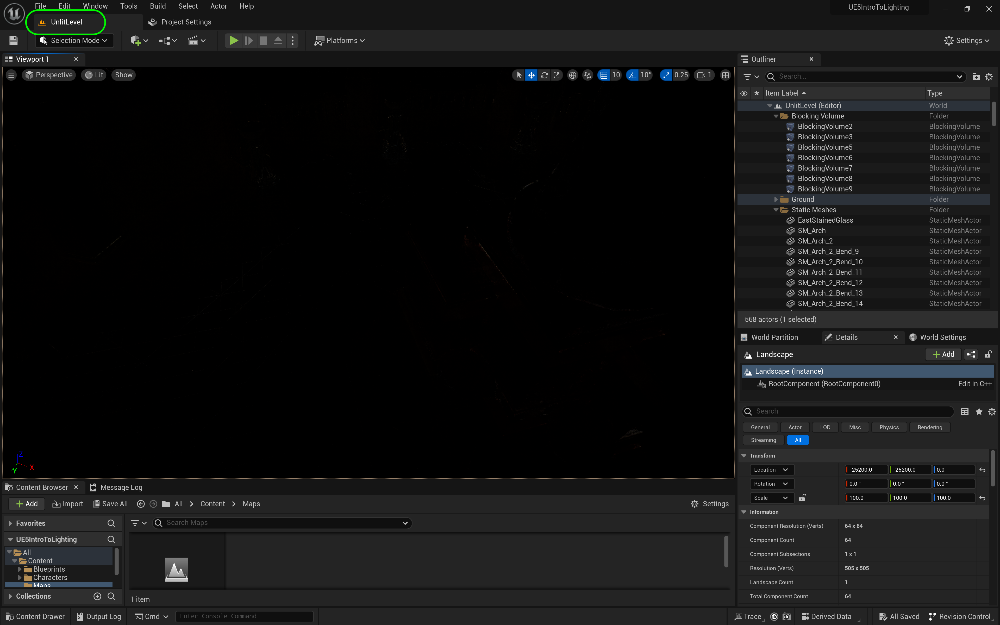

### Setting Up

[home](../README.md#user-content-ue5-lighting) • [next](../directional/README.md#user-content-directional-light--exposure)

We will be working with a level that has already been gray blocked and modelled. It is a finished level minus the lighting. This was created by the team at Unreal and included in their Content Example project in UE4 (they have removed it in the latest version). You will also have a third person character to move through the environment to check your work.

 

---

| `required.software`\|`UE5 Lighting`| 
| :--- |
| :floppy_disk: &nbsp; &nbsp; You will need to install the latest version of _UE4 5.2.X_ by downloading the [Epic Games Launcher](https://www.epicgames.com/store/en-US/download). You will also need a [P4V](https://www.perforce.com/downloads/helix-visual-client-p4v) account which is free to sign up for as we will be using version control. Lets make sure you can see hidden folders. On the PC follow these [Windows 10 Turn on Hidden Folders](https://support.microsoft.com/en-us/help/4028316/windows-view-hidden-files-and-folders-in-windows-10) directions.

##### `Step 1.`\|`ITL`|:small_blue_diamond:

You will have the starting project in your Perforce directory.  The folder is UE5-Intro-To-Lighting.  *Double click* **UE5IntroToLighting.uproject** to launch **Unreal**.

##### `Step 2.`\|`ITL`|:small_blue_diamond: :small_blue_diamond: 

Open up **UE5Lighting.uproject**. The project should load up in the Room/Level **UnlitLevel**. It should look like a pitch black room as there are no lights. 

##### `Step 3.`\|`ITL`|:small_blue_diamond: :small_blue_diamond: :small_blue_diamond:

You will see a dark room that has not been lit. To see what is going on swtich to **Unlit** mode. Next page we will start lighting the scene from scratch. If you are not in the level proper and out in space click on a mesh in the **World Outliner** and then press the <kbd>F</kbd> (focus) key to go to the active level.

##### `Step 4.`\|`ITL`|:small_blue_diamond: :small_blue_diamond: :small_blue_diamond: :small_blue_diamond:

Lets look at what is included in this project. We have a **Blocking Volumes** folder that contains invisible meshes. These are collision volumes with no visible geometry. They are used to stop players from entering areas the designer doesn't want them to go in. Select all of the  **BlockingVolumes** and press the <kbd>F</kbd> key to focus on it. Notice that is is blocking the player from jumping outside the unblocked windows and can't exit the building.

##### `Step 5.`\|`ITL`| :small_orange_diamond:

The **Static Meshes** folder contains all the static meshes for the level.

##### `Step 6.`\|`ITL`| :small_orange_diamond: :small_blue_diamond:

Our player will start on the outside terrace of this building.  This is where the level begins when we start the level.

##### `Step 7.`\|`ITL`| :small_orange_diamond: :small_blue_diamond: :small_blue_diamond:

Open up **Settings | Project Settings | Maps and Modes**. It will start the editor and full game in the level `Unlit Level`. This is the dark room we are in. We also have **GameModeBase** which is the default gamemode for the entire project. This will not load up our custom third person character.  It would have a first person controller.  But it is the **World Settings** that loads up the custom game mode.

##### `Step 8.`\|`ITL`| :small_orange_diamond: :small_blue_diamond: :small_blue_diamond: :small_blue_diamond:

##### `Step 9.`\|`ITL`| :small_orange_diamond: :small_blue_diamond: :small_blue_diamond: :small_blue_diamond: :small_blue_diamond:

##### `Step 10.`\|`ITL`| :large_blue_diamond:

##### `Step 11.`\|`ITL`| :large_blue_diamond: :small_blue_diamond: 

##### `Step 12.`\|`ITL`| :large_blue_diamond: :small_blue_diamond: :small_blue_diamond: 

##### `Step 13.`\|`ITL`| :large_blue_diamond: :small_blue_diamond: :small_blue_diamond:  :small_blue_diamond: 

##### `Step 14.`\|`ITL`| :large_blue_diamond: :small_blue_diamond: :small_blue_diamond: :small_blue_diamond:  :small_blue_diamond: 

##### `Step 15.`\|`ITL`| :large_blue_diamond: :small_orange_diamond: 

##### `Step 16.`\|`ITL`| :large_blue_diamond: :small_orange_diamond:   :small_blue_diamond: 

The **Game Mode** loads up the **Blueprints | MyGameLDDemo** that the **PlayerStart** object launches the player in the front terrace. The **Blueprints** folder also contains **ThirdPersonCharacter** which is the **UE5** mannequin that we will control in the game. This character blueprint is the **Default Pawn** in the gamemode blueprint.

##### `Step 17.`\|`ITL`| :large_blue_diamond: :small_orange_diamond: :small_blue_diamond: :small_blue_diamond:

Go to **Project Settings | Description** and update it to your liking.  I encourage you sue the [MIT License](https://opensource.org/licenses/MIT) for your Copyright notice so you can allow other students to play and look at your creation!

##### `Step 18.`\|`ITL`| :large_blue_diamond: :small_orange_diamond: :small_blue_diamond: :small_blue_diamond: :small_blue_diamond:

Select the **File | Save All** then press the <kbd>Source Control</kbd> button and select **Submit Content**.  If you are prompted, select **Check Out** for all items that are not checked out of source control. Update the **Changelist Description** message and with the latest changes. Make sure all the files are correct and press the <kbd>Submit</kbd> button. A confirmation will pop up on the bottom right with a message about a changelist was submitted with a commit number.

<!--  -->

| [home](../README.md#user-content-ue5-lighting) | [next](../directional/README.md#user-content-directional-light--exposure)|
|---|---|
