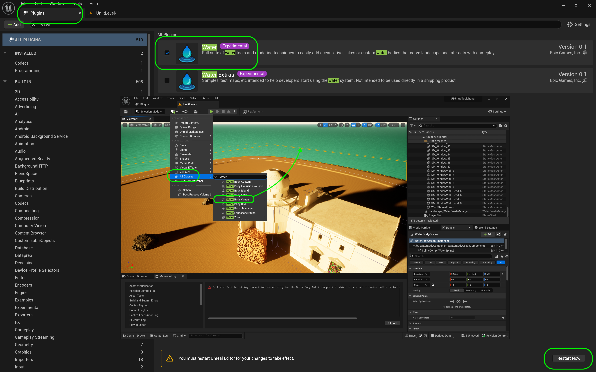
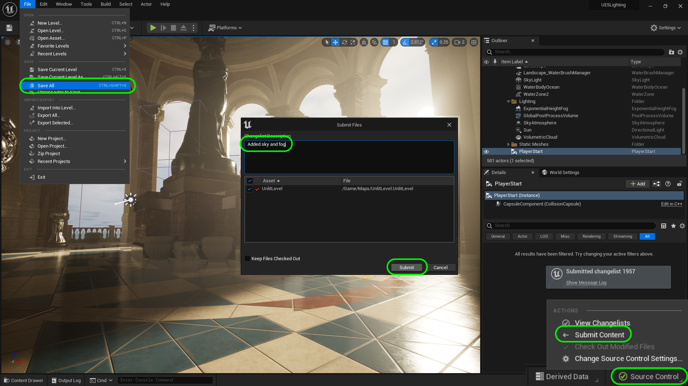

### Sky & Fog

[previous](../directional/README.md#user-content-directional-light--exposure) • [home](../README.md#user-content-ue5-lighting) • [next](../skylight/README.md#user-content-skylight)

Now that we have a single direct light we need a sky to reflect the light and act like our real atmoshpere.  We will also add some fog into the scene as air is not always completely translucent.

 

---

##### `Step 1.`\|`ITL`|:small_blue_diamond:

Open up the **Window | Env. Light Mixer** and it brings up all of the elements you need to complete an initial pass at lighting the level.

Now add a **[Sky Atmosphere](https://docs.unrealengine.com/5.0/en-US/sky-atmosphere-component-in-unreal-engine/)** to the level.  Notice that our sky goes from black to an actual atmosphere.  

> The Sky Atmosphere component in Unreal Engine is a physically-based sky and atmosphere-rendering technique. It's flexible enough to create an Earth-like atmosphere with time-of-day featuring sunrise and sunset, or to create extraterrestrial atmospheres of an exotic nature. - Unreal Manual

##### `Step 2.`\|`ITL`|:small_blue_diamond: :small_blue_diamond: 

Change the sun position and notice that the atmosphere changes based on the position of the sun. The closer the sun is to the horizon the more yellow is mixed into the light and the sky.

https://github.com/maubanel/UE5-Lighting/assets/5504953/9b1f2ea8-48fe-4a09-aeb0-13156324854e

##### `Step 3.`\|`ITL`|:small_blue_diamond: :small_blue_diamond: :small_blue_diamond:

> The sky atmoshphere also provides an aerial perspective to which you can simulate transitions from ground to sky to outer space with proper planetary curvature. - Unreal

Now you can can adjust the camera speed and zoom out into space.  Our island disappears as those object culls are set to not render at a certain distance.  But you can see that we have a complete earth like atmosphere even in space.

https://github.com/maubanel/UE5-Lighting/assets/5504953/e24d8f84-d4bd-49f4-8ad4-571ab65e42e5

##### `Step 4.`\|`ITL`|:small_blue_diamond: :small_blue_diamond: :small_blue_diamond: :small_blue_diamond:

Lets add an ocean into the scene.  Open up **Edit | Plugins** and search for the **Water** plugin. It will prompt you to restart the game.  When the game restarts look for the water actors and drag an **All Actors | Body Ocean** actor and drag it onto the landscape (the flat plane around the island).  After the shader renders you should see an ocean!

##### `Step 5.`\|`ITL`| :small_orange_diamond:
Adjust the shape of the ocean so it surrounds the level.  We cannot leave the level so it will not be noticable that we are on such a tiny island but will look better from our point of view.  Take the three water actors and move them to the **Ground** folder. 

##### `Step 6.`\|`ITL`| :small_orange_diamond: :small_blue_diamond:

Now that we have water it will be easier to see the future tweaks to the lighting.  Go back to the **Sky Atmosphere**. You can make many adjustments but most of the defaults are set for planet earth so not much needs to be done for realistic earth like atmosphere. There is one adjustment that affects the "thickness" of the atmosphere as if higher up in the sky (like on the top of a mountain). In the Sky Atmosphere you can change the **Art Direction | Aerial Perspecive View Distance Scale**. You can see a change on the horizon.

> The Aerial Perspective View Distance Scale property scales distances from the view to surfaces to make them look thicker when viewed from a high enough distance above the ground surface. - Unreal manual

https://github.com/maubanel/UE5-Lighting/assets/5504953/a3a10f69-3170-4e6d-8351-9bd93f7d0fac

##### `Step 7.`\|`ITL`| :small_orange_diamond: :small_blue_diamond: :small_blue_diamond:

Put all the lighting actors into the the **Lighting** folder.

Now you can add **Volumetric Clouds** from the **Env Light Mixer** to add moving clouds to the sky. And you see volumetric clouds in the sky.  

>The [Volumetric Cloud](https://docs.unrealengine.com/5.0/en-US/volumetric-cloud-component-properties-in-unreal-engine/) component is a physically-based cloud rendering system that uses a material-driven approach to give artists and designers the freedom to create any type of clouds they need for their projects. The cloud system handles dynamic time-of-day setups that is complemented by the Sky Atmosphere and Sky Light using the real time capture mode. The system provides scalable, artist-defined clouds that can adapt to projects using ground views, flying, and ground to outer space transitions. - Unreal Manual

Put the **Volumetric Clouds** actor in the **Lighting** folder. Now we will get into more detail on how to alter the cloud cover.  This basic actor has two major elements we can change.  The height the clouds start at and how high they extend into the sky.  If we go up in the air it is a bit more appraent what is happening here. You can adjust the **Layer Bottom Altitude** in kilometers which is how far from the ground do the clouds start.  You can also adjust the **Layer Height** which is how high in kilometers to the clouds extend from the prior starting point.

https://github.com/maubanel/UE5-Lighting/assets/5504953/712a4250-f544-4203-b9fa-387b35ec008c

##### `Step 8.`\|`ITL`| :small_orange_diamond: :small_blue_diamond: :small_blue_diamond: :small_blue_diamond:

So now back on the gazebo and you can customize the values you want for **Layer Bottom Altitude** and **Layer Height**. I raised them a bit and made them moodier.  I think this is the look I am sticking with for now.

##### `Step 9.`\|`ITL`| :small_orange_diamond: :small_blue_diamond: :small_blue_diamond: :small_blue_diamond: :small_blue_diamond:

Now lets go back to the **Env Light Mixer**.  We are missing the Height Fog. Now lets add some immediate fog as we are on the ocean which often has a fog/mist.  The horizon is too straight and visible. Drag a **[Special Effects | Exponential Height Fog](https://docs.unrealengine.com/5.0/en-US/BuildingWorlds/FogEffects/HeightFog/)** into the level in the **Lighting** folder.  

> Exponential Height Fog creates more density in low places of a map and less density in high places. The transition is smooth, so you never get a hard cutoff as you increase altitude. Exponential Height Fog also provides two fog colors—one for the hemisphere facing the dominant directional light (or straight up if none exists), and another color for the opposite hemisphere. 

https://github.com/maubanel/UE5-Lighting/assets/5504953/9c1e06a2-7a42-4e56-a2ff-db77cc6df891

##### `Step 10.`\|`ITL`| :large_blue_diamond:

If you have ever looked out on an ocean it is often hard to amke out the horizon as fog and mist usually limits your view. Toggle the eyeball in the **Outliner** on and off and look at the horizon.  You can make it look as foggy and as moody as you like.

https://github.com/maubanel/UE5-Lighting/assets/5504953/ea3533db-f91a-4999-a5c7-47469cbc96b3

##### `Step 11.`\|`ITL`| :large_blue_diamond: :small_blue_diamond: 

You can also adjust how dense the fog is with the **Fog Max Opacity**.  A value of `1` is the least transulcent and `0` would be completely transparent. You can also adjust the **Start Distance**: "*Distance from the camera that the fog will start.*" and **Fog Cuttoff Distance**: "*Scene elements past this distance will not have fog applied. This is useful for excluding skyboxes which already have fog baked into them.*" So in our case we don't want a cuttoff as we do not have a skybox with a texture on it.

https://github.com/maubanel/UE5-Lighting/assets/5504953/5dd6461e-c254-4909-ae19-aa69caba13e6

##### `Step 12.`\|`ITL`| :large_blue_diamond: :small_blue_diamond: :small_blue_diamond: 

Now there is a secondary fog layer that you can add with the **Second Fog Density** and **Second Height Falloff**.  You can also adjust the height relative to the first fog layer with the **Fog Height Offset**.  If the density is set to `0` there is no secondary fog at all. This is most usefuly when you have mountainous terrain as you can have different levels of fog floating over your landscape.  In this case I don't think it adds much so I set it back to `0`.

Make all the fog changes you see fit on your level.

https://github.com/maubanel/UE5-Lighting/assets/5504953/65373aec-cb25-4e16-8305-d1c81f7b9e61

##### `Step 13.`\|`ITL`| :large_blue_diamond: :small_blue_diamond: :small_blue_diamond:  :small_blue_diamond: 

Now if you want the light to react in interesting ways with the particles you can set [**Volumetric Fog**](https://docs.unrealengine.com/5.0/en-US/volumetric-fog-in-unreal-engine/) to true. 

>Volumetric Fog is an optional part of the Exponential Height Fog Component. Volumetric Fog computes participating media density and lighting at every point in the camera frustum to support varying densities and any number of lights that affect the fog. - Unreal Manual

You can adjust the **Scaterring Distribution**: "*This determines how directional the volumetric scattering is; a value of 0, means light scatters equally in all directions, while a value close to 1 causes scattering, predominantly in the direction of the light (you have to be looking at the light to see its scattering)*", the **Albedo**: "*This is the overall reflectiveness of the participating media. Clouds, fog, and mist, which are based on water particles, have an Albedo close to 1.*", the **Extinction Scale**: "*Controls how much the participating media blocks light*", the **View Distance** and the **Light Colors**.

Turn **Volumetric Fog** on.  Make all the fog changes you see fit on your level.

https://github.com/maubanel/UE5-Lighting/assets/5504953/72001bb1-a016-4435-8306-df9e3a8622ec

##### `Step 14.`\|`ITL`| :large_blue_diamond: :small_blue_diamond: :small_blue_diamond: :small_blue_diamond:  :small_blue_diamond: 

Now lets get interesting patterns of the sun off of the gazebo to interact with our volumetric fog.  Select the **Directional Light** (Sun). You can adjust the **Volumetric Scattering Intensity** which affects the intensity of the scattering of the volumetric fog from this light. Turn on **Light Shaft Occlusion** which adjusts how it is blurred based on the camera angle with the light. The **Occlusion Mask Darkening** controls how much the rays will darken.  

Also, turn on **Light Shaft Occlusion** which will add a bloom through the fog when looking at the light.  You can then adjust the scale, threshold and brightness.  The default settings are too pronounced so I adjusted them down to lessen the bloom effect. Turn on **Light Shaft Bloom** and adjust the **Bloom Scale**.

https://github.com/maubanel/UE5-Lighting/assets/5504953/18eca17f-891e-4de4-a26c-b6f2ce455d9d

##### `Step 15.`\|`ITL`| :large_blue_diamond: :small_orange_diamond: 

Run the game and make the tweaks to your liking.

##### `Step 16.`\|`ITL`| :large_blue_diamond: :small_orange_diamond:   :small_blue_diamond: 

Now lets make one more change.  Lets have the clouds overhead affect the lighting.  Select **Cast Cloud Shadows**.  This might have no effect, or in my case it makes the entire scene go dark.  This is because the clouds are occluding the sun and there is no other light source.  The sun will light up all the particle sin the sky and we get lots of ambient light (why we can still see when the clouds block the sun). If you can see some blue sky there will lighting.  Our sky atmosphere doesn't act as a light and there is one more actor we need for an outdoor scene that will act to light the entire sky. Turn **Cast Cloud Shadows** back to `false` and we will fix this.

https://user-images.githubusercontent.com/5504953/188625147-1dff565a-e528-4c87-8ecf-abc551befb12.mp4

Select the **File | Save All** then press the <kbd>Source Control</kbd> button and select **Submit Content**.  If you are prompted, select **Check Out** for all items that are not checked out of source control. Update the **Changelist Description** message and with the latest changes. Make sure all the files are correct and press the <kbd>Submit</kbd> button. A confirmation will pop up on the bottom right with a message about a changelist was submitted with a commit number.

<!--  -->

| [previous](../directional/README.md#user-content-directional-light--exposure)| [home](../README.md#user-content-ue5-lighting) | [next](../skylight/README.md#user-content-skylight)|
|---|---|---|
