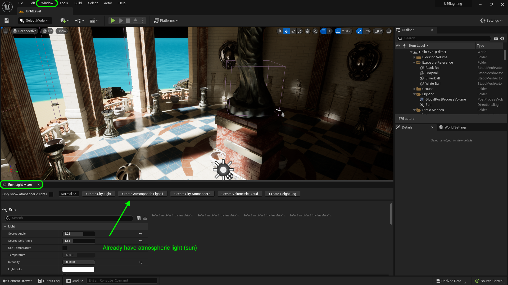
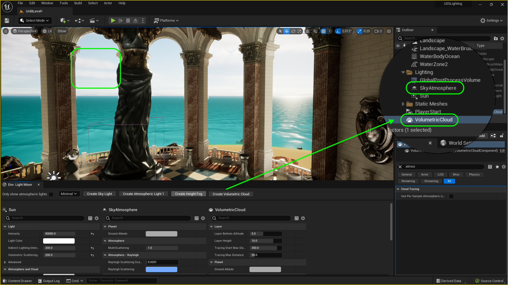
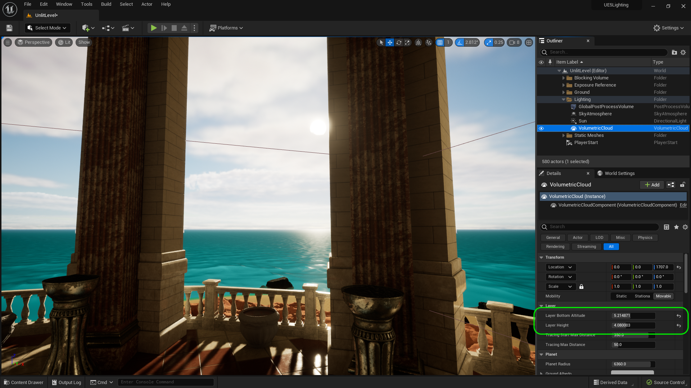
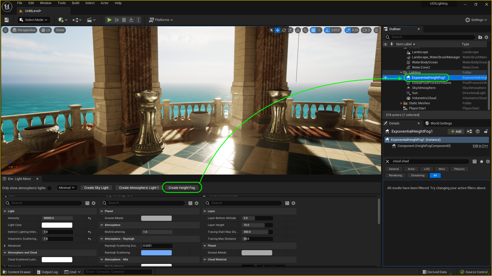

### Sky & Fog

[previous](../) • [home](../README.md#user-content-ue5-lighting) • [next](../)

Now that we have a single direct light we need a sky to reflect the light and act like our real atmoshpere.  We will also add some fog into the scene as air is not always completely translucent.

 

---

##### `Step 1.`\|`ITL`|:small_blue_diamond:

Now we have a convenient tool for setting up levels quickly.  You can click on **Window | Env. Light Mixer** and it brings up all of the elements you need to complete an initial pass at lighting the level.

##### `Step 2.`\|`ITL`|:small_blue_diamond: :small_blue_diamond: 

Now add a **[Sky Atmosphere](https://docs.unrealengine.com/5.0/en-US/sky-atmosphere-component-in-unreal-engine/)** to the level.  Notice that our sky goes from black to an actual atmosphere.  

> The Sky Atmosphere component in Unreal Engine is a physically-based sky and atmosphere-rendering technique. It's flexible enough to create an Earth-like atmosphere with time-of-day featuring sunrise and sunset, or to create extraterrestrial atmospheres of an exotic nature. - Unreal Manual

Change the sun position and notice that the atmosphere changes based on the position of the sun.

https://user-images.githubusercontent.com/5504953/188452815-0ea89816-b8ce-4a08-aa3e-035049efc78b.mp4

##### `Step 3.`\|`ITL`|:small_blue_diamond: :small_blue_diamond: :small_blue_diamond:

> The sky atmoshphere also provides an aerial perspective to which you can simulate transitions from ground to sky to outer space with proper planetary curvature. - Unreal

Now you can can adjust the camera speed and zoom out into space.  Our island disappears as those object culls are set to not render at a certain distance.  But you can see that we have a complete earth like atmosphere even in space.

https://user-images.githubusercontent.com/5504953/188460013-14fa14af-d427-4748-bf87-35e7cdf3e9ee.mp4

##### `Step 4.`\|`ITL`|:small_blue_diamond: :small_blue_diamond: :small_blue_diamond: :small_blue_diamond:

You can make many adjustments but most of the defaults are set for planet earth so not much needs to be done for realistic earth like atmosphere. There is one adjustment that affects the "thickness" of the atmosphere as if higher up in the sky (like on the top of a mountain). In the Sky Atmosphere you can change the **Art Direction | Aerial Perspecive View Distance Scale**. You can see a change on the horizon.

> The Aerial Perspective View Distance Scale property scales distances from the view to surfaces to make them look thicker when viewed from a high enough distance above the ground surface. - Unreal manual

https://user-images.githubusercontent.com/5504953/188461608-8034546b-c7cb-4fcd-b67e-0358caba7c62.mp4

##### `Step 5.`\|`ITL`| :small_orange_diamond:

Move the **SkyAtmosphere** actor to the **Lighting** folder.

Now you can add **Volumetric Clouds** from the **Env Light Mixer** to add moving clouds to the sky. And you see volumetric clouds in the sky.  

>The [Volumetric Cloud](https://docs.unrealengine.com/5.0/en-US/volumetric-cloud-component-properties-in-unreal-engine/) component is a physically-based cloud rendering system that uses a material-driven approach to give artists and designers the freedom to create any type of clouds they need for their projects. The cloud system handles dynamic time-of-day setups that is complemented by the Sky Atmosphere and Sky Light using the real time capture mode. The system provides scalable, artist-defined clouds that can adapt to projects using ground views, flying, and ground to outer space transitions. - Unreal Manual

##### `Step 6.`\|`ITL`| :small_orange_diamond: :small_blue_diamond:

Put the **Volumetric Clouds** actor in the **Lighting** folder. Now we will get into more detail on how to alter the cloud cover.  This basic actor has two major elements we can change.  The height the clouds start at and how high they extend into the sky.  If we go up in the air it is a bit more appraent what is happening here. You can adjust the **Layer Bottom Altitude** in kilometers which is how far from the ground do the clouds start.  You can also adjust the **Layer Height** which is how high in kilometers to the clouds extend from the prior starting point.

https://user-images.githubusercontent.com/5504953/188489577-4edd6f5a-53f7-45a4-b552-7417dfd47f9a.mp4

##### `Step 7.`\|`ITL`| :small_orange_diamond: :small_blue_diamond: :small_blue_diamond:

So now back on the gazebo and you can customize the values you want for **Layer Bottom Altitude** and **Layer Height**. I raised them a bit and made the a bit thinner (less tall).  I think this is the look I am sticking with for now.

##### `Step 8.`\|`ITL`| :small_orange_diamond: :small_blue_diamond: :small_blue_diamond: :small_blue_diamond:

Now lets go back to the **Env Light Mixer**.  We are missing the Height Fog. Now lets add some immediate fog as we are on the ocean which often has a fog/mist.  The horizon is too straight and visible. Drag a **[Special Effects | Exponential Height Fog](https://docs.unrealengine.com/5.0/en-US/BuildingWorlds/FogEffects/HeightFog/)** into the level in the **Lighting** folder.  

> Exponential Height Fog creates more density in low places of a map and less density in high places. The transition is smooth, so you never get a hard cutoff as you increase altitude. Exponential Height Fog also provides two fog colors—one for the hemisphere facing the dominant directional light (or straight up if none exists), and another color for the opposite hemisphere. 

Move it to the **Lighting** folder.

##### `Step 9.`\|`ITL`| :small_orange_diamond: :small_blue_diamond: :small_blue_diamond: :small_blue_diamond: :small_blue_diamond:

If you have ever looked out on an ocean it is often hard to amke out the horizon as fog and mist usually limits your view. Toggle the eyeball in the **Outliner** on and off and look at the horizon.  You can make it look as foggy and as moody as you like.

https://user-images.githubusercontent.com/5504953/188520360-70df16f0-9b3a-4de4-abcc-f315995b91c4.mp4

##### `Step 10.`\|`ITL`| :large_blue_diamond:

There are quite a few things we can tweak with the exponential height fog.  First is the **Fog Density**: "*This is the global density factor, which can be thought of as the fog layer's thickness.*".  The second is **Fog Height Falloff**: "*Height density factor, controls how the density increases as height decreases. Smaller values make the transition larger.*" You can control the height of the fog layer by adjusting the **Z** value of the fog actor.

https://user-images.githubusercontent.com/5504953/188520978-d211fa64-7a00-4b6e-a027-dddf7ad643a0.mp4

##### `Step 11.`\|`ITL`| :large_blue_diamond: :small_blue_diamond: 

Now there is a secondary fog layer hta tyou can add with the **Second Fog Density** and **Second Height Falloff**.  You can also adjust the height relative to the first fog layer with the **Fog Height Offset**.  If the density is set to `0` there is no secondary fog at all.

https://user-images.githubusercontent.com/5504953/188612829-bc4bd408-532a-4a21-967e-69cc4e289ff1.mp4

##### `Step 12.`\|`ITL`| :large_blue_diamond: :small_blue_diamond: :small_blue_diamond: 

You can also adjust how dense the fog is with the **Fog Max Opacity**.  A value of `1` is the least transulcent and `0` would be completely transparent. You can also adjust the **Start Distance**: "*Distance from the camera that the fog will start.*" and **Fog Cuttoff Distance**: "*Scene elements past this distance will not have fog applied. This is useful for excluding skyboxes which already have fog baked into them.*" So in our case we don't want a cuttoff as we do not have a skybox with a texture on it.

Make all the fog changes you see fit on your level.

https://user-images.githubusercontent.com/5504953/188612919-9d48eb9c-95ed-48f3-ab37-6ca548dd6109.mp4

##### `Step 13.`\|`ITL`| :large_blue_diamond: :small_blue_diamond: :small_blue_diamond:  :small_blue_diamond: 

Now if you want the light to react in interesting ways with the particles you can set **Volumetric Fog** to true. 

##### `Step 14.`\|`ITL`| :large_blue_diamond: :small_blue_diamond: :small_blue_diamond: :small_blue_diamond:  :small_blue_diamond: 

##### `Step 15.`\|`ITL`| :large_blue_diamond: :small_orange_diamond: 

##### `Step 16.`\|`ITL`| :large_blue_diamond: :small_orange_diamond:   :small_blue_diamond: 

##### `Step 17.`\|`ITL`| :large_blue_diamond: :small_orange_diamond: :small_blue_diamond: :small_blue_diamond:

##### `Step 18.`\|`ITL`| :large_blue_diamond: :small_orange_diamond: :small_blue_diamond: :small_blue_diamond: :small_blue_diamond:

##### `Step 19.`\|`ITL`| :large_blue_diamond: :small_orange_diamond: :small_blue_diamond: :small_blue_diamond: :small_blue_diamond: :small_blue_diamond:

##### `Step 20.`\|`ITL`| :large_blue_diamond: :large_blue_diamond:

##### `Step 21.`\|`ITL`| :large_blue_diamond: :large_blue_diamond: :small_blue_diamond:

<!--  -->

| [previous](../)| [home](../README.md#user-content-ue5-lighting) | [next](../)|
|---|---|---|
