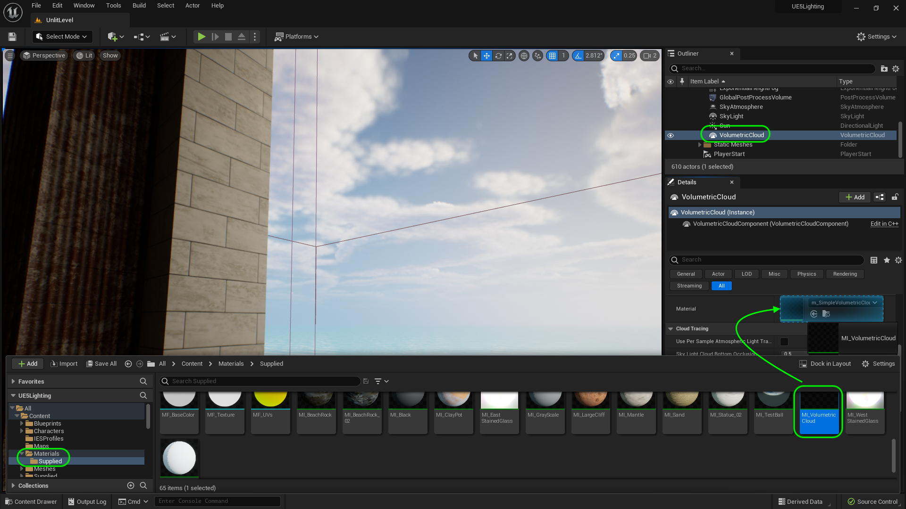
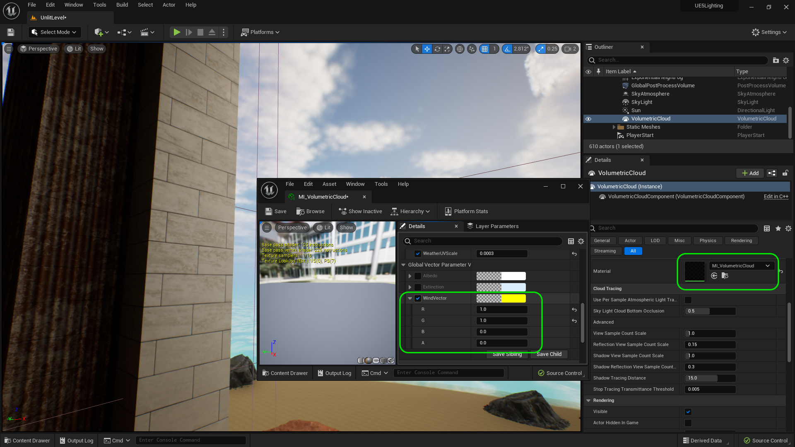
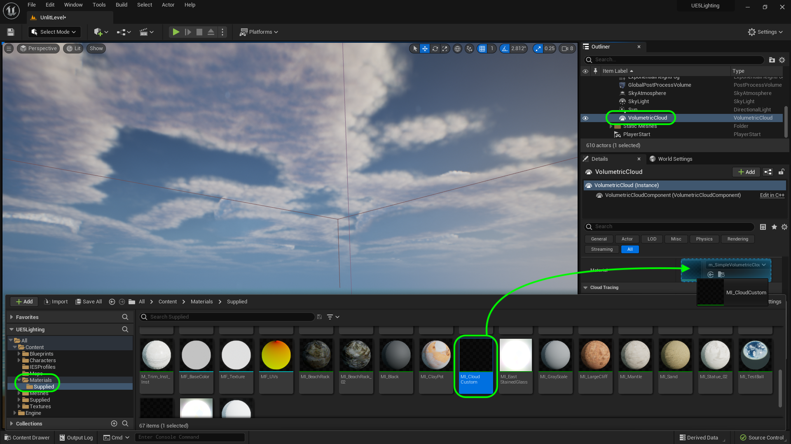
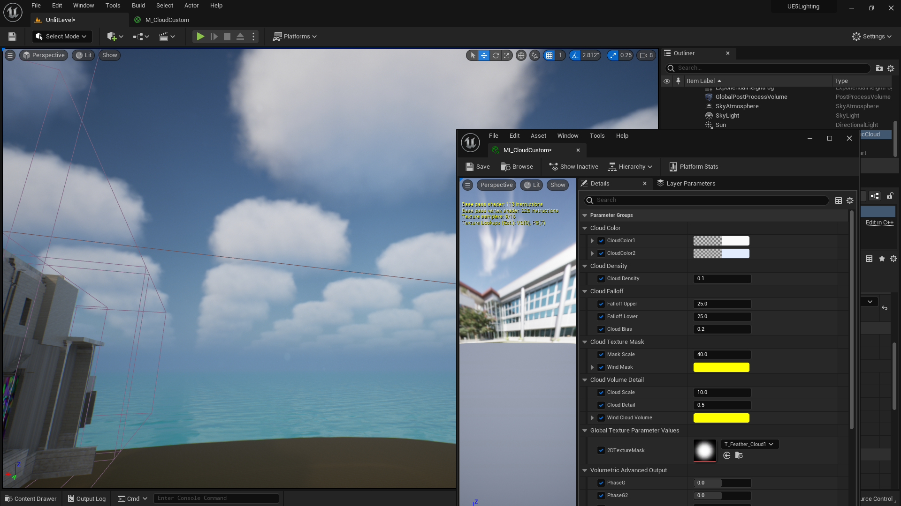

### HDRI Skies & Customize Clouds II
[previous](../) • [home](../README.md#user-content-ue5-lighting) • [next](../)

Lets finish up by customizing the clouds.

 

---

##### `Step 1.`\|`ITL`|:small_blue_diamond:

Go to **Volumetric Cloud** in the game and drag the **MI_VolumetricCloud** in the **Material** slot.  This will change nothing.

##### `Step 2.`\|`ITL`|:small_blue_diamond: :small_blue_diamond: 

Open up the material to get to the wind vector.   

##### `Step 3.`\|`ITL`|:small_blue_diamond: :small_blue_diamond: :small_blue_diamond:

If you go up above and change the **R** and **G** to `0`.  Then set each **R**, **G**, **B** an de**A** to `10`.  Notice that **R** and **G** affect the horizontal axis.  A positive number goes one direction on the axis and a negative another direction.  The **B** value makes the clouds move in **Z** up and down.  **A** appears to do nothing.

https://user-images.githubusercontent.com/5504953/190928453-da93314d-cb15-4dd9-a186-adacf821427f.mp4

##### `Step 4.`\|`ITL`|:small_blue_diamond: :small_blue_diamond: :small_blue_diamond: :small_blue_diamond:

Back on the ground level set a speed that works for the sky you want.  I want to give the sky a bit more motion than it had previously so I up the values on all three active axis. Set them to your liking, then play the game and check out the skies!

https://user-images.githubusercontent.com/5504953/190928595-38017bf2-e922-418e-b926-7ca155e9d506.mp4

##### `Step 5.`\|`ITL`| :small_orange_diamond:

Select **Volumetric Cloud** in the **Outliner** and double click the maerial instance, **m_SimpleVolumetricCloud_Inst**. Now you can adjust the parameters and change the look of the clouds.  Play around with the variuos settings and see what kind of changes you can make.  Then press play and check out the changes in game.

https://user-images.githubusercontent.com/5504953/191955086-a54ea809-163a-4d67-91af-5a4b7561f160.mp4

##### `Step 6.`\|`ITL`| :small_orange_diamond: :small_blue_diamond:

Now I have included another cloud material that allows for more customization of the input settings used. In **Materials | Supplied** you can drag **MI_CloudCustom** to the material slot in **Volumetric Cloud**.

##### `Step 7.`\|`ITL`| :small_orange_diamond: :small_blue_diamond: :small_blue_diamond:

Reset to default settings and we should have circles in the sky.

##### `Step 8.`\|`ITL`| :small_orange_diamond: :small_blue_diamond: :small_blue_diamond: :small_blue_diamond:

Now the **Mask Scale** and **Cloud Scale** play hand in hand so you can adjust them seperately.  But usually they need to be updated in unison to look correct.

https://user-images.githubusercontent.com/5504953/192096074-f75d19c5-39da-4d13-9e6a-7a82dbbc40d8.mp4

##### `Step 9.`\|`ITL`| :small_orange_diamond: :small_blue_diamond: :small_blue_diamond: :small_blue_diamond: :small_blue_diamond:

You can adjust how the clouds falloff from the top and baottom as well as a cloud bioas on the **Cloud Falloff** section.

https://user-images.githubusercontent.com/5504953/192096086-b5267553-79ef-4f3a-bf6b-dcbfab73cfcb.mp4

##### `Step 10.`\|`ITL`| :large_blue_diamond:

You can adjust the **Wind Mask** and **Wind Cloud Volume**.  One makes the clouds move the other affects how the clouds change when they move.  Again, these two settings work nicely together and need to be adjusted sepeartely to create a given effect.

https://user-images.githubusercontent.com/5504953/192096098-53500b86-0690-4209-9dc5-15c724b7e3b0.mp4

##### `Step 11.`\|`ITL`| :large_blue_diamond: :small_blue_diamond: 

Now you can also change the color of the bottom of the clouds and top of the clouds.  In this case I am making the top a bit more sky blue to make them blend in a bit better.

https://user-images.githubusercontent.com/5504953/192096585-792797b3-fa38-419a-9a4f-921dacaf0120.mp4

##### `Step 12.`\|`ITL`| :large_blue_diamond: :small_blue_diamond: :small_blue_diamond: 

You can also adjust the **Cloud Density** for thicker or a thinner layer of clouds.

https://user-images.githubusercontent.com/5504953/192096822-9d16bfc9-5633-49aa-957a-4260c8c19bea.mp4

##### `Step 13.`\|`ITL`| :large_blue_diamond: :small_blue_diamond: :small_blue_diamond:  :small_blue_diamond: 

##### `Step 14.`\|`ITL`| :large_blue_diamond: :small_blue_diamond: :small_blue_diamond: :small_blue_diamond:  :small_blue_diamond: 

##### `Step 15.`\|`ITL`| :large_blue_diamond: :small_orange_diamond: 

##### `Step 16.`\|`ITL`| :large_blue_diamond: :small_orange_diamond:   :small_blue_diamond: 

##### `Step 17.`\|`ITL`| :large_blue_diamond: :small_orange_diamond: :small_blue_diamond: :small_blue_diamond:

##### `Step 18.`\|`ITL`| :large_blue_diamond: :small_orange_diamond: :small_blue_diamond: :small_blue_diamond: :small_blue_diamond:

##### `Step 19.`\|`ITL`| :large_blue_diamond: :small_orange_diamond: :small_blue_diamond: :small_blue_diamond: :small_blue_diamond: :small_blue_diamond:

##### `Step 20.`\|`ITL`| :large_blue_diamond: :large_blue_diamond:

##### `Step 21.`\|`ITL`| :large_blue_diamond: :large_blue_diamond: :small_blue_diamond:

| `lighting.reflections`\|`THE END`| 
| :--- |
| **That's All Folks!** Thanks for sticking around. That's it for this lesson. |

<!--  -->

| [previous](../)| [home](../README.md#user-content-ue5-lighting) | [next](../)|
|---|---|---|
