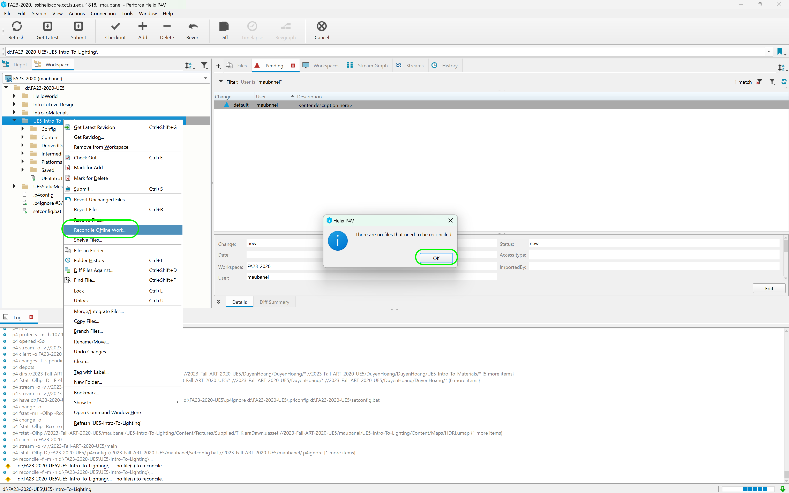

### Customize Clouds 

[previous](../path-tracing/README.md#path-tracing) • [home](../README.md#user-content-ue4-lighting)

Lets look at customizing clouds as the default clouds don't have much customization at first glance. We have a more advanced cloud material that has more parameters to edit.

 

---

##### `Step 1.`\|`ITL`|:small_blue_diamond:

Now lets add a more advanced material with more elements to control.  Go to **Materials | Supplied** and drag and drop `MI_VolumetricCloud` into the **Volumetric Cloud Instance | Cloud Material | Material** slot.

##### `Step 2.`\|`ITL`|:small_blue_diamond: :small_blue_diamond: 

Open up the material to get to the wind vector. If you go up above and change the **R** and **G** to `0`.  Then set each **R**, **G**, **B** to a vlue you like.  Notice that **R** and **G** affect the horizontal axis.  A positive number goes one direction on the axis and a negative another direction.  The **B** value makes the clouds move in **Z** up and down.  **A** appears to do nothing. I am happy making the clouds move in the same direction as the sun is focusing for some symmetry.

https://github.com/maubanel/UE5-Lighting/assets/5504953/8ec537ea-6b66-4c3b-8aae-72bc1155a8d4

##### `Step 3.`\|`ITL`|:small_blue_diamond: :small_blue_diamond: :small_blue_diamond:

Now make adjustments to the various settings.  These get pretty complicated and I am not sure the exact meaning of each editable value, but you can play around with them to get different kind of cloud formations.  

https://github.com/maubanel/UE5-Lighting/assets/5504953/df05563d-82fd-4be1-afea-6b58aba72381

##### `Step 4.`\|`ITL`|:small_blue_diamond: :small_blue_diamond: :small_blue_diamond: :small_blue_diamond:

Select the **File | Save All** then press the #<kbd>Revision Control</kbd> button and select **Submit Content**.  If you are prompted, select **Check Out** for all items that are not checked out of source control. Update the **Changelist Description** message and with the latest changes. Make sure all the files are correct and press the <kbd>Submit</kbd> button. A confirmation will pop up on the bottom right with a message about a changelist was submitted with a commit number. Quit Unreal and make sure your **Pending** tab in **P4V** is empty. **Submit** any work that is still in the editor.

##### `Step 5.`\|`ITL`| :small_orange_diamond:

Sometimes not all files get submitted to Unreal especially for files that don't show up in the editor.  It is good practice one you submit in **Unreal** and quit the game to right click on the top most project folder and select **Reconcile Offline Work...**.

This will either give a message saying ther is nothing to reconcile or bring up a tab.  Make sure that these are **NOT** files in the **Intermediate** and **Saved** folders as these should be ignored from the `.p4ignore`.

If the files are in **Content** or **Configuration** then press the <kbd>Reconcile</kbd> button.  Then submit the changes with a message and press the <kbd>Submit</kbd> button.

| `lighting.ue5`\|`THE END`| 
| :--- |
| **That's All Folks!** Thanks for sticking around. That's it for this lesson. |

<!--  -->

| [previous](../path-tracing/README.md#path-tracing)| [home](../README.md#user-content-ue4-lighting) | 
|---|---|
