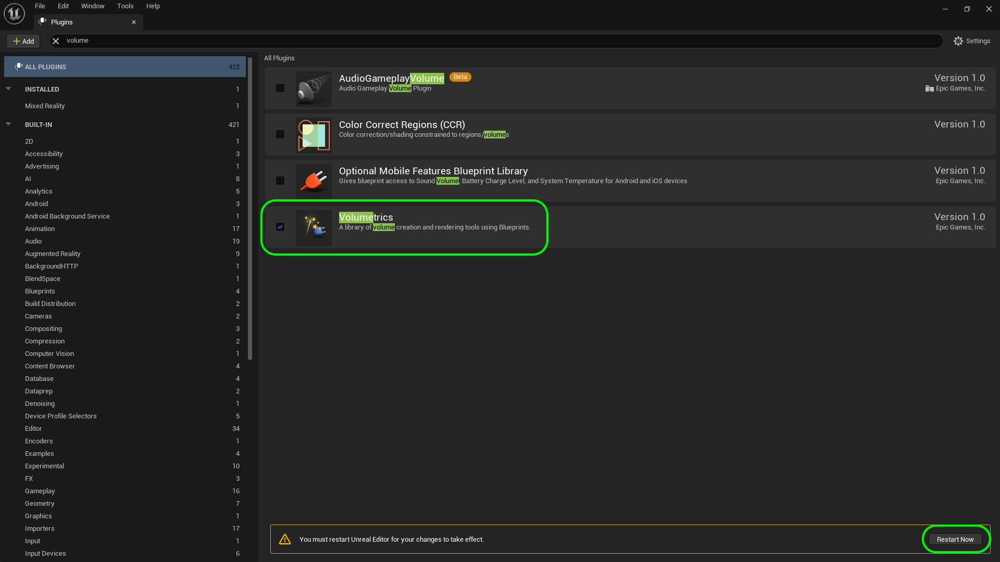
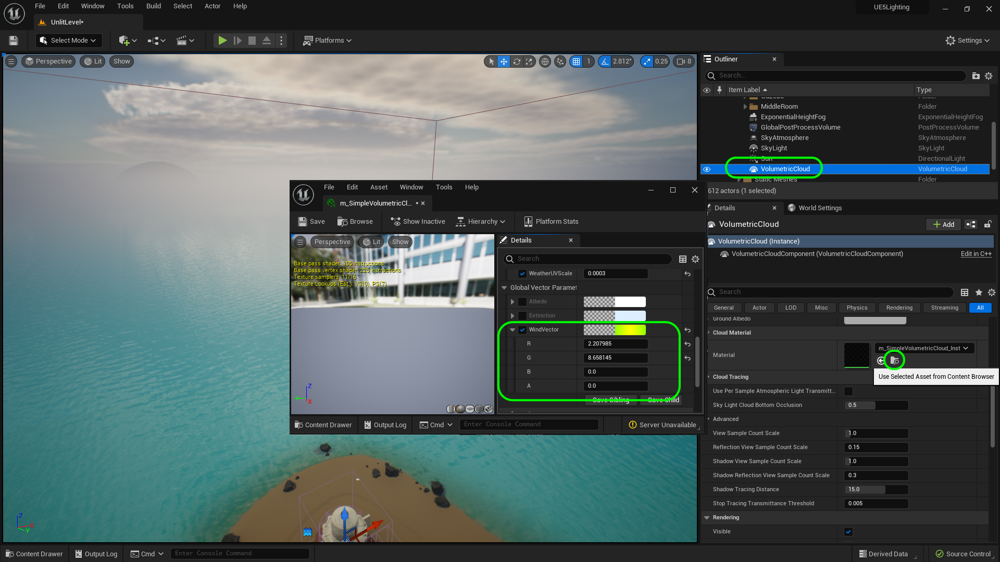
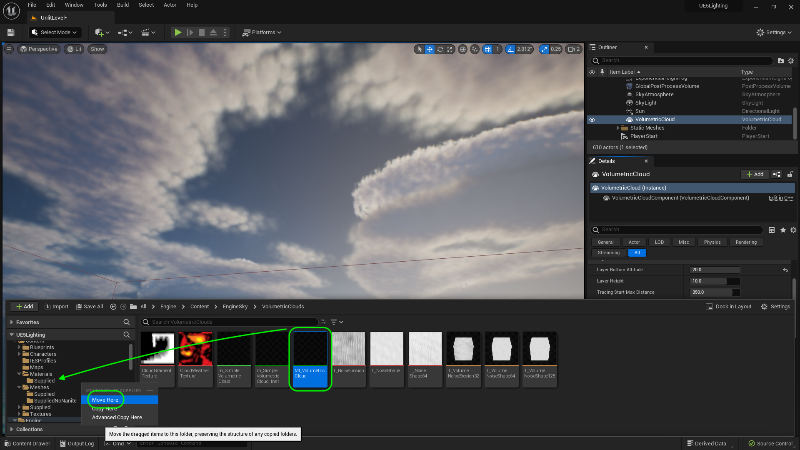

### Customize Clouds 

[previous](../post-process/README.md#user-content-post-process-volumes) • [home](../README.md#user-content-ue4-lighting)

Lets look at customizing clouds as the default clouds don't have much customization at first glance. We have a more advanced cloud material that has more parameters to edit.

 

---

##### `Step 1.`\|`ITL`|:small_blue_diamond:

Now the last thing we will look at are the volumetric clouds..  Lets go to **Edit | Plugins** and add the **Volumetrics** plugin and restart the engine to load the plugin.

##### `Step 2.`\|`ITL`|:small_blue_diamond: :small_blue_diamond: 

Now lets adjust the speed of the clouds movement.  Select in the **Outliner** the **Volumetric Clouds** and open up the material used **M_SimpleVolumetricCloud_Inst** by clicking on the folder next to the material. Right click on **M_SimpleVolumetricCloud_Inst** and select **Duplicate**.  Name the new material instance `MI_VolumetricCloud`.  Now we don't want to edit the one in the **Engine** folder as this will change it for every project moving forward.  We just want to affect the clouds in this one level which is why we are duplicating this texture.

##### `Step 3.`\|`ITL`|:small_blue_diamond: :small_blue_diamond: :small_blue_diamond:

##### `Step 4.`\|`ITL`|:small_blue_diamond: :small_blue_diamond: :small_blue_diamond: :small_blue_diamond:

##### `Step 5.`\|`ITL`| :small_orange_diamond:

##### `Step 6.`\|`ITL`| :small_orange_diamond: :small_blue_diamond:

##### `Step 7.`\|`ITL`| :small_orange_diamond: :small_blue_diamond: :small_blue_diamond:

##### `Step 8.`\|`ITL`| :small_orange_diamond: :small_blue_diamond: :small_blue_diamond: :small_blue_diamond:

##### `Step 9.`\|`ITL`| :small_orange_diamond: :small_blue_diamond: :small_blue_diamond: :small_blue_diamond: :small_blue_diamond:

##### `Step 10.`\|`ITL`| :large_blue_diamond:

##### `Step 11.`\|`ITL`| :large_blue_diamond: :small_blue_diamond: 

##### `Step 12.`\|`ITL`| :large_blue_diamond: :small_blue_diamond: :small_blue_diamond: 

##### `Step 13.`\|`ITL`| :large_blue_diamond: :small_blue_diamond: :small_blue_diamond:  :small_blue_diamond: 

##### `Step 14.`\|`ITL`| :large_blue_diamond: :small_blue_diamond: :small_blue_diamond: :small_blue_diamond:  :small_blue_diamond: 

##### `Step 15.`\|`ITL`| :large_blue_diamond: :small_orange_diamond: 

##### `Step 16.`\|`ITL`| :large_blue_diamond: :small_orange_diamond:   :small_blue_diamond: 

##### `Step 17.`\|`ITL`| :large_blue_diamond: :small_orange_diamond: :small_blue_diamond: :small_blue_diamond:

##### `Step 18.`\|`ITL`| :large_blue_diamond: :small_orange_diamond: :small_blue_diamond: :small_blue_diamond: :small_blue_diamond:

##### `Step 19.`\|`ITL`| :large_blue_diamond: :small_orange_diamond: :small_blue_diamond: :small_blue_diamond: :small_blue_diamond: :small_blue_diamond:

##### `Step 20.`\|`ITL`| :large_blue_diamond: :large_blue_diamond:

##### `Step 21.`\|`ITL`| :large_blue_diamond: :large_blue_diamond: :small_blue_diamond:

Drag and drop **MI_VolumetricCloud** in **Materials | Supplied** and select **Move Here**.

<!--  -->

| [previous](../post-process/README.md#user-content-post-process-volumes)| [home](../README.md#user-content-ue4-lighting) | 
|---|---|
