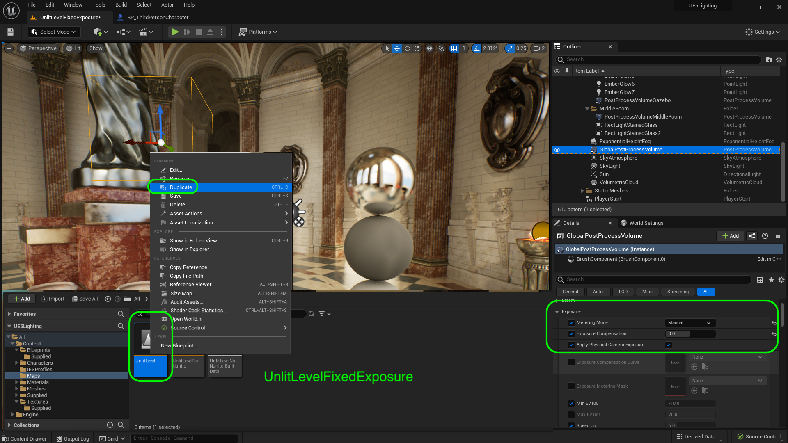
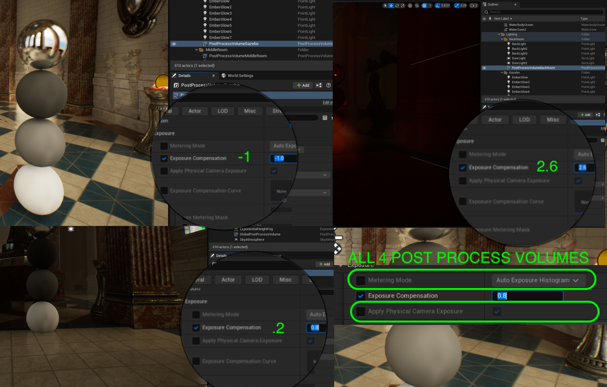
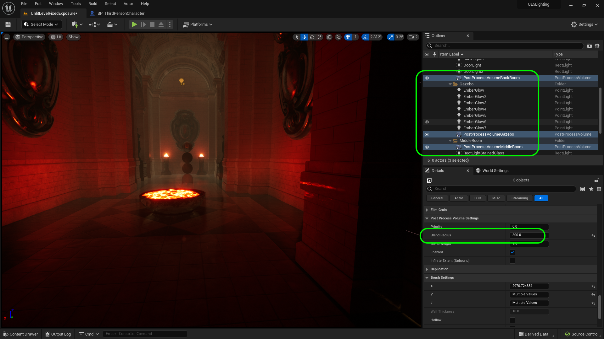
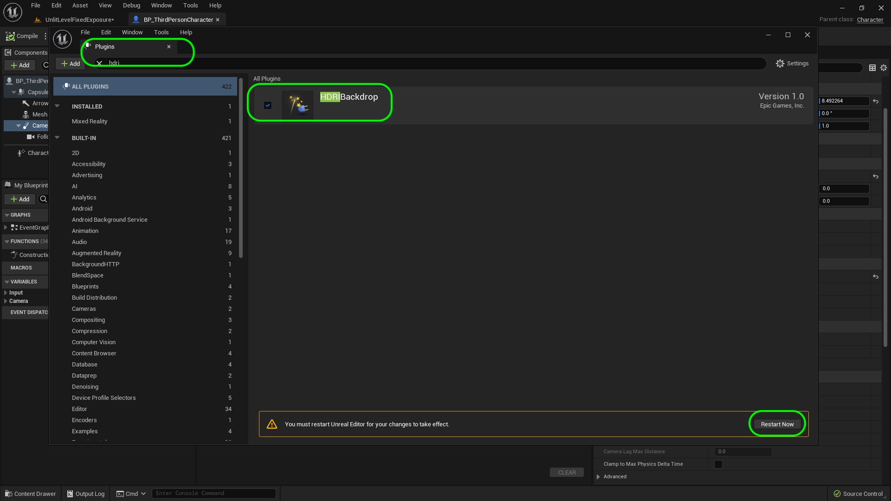
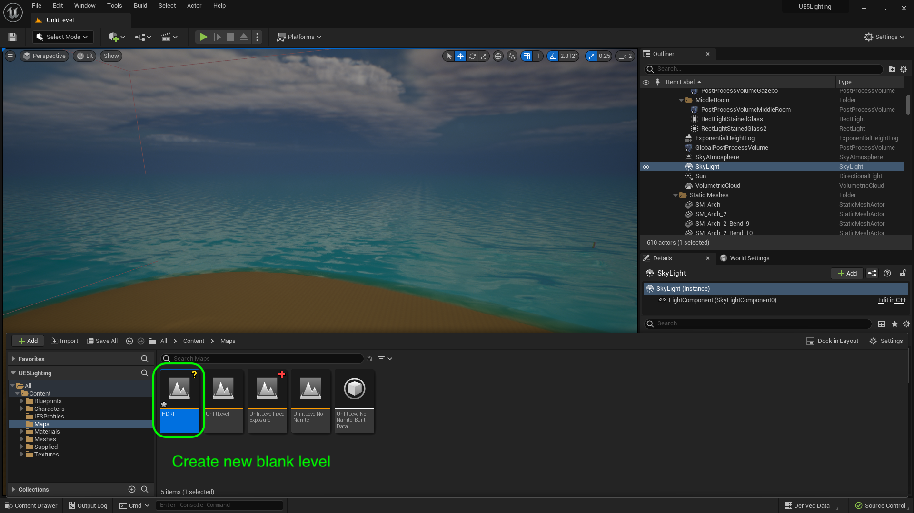

### Changing Sky Texture

[previous](../post-process/README.md#user-content-post-process-volumes) • [home](../README.md#user-content-ue4-lighting)

We will look at using an HDRI image to create the lighting the environment which is good for portfolio pieces.  We will also look at customizing clouds as the default clouds don't have much customization at first glance. Lets start by creating another level that uses the exposure in the post production volume to chnage the exposure in each room.

 

---

##### `Step 1.`\|`ITL`|:small_blue_diamond:

Lets change exposure in the post production volume rather than dynamically per frame.  Go to **Maps | UnlitLevel** and select  **Duplicate** and call the new level `UnlitLevelFixedExposure`.  Double click this new level to go to it.

##### `Step 2.`\|`ITL`|:small_blue_diamond: :small_blue_diamond: 

Go to all 4 post process volumes and change **Metering Mode** to `Manual`, and **Apply Physical Camera Exposure** to `true`.  Set the **Exposure Compenstion** for the back room to `2.6`, middle room to `.2` and front gazebo & global volume to `-1`.  Double check the exposure balls in each room and make adjustments as necessary.

##### `Step 3.`\|`ITL`|:small_blue_diamond: :small_blue_diamond: :small_blue_diamond:

We want to increase the radius of belnding from one volume to another.  If you <kbd>Shift</kbd> select the **PostProcessVolumeBackRoom**, **PostProcessVolumeGazebo** and **PostProcessVolumeMiddleRoom** you can adjust the **Post Production Volume Settings | Blend Radius** to `300` (3 meters or ~ 10 feet).

##### `Step 4.`\|`ITL`|:small_blue_diamond: :small_blue_diamond: :small_blue_diamond: :small_blue_diamond:

Run the game, and make a determination, do you like the audo iris settings or do you prefer having a fixed exposure per room?  Which feels more like a game, which feels more cinematic?  If I was to do one more tweak would be to give a custom exposure to the hallway by the backroom which could use an exposure boost.  I personally prefer the fixed exposure.

https://user-images.githubusercontent.com/5504953/189629265-a132d73d-360f-47f3-9adb-431ae11c0eb1.mp4

##### `Step 5.`\|`ITL`| :small_orange_diamond:

Lets look at **HDRI Backdrops**. The plugin for this feature allows for high-resolution environmental images to be used as a background and an input/light source to the skylight.  The **HDRI** image needs to be a `.hdr` format and include an image with 16 bit per channel images.  The added information allows the image to represent the range of tones we can see with the human eye.  A standar 8 bit image only has 256 shades of gray, where a 16 bit image can generate over 65,000 shades of gray. So for lighting, it produces a lot more subtlety and more acccurately represents the original scene.

First lets go to **Edit | Plugins** and search for the **HDRI Backdrop** plugin. You will have to **restart** the game, to load up the editor.

##### `Step 6.`\|`ITL`| :small_orange_diamond: :small_blue_diamond:

Press **File | New Level** and pick a new **Blank Level** and call it `HDRI`.

##### `Step 7.`\|`ITL`| :small_orange_diamond: :small_blue_diamond: :small_blue_diamond:

Download [T_KiaraDawn.hdr](../Assets/T_KiaraDawn.hdr) and drag it into the **Textures | Supplied** folder.

##### `Step 8.`\|`ITL`| :small_orange_diamond: :small_blue_diamond: :small_blue_diamond: :small_blue_diamond:

Open up **T_KiaraDawn** and set the **Level of Detail | Meip Gen Settings** to `NoMipmaps`.  Since this is surrounding us at all times we always want to use the highest resolution image and don't want the renderer to scale it.

##### `Step 9.`\|`ITL`| :small_orange_diamond: :small_blue_diamond: :small_blue_diamond: :small_blue_diamond: :small_blue_diamond:

Press the **Add Actor | Lights | HDRI Backdrop** to the level.  Assign `T_KiaraDawn` to **Cube Mip Map** on the new HDRI Background light. Rotate around and we are surrounded by this high dynamic range spherical projection.

https://user-images.githubusercontent.com/5504953/190878735-57802e0d-372d-4512-918b-1df4b91c7cf2.mp4

##### `Step 10.`\|`ITL`| :large_blue_diamond:

We can adust the **Projection Center | Z** to get to the original height of where the camera was located. The ground is are cue to when it is in focus and to scale. We can also adjust the **Size** and look at the horizon to flatten it.  The **Intensity** can be adjusted to adjust the amount of light is sent by the skylight that is built into the HDRI Backdrop blueprint.

https://user-images.githubusercontent.com/5504953/190878864-c57640c4-e965-4919-bb93-4fdab61a8be4.mp4

##### `Step 11.`\|`ITL`| :large_blue_diamond: :small_blue_diamond: 

##### `Step 12.`\|`ITL`| :large_blue_diamond: :small_blue_diamond: :small_blue_diamond: 

##### `Step 13.`\|`ITL`| :large_blue_diamond: :small_blue_diamond: :small_blue_diamond:  :small_blue_diamond: 

| `lighting.reflections`\|`THE END`| 
| :--- |
| **That's All Folks!** Thanks for sticking around. That's it for this lesson. |

<!--  -->

| [previous](../post-process/README.md#user-content-post-process-volumes)| [home](../README.md#user-content-ue4-lighting) | 
|---|---|
