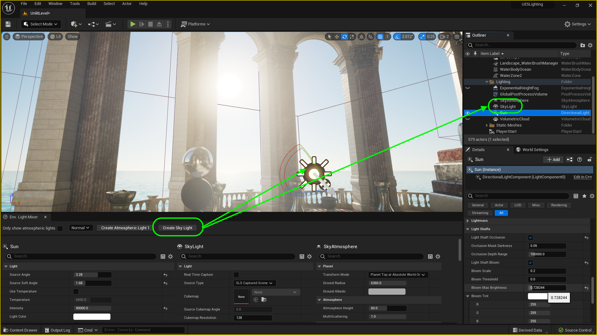
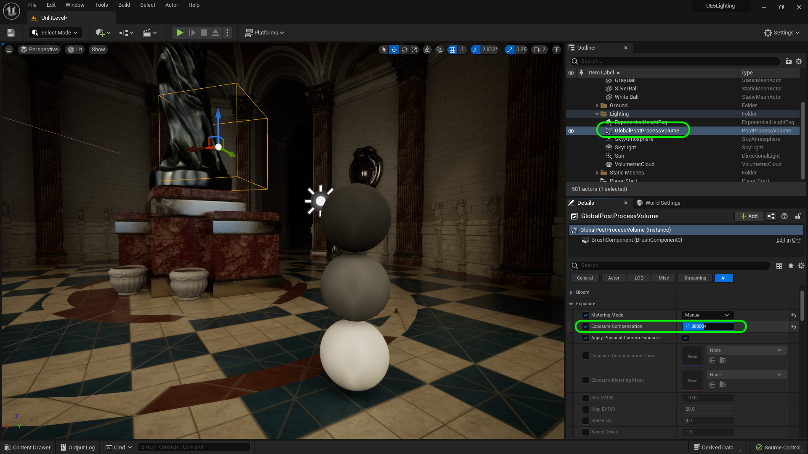

### SkyLight

[previous](../sky-fog/README.md#user-content-sky--fog) • [home](../README.md#user-content-ue5-lighting) • [next](../)

This is the final outdoor lighting effect we will look at.  It acts as the sky ambient light for an outdoor scene. We have both outdoor and indoor scenes so we will need the skylight. The skylight also is used for reflections in the level.  

>The Sky Light captures the distant parts of your level and applies that to the scene as a light. That means the sky's appearance and its lighting/reflections will match, even if your sky is coming from atmosphere, or layered clouds on top of a skybox, or distant mountains. You can also manually specify a cubemap to use. - Unreal Manual

 

---

##### `Step 1.`\|`ITL`|:small_blue_diamond:

Go back to the editor and make sure you have opened up **Window | Env Light Mixer** and select a **SkyLight**.  Move it to the **Lighting** folder.  Make sure it's mobility is set to **Movable**.

##### `Step 2.`\|`ITL`|:small_blue_diamond: :small_blue_diamond: 

Now if you zoom way up and turn the eyeball on and off.  You will see that now the water reflects the sky and that the sky is lighting the scene (taking into account the clouds). 

https://user-images.githubusercontent.com/5504953/188761989-cf2176a2-6bec-4c56-a22c-d51d5dee114f.mp4

##### `Step 3.`\|`ITL`|:small_blue_diamond: :small_blue_diamond: :small_blue_diamond:

Now you can go back to the **Directional Light** (Sun) and now go to **Atmosphere and Cloud | Cloud Shadows** so that the cloud casts shadows on the ground.  Notice that the ground does not go black like it did before because even though the clouds are blocking the sun, the sky is still lighting the scene (especially the blue parts).  You can see the shadow on the building really soften when we take the clouds into account.

https://user-images.githubusercontent.com/5504953/188763433-13739436-f804-4133-b0e8-e8939ce4db15.mp4

##### `Step 4.`\|`ITL`|:small_blue_diamond: :small_blue_diamond: :small_blue_diamond: :small_blue_diamond:

Now in my case it darkened the scene.  I go back to the reference balls in the room and select the **Global Post Production Volume** adjust the **Exposure | Exposure Compensation** value to re-expose the room with the new settings.

##### `Step 5.`\|`ITL`| :small_orange_diamond:

Now the eyeball in the **Outliner** only affects the editor.  So if you turn off the lights using the eyeball it doesn't affect the game, just the editor.  So if you hit play, those lights work again.

https://user-images.githubusercontent.com/5504953/188764426-325f47b9-5594-4436-bb26-4bd945466d14.mp4

##### `Step 6.`\|`ITL`| :small_orange_diamond: :small_blue_diamond:

If you want to turn off a light in **both** the editor and in game you can turn off the switch for **Affects World**.  Select the **Sun** actor and turn the light on and off. This way you don't have to delete a light, you can just turn it off in the editor and it will not affect the world anymore in game or in editor.

https://user-images.githubusercontent.com/5504953/188778954-651a88dd-53ef-4f2e-81a4-f97cce879aa5.mp4

##### `Step 7.`\|`ITL`| :small_orange_diamond: :small_blue_diamond: :small_blue_diamond:

Now if you go back to the gazebo and you turn off **Affects World** on the **Sky Light**, you can see the shadows goes from solid and crisp to light and blurry because of the effect of the sun being filtered through the clouds.  Look in the silver ball, the sky in the reflection also disappears.  Remember the skylight provides additional environmental lighting as well as reflections.

https://user-images.githubusercontent.com/5504953/188779547-0468efb6-767d-410f-8a6b-dde2b168a637.mp4

##### `Step 8.`\|`ITL`| :small_orange_diamond: :small_blue_diamond: :small_blue_diamond: :small_blue_diamond:

##### `Step 9.`\|`ITL`| :small_orange_diamond: :small_blue_diamond: :small_blue_diamond: :small_blue_diamond: :small_blue_diamond:

##### `Step 10.`\|`ITL`| :large_blue_diamond:

##### `Step 11.`\|`ITL`| :large_blue_diamond: :small_blue_diamond: 

##### `Step 12.`\|`ITL`| :large_blue_diamond: :small_blue_diamond: :small_blue_diamond: 

##### `Step 13.`\|`ITL`| :large_blue_diamond: :small_blue_diamond: :small_blue_diamond:  :small_blue_diamond: 

##### `Step 14.`\|`ITL`| :large_blue_diamond: :small_blue_diamond: :small_blue_diamond: :small_blue_diamond:  :small_blue_diamond: 

##### `Step 15.`\|`ITL`| :large_blue_diamond: :small_orange_diamond: 

##### `Step 16.`\|`ITL`| :large_blue_diamond: :small_orange_diamond:   :small_blue_diamond: 

##### `Step 17.`\|`ITL`| :large_blue_diamond: :small_orange_diamond: :small_blue_diamond: :small_blue_diamond:

##### `Step 18.`\|`ITL`| :large_blue_diamond: :small_orange_diamond: :small_blue_diamond: :small_blue_diamond: :small_blue_diamond:

##### `Step 19.`\|`ITL`| :large_blue_diamond: :small_orange_diamond: :small_blue_diamond: :small_blue_diamond: :small_blue_diamond: :small_blue_diamond:

##### `Step 20.`\|`ITL`| :large_blue_diamond: :large_blue_diamond:

##### `Step 21.`\|`ITL`| :large_blue_diamond: :large_blue_diamond: :small_blue_diamond:

<!--  -->

| [previous](../sky-fog/README.md#user-content-sky--fog)| [home](../README.md#user-content-ue5-lighting) | [next](../)|
|---|---|---|
