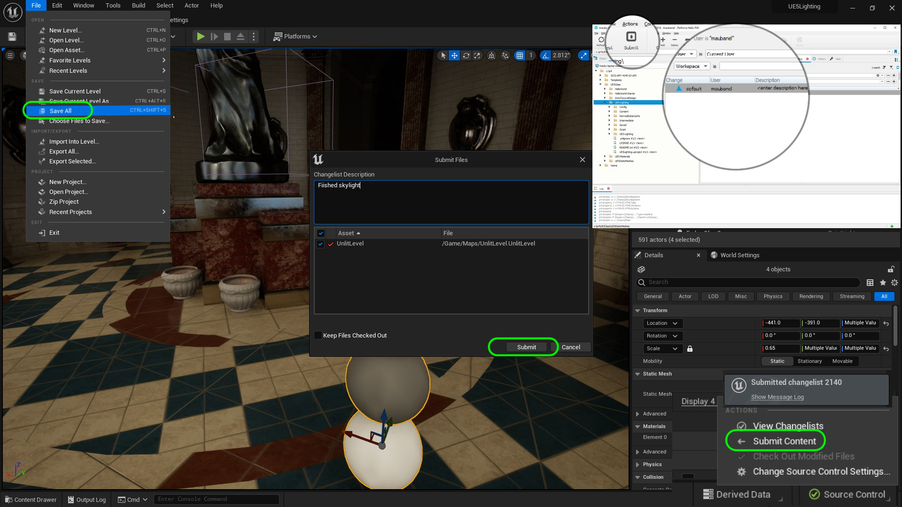

### SkyLight

[previous](../sky-fog/README.md#user-content-sky--fog) • [home](../README.md#user-content-ue5-lighting) • [next](../point-lights/README.md#user-content-point-lights)

This is the final outdoor lighting effect we will look at.  It acts as the sky ambient light for an outdoor scene. We have both outdoor and indoor scenes so we will need the skylight. The [SkyLight](https://docs.unrealengine.com/5.0/en-US/sky-lights-in-unreal-engine/) also is used for reflections in the level.  

>The Sky Light captures the distant parts of your level and applies that to the scene as a light. That means the sky's appearance and its lighting/reflections will match, even if your sky is coming from atmosphere, or layered clouds on top of a skybox, or distant mountains. You can also manually specify a cubemap to use. - Unreal Manual

 

---

##### `Step 1.`\|`ITL`|:small_blue_diamond:

Go back to the editor and make sure you have opened up **Window | Env Light Mixer** and select a **SkyLight**.  Move it to the **Lighting** folder. 

##### `Step 2.`\|`ITL`|:small_blue_diamond: :small_blue_diamond: 

Now if you zoom way up and turn the eyeball on and off.  You will see that now the water reflects the sky and that the sky is lighting the scene (taking into account the clouds). Notice that when the directional light gets turned off that the lighting doesn't disappear.  The skylight is using a capture of the sky to light up the scene with soft indirect light. Make sure it's mobility is set to **Movable**.

https://github.com/maubanel/UE5-Lighting/assets/5504953/7d3c12fc-34e8-4b85-b1b0-daba1d43397f

##### `Step 3.`\|`ITL`|:small_blue_diamond: :small_blue_diamond: :small_blue_diamond:

Now you can go back to the **Directional Light** (Sun) and now go to **Atmosphere and Cloud | Cloud Shadows** so that the cloud casts shadows on the ground.  Notice that the ground does not go black like it did before because even though the clouds are blocking the sun, the sky is still lighting the scene (especially the blue parts).  You can see the shadow on the building really soften when we take the clouds into account.

If you move back into the gazebo you see the sky has more detail as the bottom of the clouds are more shadowed.  Even in the back of the room you get an effect on the global illumination.  Lets keep cloud shadows on as it significantly improves the look.

https://github.com/maubanel/UE5-Lighting/assets/5504953/e7890e32-209a-4669-91c5-ac4fcbb192ac

##### `Step 4.`\|`ITL`|:small_blue_diamond: :small_blue_diamond: :small_blue_diamond: :small_blue_diamond:

Now in my case it darkened the scene.  I go back to the reference balls in the room and select the **Global Post Production Volume** adjust the **Exposure | Exposure Compensation** value to re-expose the room with the new settings. Now my sun is at a sunrise (or sunset) position with a yellow light. I like an exposure compensation of `0.2` as it gives me the right light I think is appropriate for a sunny morning in a covered gazebo.

##### `Step 5.`\|`ITL`| :small_orange_diamond:

Now the eyeball in the **Outliner** only affects the editor.  So if you turn off the lights using the eyeball it doesn't affect the game, just the editor.  So if you hit play, those lights work again.

https://github.com/maubanel/UE5-Lighting/assets/5504953/654461b7-b2be-4724-861c-1152f54a1bd6

##### `Step 6.`\|`ITL`| :small_orange_diamond: :small_blue_diamond:

If you want to turn off a light in **both** the editor and in game you can turn off the switch for **Affects World**.  Select the **Sun** actor and turn the light on and off. This way you don't have to delete a light, you can just turn it off in the editor and it will not affect the world anymore in game or in editor.

https://github.com/maubanel/UE5-Lighting/assets/5504953/a3a5f7af-03a2-4ee7-9549-8b46201db301

##### `Step 7.`\|`ITL`| :small_orange_diamond: :small_blue_diamond: :small_blue_diamond:

Now if you go back to the gazebo and you turn off **Affects World** on the **Sky Light**, you can see the shadows get a bit of fill. The sky light fills in details in the shadow and makes up for the fact that the ray tracer can only calculate so many bounces.  It also affects reflections.  Look in the silver ball, the sky in the reflection also disappears.  Remember the skylight provides additional environmental lighting as well as reflections for your level.

https://github.com/maubanel/UE5-Lighting/assets/5504953/4161e7b4-c043-4dbe-996c-58fce88cf817

##### `Step 8.`\|`ITL`| :small_orange_diamond: :small_blue_diamond: :small_blue_diamond: :small_blue_diamond:

The first option we will look at for the **SkyLight** is the **RealTime** setting. Move the silver ball outside the gazebo and look at the reflection.  Select the **Skylight**.  Turn on and off the **Real Time** toggle.

>The Real Time Capture mode provides dynamic and specular environment lighting, making possible dynamic time-of-day simulations with real-time reflections on scene elements. - Unreal manual

This way you will see the sky atmosphere, volumetric clouds and exponential height fog all get updated in real time during gameplay. Go to your silver reflective ball and look at the difference when turning real time on and off.  When you turn it off you can recapture your scene by pressing the <kbd>SkyLight | Recapture</kbd> button in the skylight actor.

https://github.com/maubanel/UE5-Lighting/assets/5504953/4de428ac-9ae2-480e-841e-8dafde1f265c

##### `Step 9.`\|`ITL`| :small_orange_diamond: :small_blue_diamond: :small_blue_diamond: :small_blue_diamond: :small_blue_diamond:

Our reflection has a black ring at the bottom when you move outside the building.  This is because the default setting is to reflect black from the lower hemisphere.  This is useful when using a cubemap where there is lighting information from the ground plane being cast.  But in our case we have no texture on a skydome, so we want to turn off **Lower Hemisphere is Solid Color**. In our case this gets rid of the black ring around the horizon. You also notice that the new water shader is not reflecting in the Unreal reflection volume.

>Lower Hemisphere is Solid Color determines whether all lighting from the lower hemisphere should be set to zero. This is useful to prevent leaking from the lower hemisphere. Advanced.

https://github.com/maubanel/UE5-Lighting/assets/5504953/13464f2e-d8f5-4d10-9824-1795c4cf1749

##### `Step 10.`\|`ITL`| :large_blue_diamond:

Move the silver ball back into its location with the other exposure balls. Now we can adjust the resolution of the map used for reflections. We can adjust the **Cubemap Resolution**.  We will use power of two numbers so go to 512 and 1024.  It looks better but we have no mirrored surfaces.  Now in this level I think the 128 resolution will suffice.

>Maximum resolution for the very top processed cubemap MIP. It also must be a power of 2 texture. - Unreal manual=

https://github.com/maubanel/UE5-Lighting/assets/5504953/079dbbcd-a33f-4642-a321-b0060c8a3423

##### `Step 11.`\|`ITL`| :large_blue_diamond: :small_blue_diamond: 

Now the **SkyLight** is using the actual sky in the game.  We can also use an **HDR** 360 capture to project instead. 

You can match real life locations really quickly this way.  It will also affect the sky in the reflection. Go to the **SkyLight** and select **Source Type** and  choose `SLS Specified Cubemap`. Adjust the **Intensity Scale** as the scene is too dark.  Switch between the three HDR's and look how the ambient lighting changes brightness and color as well as the reflection changing.

https://user-images.githubusercontent.com/5504953/188874768-91f4cb40-4b42-48c0-aba6-2bf64d5068f5.mp4

##### `Step 12.`\|`ITL`| :large_blue_diamond: :small_blue_diamond: :small_blue_diamond: 

##### `Step 13.`\|`ITL`| :large_blue_diamond: :small_blue_diamond: :small_blue_diamond:  :small_blue_diamond: 

Change the **Intensity Scale** back to `1.0`, the **Source Type** to `SLS Capture Scene` and the **Real Time Capture** back to `true`. We will use our existing sky as our lighting and reflection source.

##### `Step 14.`\|`ITL`| :large_blue_diamond: :small_blue_diamond: :small_blue_diamond: :small_blue_diamond:  :small_blue_diamond: 

Select the **File | Save All** then press the <kbd>Source Control</kbd> button and select **Submit Content**.  If you are prompted, select **Check Out** for all items that are not checked out of source control. Update the **Changelist Description** message and with the latest changes. Make sure all the files are correct and press the <kbd>Submit</kbd> button. A confirmation will pop up on the bottom right with a message about a changelist was submitted with a commit number. Quit Unreal and make sure your **Pending** tab in **P4V** is empty. **Submit** any work that is still in the editor.

<!--  -->

| [previous](../sky-fog/README.md#user-content-sky--fog)| [home](../README.md#user-content-ue5-lighting) | [next](../point-lights/README.md#user-content-point-lights)|
|---|---|---|
