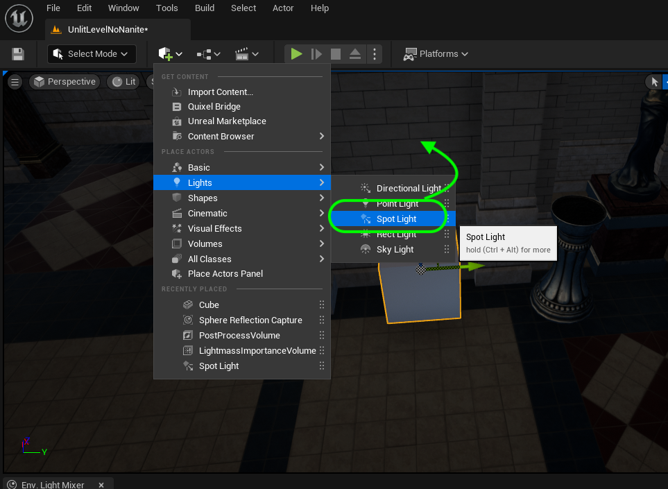
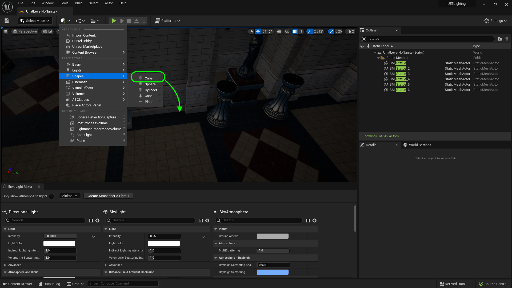
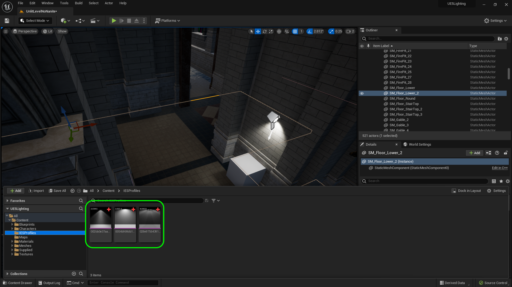
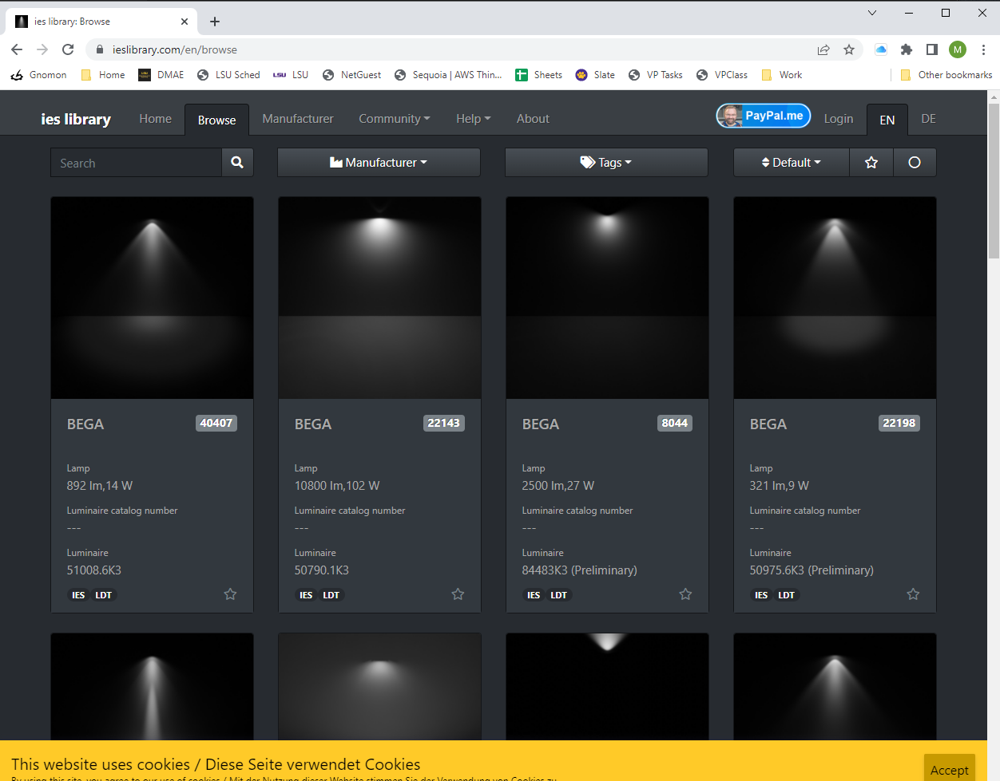
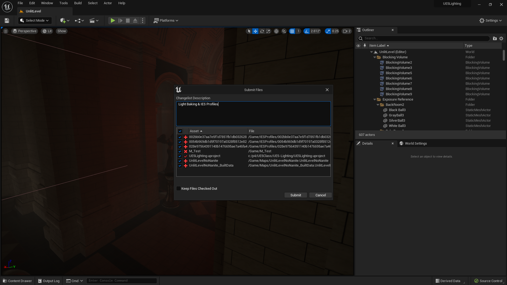

### Spot Light

[previous](../baked-lighting/README.md#user-content-baked-lighting) • [home](../README.md#user-content-ue5-lighting) • [next](../post-process/README.md#user-content-post-process-volumes)

Lets look at the final type of light that we have not used yet.  It is the [spot light](https://docs.unrealengine.com/5.2/en-US/spot-lights-in-unreal-engine/).  

>A Spot Light emits light from a single point in a cone shape. Users are given two cones to shape the light - the Inner Cone Angle and Outer Cone Angle. Within the Inner Cone Angle, the light achieves full brightness. As you go from the extent of the inner radius to the extents of the Outer Cone Angle, a falloff takes place, creating a penumbra, or softening around the Spot Light's disc of illumination. The Radius of the light defines the length of the cones. More simply, this will work like a flash light or stage can light.

 

---

##### `Step 1.`\|`ITL`|:small_blue_diamond:

Our scene doesn't contain any artificial lighting so we don't have a natural use for a spot light.  We do have one point light in the back room that can be replaced with a spotlight.  It is a lot more efficient to use that a point light and allows you to direct the lighting to where you need it. Delete the point light above the fireplace as we will use the spot light instead.

##### `Step 2.`\|`ITL`|:small_blue_diamond: :small_blue_diamond: 

Change the spot light color to **Orange** and then put the light pointing upwards above the fire pit.  Adjust the brightness of the light.

##### `Step 3.`\|`ITL`|:small_blue_diamond: :small_blue_diamond: :small_blue_diamond:

Make sure the attenuation radius is large enough the light the back hallway as it is very dark.  I adjusted the size to extend just past the hallway.

##### `Step 4.`\|`ITL`|:small_blue_diamond: :small_blue_diamond: :small_blue_diamond: :small_blue_diamond:

Now it is not a point light but essentially because of the edges of the bowl the light only goes upwards.  So we can adjust the outer cone angle to `90.0`°.

##### `Step 5.`\|`ITL`| :small_orange_diamond:

Add a `FLI_FlickerBackRoom` to the **Light FunctionMaterial** of the spot light.  Make adjustments to your liking.  Then play the game and jump on the flames to see what the light is doing.

https://github.com/maubanel/UE5-Lighting/assets/5504953/082e44d7-779d-4530-a2a7-398bcbfc4fdc

##### `Step 6.`\|`ITL`| :small_orange_diamond: :small_blue_diamond:

Open back up the original **UnlitLevel**. Lets add a **Cube** to the back wall in the middle room.

##### `Step 7.`\|`ITL`| :small_orange_diamond: :small_blue_diamond: :small_blue_diamond:

Add a Spot Light and put it above the box pointing down.

##### `Step 8.`\|`ITL`| :small_orange_diamond: :small_blue_diamond: :small_blue_diamond: :small_blue_diamond:

https://github.com/maubanel/UE5-Lighting/assets/5504953/a0e642f0-fd46-4964-8775-884fcfe077a6

##### `Step 9.`\|`ITL`| :small_orange_diamond: :small_blue_diamond: :small_blue_diamond: :small_blue_diamond: :small_blue_diamond:

Create a folder called **IESProfiles**.  Drag the three profiles you downloaded from the internet into this new folder.  You will see a thumbnail of the shape of the light.

Now we can replicate a specific type/brand of light using **ies** profiles.  A site like [ies library](https://ieslibrary.com) has light profiles availabel to us.  This affects how light comes out of bulb.  If it is used on a Rect or point light, it turns them into spot lights.

>The Illuminating Engineering Society (IES) has defined a file format which describes a light's distribution from a light source using real world measured data. These IES Photometric files, or IES Profiles, are a lighting industry standard method of diagramming the brightness and falloff of light as it exists a particular real world light fixture. It enables them to account for reflective surfaces in the light fixture, the shape of the light bulb, and any lensing effects that happens. - [Unreal Manual](https://docs.unrealengine.com/5.0/en-US/using-ies-light-profiles-in-unreal-engine/). 

Google and download three free ies profiles.

Make a copy of the spot light and move it over.  Change between the IES profiles and look at how the light changes to match the real life light pattern shown on the web.

https://user-images.githubusercontent.com/5504953/189501986-00161166-4255-4821-9543-536ab98ca7ff.mp4

Select the **File | Save All** then press the <kbd>Source Control</kbd> button and select **Submit Content**.  If you are prompted, select **Check Out** for all items that are not checked out of source control. Update the **Changelist Description** message and with the latest changes. Make sure all the files are correct and press the <kbd>Submit</kbd> button. A confirmation will pop up on the bottom right with a message about a changelist was submitted with a commit number. Quit Unreal and make sure your **Pending** tab in **P4V** is empty. **Submit** any work that is still in the editor.

<!--  -->

| [previous](../baked-lighting/README.md#user-content-baked-lighting)| [home](../README.md#user-content-ue5-lighting) | [next](../post-process/README.md#user-content-post-process-volumes)|
|---|---|---|
